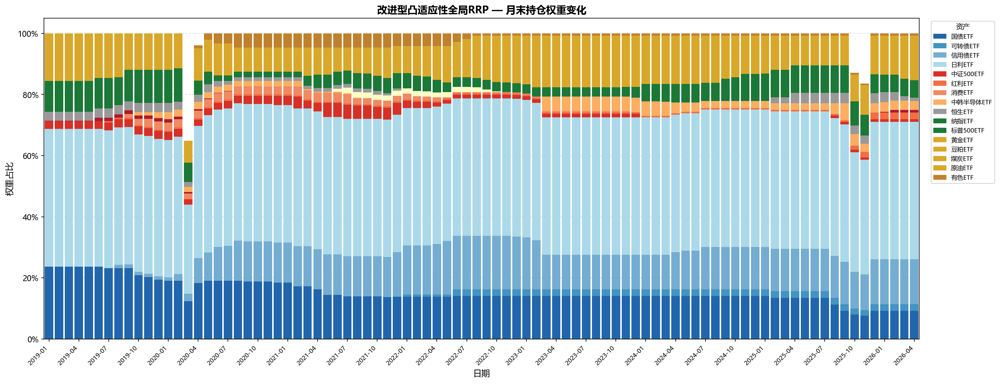

# 宽松风险平价全球资产配置框架 | Relaxed Risk Parity Framework for Global Asset Allocation

<p align="center">
  <a href="#zh"></a>
  <a href="#en"></a>
</p>

<p align="center">
  
  
  
  
</p>

<a id="zh"></a>

## 中文

### 项目概览
本项目研究宽松风险平价在全球多资产配置中的应用，重点比较传统风险平价、本土宽松风险平价、全球宽松风险平价、防御型动态风险覆盖模型，以及 HRP / HERC 层次化配置 benchmark。

### 核心模型
| 模型 | 定位 | 说明 |
|---|---|---|
| Standard Risk Parity | 基准模型 | 传统风险贡献均衡组合 |
| Local Relaxed Risk Parity | 本土宽松模型 | 在风险平价约束中引入松弛项，平衡风险均衡与收益目标 |
| Global Relaxed Risk Parity | 主展示模型 | 扩展到全球多资产配置，是当前收益效率最高的主模型 |
| Defensive Dynamic Relaxed Risk Parity | 防御型动态模型 | 在全球宽松风险平价基础上加入风险覆盖层，管理回撤、趋势、波动率和换手 |
| HRP Benchmark / HERC Benchmark | 横向 benchmark | 用于检验层次聚类配置是否能替代 RRP 型全球配置 |

Defensive Dynamic Relaxed Risk Parity is not designed to mechanically maximize Sharpe. Its role is to reduce risk exposure during adverse regimes, so it should be evaluated together with maximum drawdown, Calmar ratio, downside behavior, and turnover.

### 最新结果看板
评估区间从 `2019-01-01` 开始。下表直接来自 `results/tables/showcase_performance_summary.csv`。
| Model | Annual Return | Annual Volatility | Sharpe | Sortino | Max Drawdown | Calmar | Avg Turnover | Turnover-adjusted Sharpe |
|---|---:|---:|---:|---:|---:|---:|---:|---:|
| Global RRP | 4.25% | 4.02% | 0.61 | 0.70 | -6.43% | 0.66 | 0.0098 | 1.04 |
| Defensive Dynamic RRP | 5.21% | 4.33% | 0.78 | 1.02 | -6.18% | 0.84 | 0.0099 | 1.19 |
| Defensive Dynamic RRP before overlay optimization | 4.65% | 4.42% | 0.64 | 0.81 | -6.88% | 0.68 | 0.0096 | 1.04 |

Benchmark 结果保留在公开表格中，但不作为本文的主要贡献。
| Model | Annual Return | Annual Volatility | Sharpe | Sortino | Max Drawdown | Calmar | Avg Turnover | Turnover-adjusted Sharpe |
|---|---:|---:|---:|---:|---:|---:|---:|---:|
| Standard Risk Parity | 2.60% | 0.72% | 1.08 | 1.42 | -0.97% | 2.67 | 0.0116 | 3.49 |
| Local Relaxed Risk Parity | 4.91% | 4.11% | 0.75 | 0.90 | -6.75% | 0.73 | 0.0060 | 1.18 |
| HRP Benchmark | 1.69% | 0.18% | -0.75 | -1.18 | -0.08% | 20.72 | 0.0005 | 9.59 |
| HERC Benchmark | 2.25% | 0.57% | 0.75 | 1.10 | -0.58% | 3.86 | 0.0028 | 3.91 |

全量方案回测结果如下，包含基准配置、RRP 系列、层次化 benchmark、标准 pipeline 动态模型，以及 showcase 优化后的防御型动态模型。
| Strategy | Source | Annual Return | Annual Volatility | Sharpe | Sortino | Max Drawdown | Calmar | Total Return | Avg Turnover |
|---|---|---:|---:|---:|---:|---:|---:|---:|---:|
| Equal Weight | `hrp_comparison.csv` | 10.84% | 11.08% | 0.81 | 1.30 | -13.91% | 0.78 | 112.94% | 0.0006 |
| Minimum Variance | `hrp_comparison.csv` | 1.72% | 0.20% | -0.53 | -0.62 | -0.29% | 5.91 | 13.30% | 0.0020 |
| Standard Risk Parity | `hrp_comparison.csv` | 2.38% | 0.86% | 0.66 | 0.80 | -1.17% | 2.03 | 18.86% | 0.0111 |
| Local Relaxed Risk Parity | `hrp_comparison.csv` | 2.77% | 4.05% | 0.24 | 0.27 | -7.63% | 0.36 | 22.24% | 0.0072 |
| Global RRP | `hrp_comparison.csv` | 4.25% | 4.02% | 0.61 | 0.70 | -6.43% | 0.66 | 35.77% | 0.0098 |
| HRP Benchmark | `hrp_comparison.csv` | 1.69% | 0.18% | -0.75 | -1.18 | -0.08% | 20.72 | 13.08% | 0.0005 |
| HERC Benchmark | `hrp_comparison.csv` | 2.25% | 0.57% | 0.75 | 1.10 | -0.58% | 3.86 | 17.71% | 0.0028 |
| Defensive Dynamic RRP | `hrp_comparison.csv` | 4.64% | 4.45% | 0.63 | 0.82 | -6.88% | 0.67 | 38.08% | 0.0094 |
| Defensive Dynamic RRP before overlay optimization | `showcase_performance_summary.csv` | 4.65% | 4.42% | 0.64 | 0.81 | -6.88% | 0.68 | 38.20% | 0.0096 |

### 图表展示
<p align="center"></p>
<p align="center"><em>改进型凸适应性全局RRP — 月末持仓权重变化（2019-01 至 2026-04，共89个再平衡日）</em></p>

<p align="center"></p>
<p align="center"><em>Showcase NAV comparison.</em></p>
<p align="center"></p>
<p align="center"><em>Showcase drawdown comparison.</em></p>

- `results/figures/improved_weights_timeline.png`
- `results/figures/showcase_risk_overlay_ablation.png`
- `results/figures/showcase_parameter_timeline.png`
- `results/figures/nav_comparison.png`
- `results/figures/drawdown_comparison.png`

### 方法框架
框架包括风险贡献均衡、宽松收益目标、全球多资产扩展、防御型动态覆盖、回撤缩放、软趋势过滤、波动率目标、再入场逻辑、换手控制和交易成本调整。

### AFML 风格验证设计
验证流程借鉴 Lopez de Prado 的 walk-forward、反过拟合和多重检验思想，但不声称完整实现 CSCV 或完整 Deflated Sharpe Ratio。每个测试期只使用此前数据进行参数选择，并报告稳定性、换手、简化 PBO 和保守调整 Sharpe 诊断。

### HRP / HERC Benchmark
HRP / HERC 是横向 benchmark，用于检验层次聚类风险配置在同一数据集和评估窗口下是否优于 RRP 型全球配置。结果透明保留，不隐藏弱于主模型的情形。

### 如何运行
```bash
pip install -r requirements.txt
python -m pytest
python scripts/optimize_showcase_rrp.py
python scripts/run_rrp_pipeline.py --mode full
python scripts/run_hrp_comparison.py
```

### 输出文件
- `results/tables/showcase_performance_summary.csv`
- `results/tables/showcase_risk_overlay_ablation.csv`
- `results/tables/showcase_walkforward_validation.csv`
- `results/tables/showcase_parameter_stability.csv`
- `results/tables/showcase_improvement_attribution.csv`
- `results/tables/performance_summary.csv`
- `results/tables/hrp_comparison.csv`
- `results/figures/showcase_nav_comparison.png`
- `results/figures/showcase_drawdown_comparison.png`

### 适用场景与局限性
本项目是回测研究，不构成投资建议。数据质量、资产映射、交易成本、滑点、杠杆融资成本、税费、流动性和实盘可交易性都需要独立复核。

### 参考文献
1. Gambeta, V., & Kwon, R. (2020). Risk return trade-off in relaxed risk parity portfolio optimization.
2. Lopez de Prado, M. (2018). Advances in Financial Machine Learning.
3. Bailey, D. H., Borwein, J. M., Lopez de Prado, M., & Zhu, Q. J. (2015). The Probability of Backtest Overfitting.
4. Bailey, D. H., & Lopez de Prado, M. (2014). The Deflated Sharpe Ratio.
5. Lopez de Prado, M. (2016). Building Diversified Portfolios that Outperform Out-of-Sample.

<a id="en"></a>

## English

### Project Overview
This repository studies Relaxed Risk Parity for global multi-asset allocation, comparing classical risk parity, local and global relaxed variants, a defensive dynamic overlay, and HRP / HERC hierarchical benchmarks.

### Core Models
| Model | Role | Description |
|---|---|---|
| Standard Risk Parity | Baseline | Classical risk-contribution balancing |
| Local Relaxed Risk Parity | Local relaxed model | Balances risk parity with return objectives through relaxation terms |
| Global Relaxed Risk Parity | Main showcase model | Global multi-asset extension and the main return-efficient model |
| Defensive Dynamic Relaxed Risk Parity | Defensive overlay | Manages drawdown, trend, volatility, re-entry, and turnover controls |
| HRP Benchmark / HERC Benchmark | Benchmarks | Hierarchical allocation references, not the main contribution |

Defensive Dynamic Relaxed Risk Parity is not designed to mechanically maximize Sharpe. Its role is to reduce risk exposure during adverse regimes, so it should be evaluated together with maximum drawdown, Calmar ratio, downside behavior, and turnover.

### Latest Results
Evaluation starts on `2019-01-01`. The table is generated from `results/tables/showcase_performance_summary.csv`.
| Model | Annual Return | Annual Volatility | Sharpe | Sortino | Max Drawdown | Calmar | Avg Turnover | Turnover-adjusted Sharpe |
|---|---:|---:|---:|---:|---:|---:|---:|---:|
| Global RRP | 4.25% | 4.02% | 0.61 | 0.70 | -6.43% | 0.66 | 0.0098 | 1.04 |
| Defensive Dynamic RRP | 5.21% | 4.33% | 0.78 | 1.02 | -6.18% | 0.84 | 0.0099 | 1.19 |
| Defensive Dynamic RRP before overlay optimization | 4.65% | 4.42% | 0.64 | 0.81 | -6.88% | 0.68 | 0.0096 | 1.04 |

Benchmark results are retained transparently.
| Model | Annual Return | Annual Volatility | Sharpe | Sortino | Max Drawdown | Calmar | Avg Turnover | Turnover-adjusted Sharpe |
|---|---:|---:|---:|---:|---:|---:|---:|---:|
| Standard Risk Parity | 2.60% | 0.72% | 1.08 | 1.42 | -0.97% | 2.67 | 0.0116 | 3.49 |
| Local Relaxed Risk Parity | 4.91% | 4.11% | 0.75 | 0.90 | -6.75% | 0.73 | 0.0060 | 1.18 |
| HRP Benchmark | 1.69% | 0.18% | -0.75 | -1.18 | -0.08% | 20.72 | 0.0005 | 9.59 |
| HERC Benchmark | 2.25% | 0.57% | 0.75 | 1.10 | -0.58% | 3.86 | 0.0028 | 3.91 |

The full strategy backtest table is shown below, covering baseline allocations, RRP variants, hierarchical benchmarks, the standard pipeline dynamic model, and the showcase-optimized defensive dynamic model.
| Strategy | Source | Annual Return | Annual Volatility | Sharpe | Sortino | Max Drawdown | Calmar | Total Return | Avg Turnover |
|---|---|---:|---:|---:|---:|---:|---:|---:|---:|
| Equal Weight | `hrp_comparison.csv` | 10.84% | 11.08% | 0.81 | 1.30 | -13.91% | 0.78 | 112.94% | 0.0006 |
| Minimum Variance | `hrp_comparison.csv` | 1.72% | 0.20% | -0.53 | -0.62 | -0.29% | 5.91 | 13.30% | 0.0020 |
| Standard Risk Parity | `hrp_comparison.csv` | 2.38% | 0.86% | 0.66 | 0.80 | -1.17% | 2.03 | 18.86% | 0.0111 |
| Local Relaxed Risk Parity | `hrp_comparison.csv` | 2.77% | 4.05% | 0.24 | 0.27 | -7.63% | 0.36 | 22.24% | 0.0072 |
| Global RRP | `hrp_comparison.csv` | 4.25% | 4.02% | 0.61 | 0.70 | -6.43% | 0.66 | 35.77% | 0.0098 |
| HRP Benchmark | `hrp_comparison.csv` | 1.69% | 0.18% | -0.75 | -1.18 | -0.08% | 20.72 | 13.08% | 0.0005 |
| HERC Benchmark | `hrp_comparison.csv` | 2.25% | 0.57% | 0.75 | 1.10 | -0.58% | 3.86 | 17.71% | 0.0028 |
| Defensive Dynamic RRP | `hrp_comparison.csv` | 4.64% | 4.45% | 0.63 | 0.82 | -6.88% | 0.67 | 38.08% | 0.0094 |
| Defensive Dynamic RRP before overlay optimization | `showcase_performance_summary.csv` | 4.65% | 4.42% | 0.64 | 0.81 | -6.88% | 0.68 | 38.20% | 0.0096 |

### Figures
<p align="center"></p>
<p align="center"></p>

### Methodology
The framework combines relaxed risk parity, global diversification, defensive risk overlays, drawdown-aware scaling, soft trend filtering, volatility targeting, re-entry logic, turnover control, and transaction-cost-aware evaluation.

### AFML-Inspired Validation Design
The showcase uses strict walk-forward validation. Candidate selection only uses data before each test period, with simplified PBO-style diagnostics, parameter stability checks, turnover-aware metrics, and conservative adjusted Sharpe diagnostics.

### HRP / HERC Benchmark
HRP / HERC are benchmarks used to test whether hierarchical clustering alone can outperform RRP-based global diversification under the same evaluation setup.

### How to Run
```bash
pip install -r requirements.txt
python -m pytest
python scripts/optimize_showcase_rrp.py
python scripts/run_rrp_pipeline.py --mode full
python scripts/run_hrp_comparison.py
```

### Output Files
- `results/tables/showcase_performance_summary.csv`
- `results/tables/showcase_risk_overlay_ablation.csv`
- `results/tables/showcase_walkforward_validation.csv`
- `results/tables/showcase_parameter_stability.csv`
- `results/tables/showcase_improvement_attribution.csv`
- `results/tables/performance_summary.csv`
- `results/tables/hrp_comparison.csv`
- `results/figures/showcase_nav_comparison.png`
- `results/figures/showcase_drawdown_comparison.png`

### Use Cases and Limitations
This is backtest research, not investment advice. Data quality, asset mappings, transaction costs, slippage, financing costs, taxes, liquidity, and live tradability require independent review.

### References
1. Gambeta, V., & Kwon, R. (2020). Risk return trade-off in relaxed risk parity portfolio optimization.
2. Lopez de Prado, M. (2018). Advances in Financial Machine Learning.
3. Bailey, D. H., Borwein, J. M., Lopez de Prado, M., & Zhu, Q. J. (2015). The Probability of Backtest Overfitting.
4. Bailey, D. H., & Lopez de Prado, M. (2014). The Deflated Sharpe Ratio.
5. Lopez de Prado, M. (2016). Building Diversified Portfolios that Outperform Out-of-Sample.

## License
MIT License.
