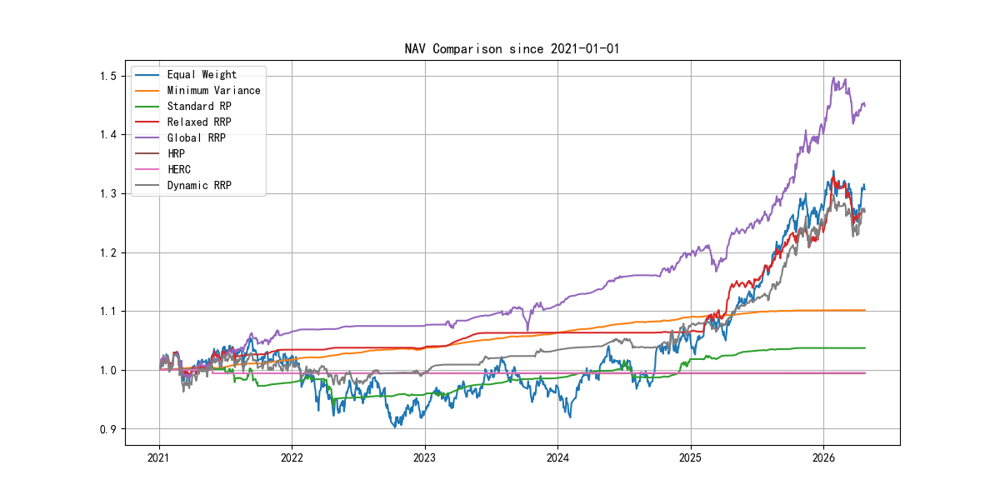
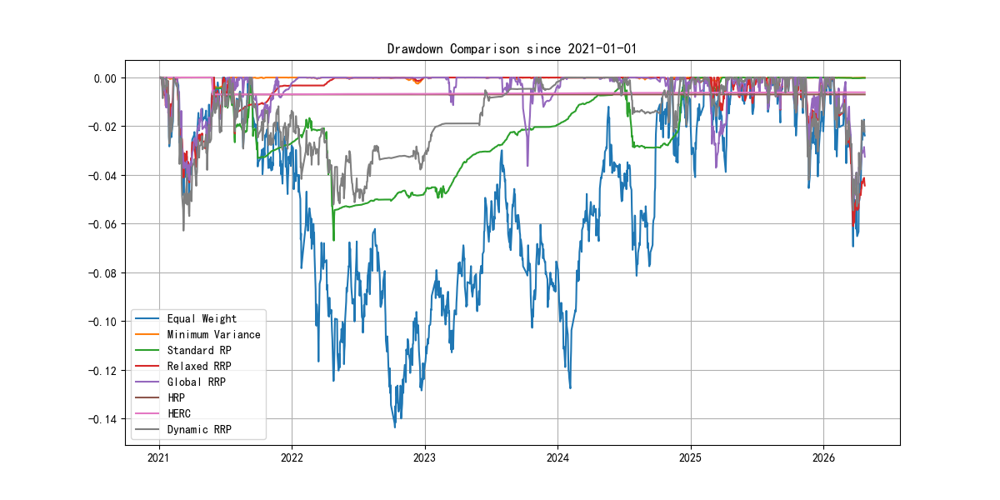
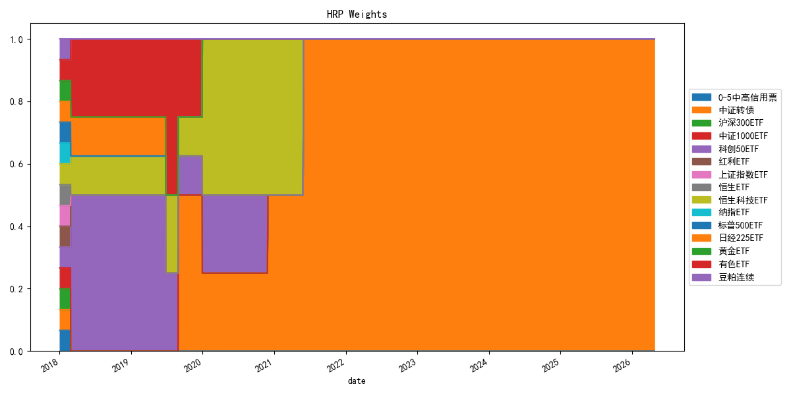

# 宽松风险平价研究框架 | Relaxed Risk Parity Research

<p align="center">
  <a href="#zh"></a>
  <a href="#en"></a>
</p>

<p align="center">
  
  
  
</p>

<p align="center">
  A quantitative asset allocation research framework bridging standard Risk Parity, Relaxed Risk Parity, and dynamic walk-forward parameter selection.
</p>

---

<a id="zh"></a>

## 简体中文

当前语言：中文 | [Switch to English](#en)

### 📌 项目概览
本项目旨在低利率与全球宏观剧烈波动的环境下，对传统风险平价（Risk Parity）框架进行工程化改良。引入 **宽松风险平价（Relaxed Risk Parity, RRP）** 模型，解决了标准 RP 组合收益弹性不足的问题，并集成了**动态风险闸门**与**趋势过滤**等先进控撤手段。

### 🚀 核心版本演进
| 版本 | 模型类型 | 资产池范围 | 特性说明 |
| :--- | :--- | :--- | :--- |
| V1 | 标准 RP | 本土资产 | 严格等风险贡献，极致稳健。 |
| V2 | 宽松 RRP | 本土资产 | **引入松弛变量**，本土股债混合增强。 |
| V3 | 宽松 RRP | 全球资产 | 加入美债、标普、汇率，利用全球分散化。 |
| **Dynamic** | 动态 RRP | 全球资产 | **最新升级**：趋势过滤 + 动态风险闸门自适应。 |

### 🧠 风险控制杀手锏 (Risk Overlay)
1.  **动态风险闸门**: 实时监控回撤，一旦超过 3.5%，波动率预算自动减半。
2.  **趋势过滤器**: 扫描 60 日均线，自动规避处于下行趋势的风险资产。
3.  **波动率目标管理**: 全量资产遵循 6.0% 的激进波动率目标约束。

### 📊 绩效看板 (Evaluation: 2021-01-01 to Present)
| 指标 | V1 Standard RP | V2 Relaxed RRP | V3 Global RRP | **Dynamic RRP** | HRP | HERC |
| :--- | :--- | :--- | :--- | :--- | :--- | :--- |
| **年化收益** | 0.69% | 4.56% | **7.18%** | 4.49% | -0.11% | -0.10% |
| **最大回撤** | -6.69% | -6.10% | -5.26% | -6.28% | -0.70% | -0.70% |
| **夏普比率** | -0.55 | 0.75 | **1.31** | 0.49 | -6.35 | -6.29 |
| **月度换手率** | 0.049 | 0.022 | 0.037 | 0.022 | 0.001 | 0.001 |

#### 📈 净值走势对比 (NAV Comparison)
<p align="center">
  
</p>

#### 📉 回撤走势对比 (Drawdown Comparison)
<p align="center">
  
</p>

#### 🧩 HRP 权重演进 (HRP Weights)
<p align="center">
  
</p>

> **结论**：在当前样本区间内，V3 Global RRP 的夏普比率最高；HRP/HERC 提供层次化风险基准，但在本资产池与区间内收益弹性较弱。

### 📂 仓库结构
```text
Relaxed-Risk-Parity-Research/
├── RRP.py (兼容入口/Wrapper)
├── src/ (核心模块库)
│   ├── risk_parity.py (RRP优化核心)
│   ├── dynamic_selection.py (动态选参引擎)
│   ├── backtest.py (集成风险闸门的回测引擎)
│   └── data_loader.py (Tushare Pro 数据引擎)
├── scripts/
│   └── run_rrp_pipeline.py (全流程一键运行)
└── results/ (报告与图表)
```

### 🛠 快速开始
```bash
# 安装依赖
pip install -r requirements.txt

# 运行全流程 (默认使用 Tushare)
python scripts/run_rrp_pipeline.py --mode full

# 运行 HRP/HERC 基准对比
python scripts/run_hrp_comparison.py
```

### HRP 与 HERC 基准
本项目加入了 Hierarchical Risk Parity (HRP) 与 Hierarchical Equal Risk Contribution (HERC) 作为 RRP 框架的分散化基准。HRP 是层次化风险基准，HERC 是实用的层次化等风险贡献变体；二者均为多头、满仓的基准配置模型，用于比较组合分散结构，不代表一定优于 RRP。由于仓库当前没有定义可辩护的股债资产映射，暂不加入 60/40 基准。

输出文件：
- `results/tables/performance_summary.csv`
- `results/tables/hrp_comparison.csv`
- `results/figures/nav_comparison.png`
- `results/figures/drawdown_comparison.png`
- `results/figures/hrp_weights_timeline.png`

### 📚 参考文献
1. Gambeta, V., & Kwon, R. (2020). *Risk return trade-off in relaxed risk parity portfolio optimization*.
2. López de Prado, M. (2018). *Advances in Financial Machine Learning*.
3. 浙商证券. (2026). 《债市专题研究：宽松改进下的风险平价，从本土化到全球化》.

---

<a id="en"></a>

## English

Current Language: English | [切换到中文](#zh)

### 📌 Project Overview
This project enhances the traditional Risk Parity framework with **Relaxed Risk Parity (RRP)** and **Dynamic Risk Overlays**. It addresses return elasticity limitations and integrates advanced drawdown controls like **Risk Budget Overlay** and **Momentum Filters**.

### 🚀 Evolution of Models
| Version | Model Type | Asset Pool | Key Features |
| :--- | :--- | :--- | :--- |
| V1 | Standard RP | Local Assets | Strict ERC, extreme stability. |
| V2 | Relaxed RRP | Local Assets | **Relaxation introduced**, domestic enhancement. |
| V3 | Relaxed RRP | Global Assets | Diversification with USDX, S&P, Treasuries. |
| **Dynamic** | Dynamic RRP | Global Assets | **Latest**: Adaptive risk budget + trend filtering. |

### 🧠 Killer Risk Controls (Risk Overlay)
1.  **Risk Budget Overlay**: Automatically halves Vol Target if drawdown exceeds 3.5%.
2.  **Momentum Filter**: Scans 60-day MA to avoid assets in downward trends.
3.  **Volatility Targeting**: Enforces a strict 6.0% aggressive volatility target.

### 📊 Performance Dashboard (Evaluation: 2021-01-01 to Present)
| Metric | V1 Standard RP | V2 Relaxed RRP | V3 Global RRP | **Dynamic RRP** | HRP | HERC |
| :--- | :--- | :--- | :--- | :--- | :--- | :--- |
| **Ann. Return** | 0.69% | 4.56% | **7.18%** | 4.49% | -0.11% | -0.10% |
| **Max Drawdown** | -6.69% | -6.10% | -5.26% | -6.28% | -0.70% | -0.70% |
| **Sharpe Ratio** | -0.55 | 0.75 | **1.31** | 0.49 | -6.35 | -6.29 |
| **Turnover** | 0.049 | 0.022 | 0.037 | 0.022 | 0.001 | 0.001 |

#### 📈 NAV Comparison
<p align="center">
  
</p>

#### 📉 Drawdown Comparison
<p align="center">
  
</p>

#### 🧩 HRP Weights
<p align="center">
  
</p>

> **Conclusion**: In the current sample, V3 Global RRP has the strongest Sharpe ratio. HRP/HERC provide hierarchical risk benchmarks, but they have weaker return elasticity in this asset universe and period.

### 📂 Repository Structure
```text
Relaxed-Risk-Parity-Research/
├── RRP.py (Legacy Wrapper)
├── src/ (Core Modules)
│   ├── risk_parity.py (Optimization core)
│   ├── dynamic_selection.py (Selection engine)
│   ├── backtest.py (Backtest with Risk Gates)
│   └── data_loader.py (Tushare Pro engine)
├── scripts/
│   └── run_rrp_pipeline.py (Main execution script)
└── data/ (Market data)
```

### 🛠 Quick Start
```bash
# Install dependencies
pip install -r requirements.txt

# Run full pipeline
python scripts/run_rrp_pipeline.py --mode full

# Run HRP/HERC benchmark comparison
python scripts/run_hrp_comparison.py
```

### HRP And HERC Benchmarks
The repository includes Hierarchical Risk Parity (HRP) and Hierarchical Equal Risk Contribution (HERC) as diversification benchmarks for the Relaxed Risk Parity workflow. HRP is a hierarchical risk-based benchmark, and HERC is a practical hierarchical equal-risk-contribution variant. These models are long-only, fully invested benchmark allocators; they are included to compare diversification structure, not to imply guaranteed outperformance. A 60/40 benchmark is excluded because the repository does not currently define a defensible equity-bond asset mapping.

Run:
```bash
python scripts/run_hrp_comparison.py
```

Generated outputs:
- `results/tables/performance_summary.csv`
- `results/tables/hrp_comparison.csv`
- `results/figures/nav_comparison.png`
- `results/figures/drawdown_comparison.png`
- `results/figures/hrp_weights_timeline.png`

### 📚 References
1. Gambeta & Kwon (2020). *Risk return trade-off in relaxed risk parity*.
2. López de Prado (2018). *Advances in Financial Machine Learning*.
3. Zheshang Securities. (2026). *Special Report on Bond Market: Relaxed Risk Parity - From Localization to Globalization*.

## 📄 License
MIT License.
