# 宽松风险平价全球资产配置框架 | Relaxed Risk Parity Framework for Global Asset Allocation

<p align="center">
  <a href="#zh"></a>
  <a href="#en"></a>
</p>

<a id="zh"></a>

## 中文

### 项目概览

本仓库是一个面向论文研究的全球多资产配置框架，围绕宽松风险平价、全球资产扩展、凸优化近似、CVaR 尾部风险控制、换手约束和稳健性验证展开。项目目标不是短期交易信号，而是构建可解释、可复现、可实施的长期机构型资产配置研究流程。

最终组合权重由透明优化流程生成。机器学习、图特征和状态识别模块仅作为诊断信息或约束输入，不直接生成组合权重。

### 研究框架

| 模型 / 模块 | 公开标签 | 研究定位 |
|---|---|---|
| 传统风险平价 | Standard Risk Parity | 基础风险预算参照 |
| 本地宽松风险平价 | Local Relaxed Risk Parity | 本地资产池中的宽松风险平价模型 |
| 全球宽松风险平价 | Global RRP | 主要的收益效率展示模型 |
| 防御型动态宽松风险平价 | Defensive Dynamic RRP | 防御型风险覆盖实验，不是主要收益最大化模型 |
| 凸自适应全球宽松风险平价 | Convex Adaptive Global RRP | 凸化的宽松风险预算近似 |
| 改进凸自适应全球宽松风险平价 | Improved Convex Adaptive Global RRP | 强调低换手、CVaR 尾部风险控制和可实施性的凸优化改进 |
| 层次风险平价基准 | HRP Benchmark | 层次化风险配置基准 |
| 层次等风险贡献基准 | HERC Benchmark | 层次化风险配置基准 |

模型层级上，Global RRP、Defensive Dynamic RRP 和 Convex Adaptive Global RRP 构成当前基线 / 主模型组；Improved Convex Adaptive Global RRP 是在此基础上的研究扩展，用于展示受约束参数细化后的可实施低换手方案。

### 数据与方法

| 项目 | 说明 |
|---|---|
| 价格数据 | `data/processed/etf_prices_updated.csv` |
| 资产映射 | `data/processed/etf_asset_mapping.csv` |
| 数据区间 | `2018-01-02` 至 `2026-04-30` |
| 评估起点 | `2021-01-01` |
| 再平衡频率 | 月度再平衡 |
| 交易成本 | 默认 3 bps，并区分 gross return 与 net return |

每个再平衡日只使用当时已具备足够历史观测的 ETF 估计信号、协方差和权重；尚未上市或历史不足的 ETF 不参与优化。历史结果不代表未来表现。

### 核心算法与优化形式

**Point-in-time 再平衡输入。** 每个再平衡日只使用该日期之前的历史窗口，避免未来信息泄露。

$$
R_t = {r_s | s < t, s in H_t}
$$

$$
I_t = {i | A_i,t = 1, O_i,t ≥ O_min}
$$

$$
μ_t = mean(R_t) × N_trading,    Σ_t = Cov(R_t) × N_trading
$$

其中，`H_t` 为回看窗口，`A_i,t` 表示资产在 `t` 时点可交易，`O_i,t` 为可用历史观测数。

**Global RRP。** 该模型保留风险预算思想，同时加入收益目标和宽松风险平价约束，是主要的收益效率展示模型。

$$
minimize ψ - γ over x, ζ, ψ, γ, ρ
$$

约束条件：

$$
ζ = Σ_t x
$$

$$
Σ_i x_i = 1,  x_i ≥ 0
$$

$$
x_i ζ_i ≥ γ²
$$

$$
ρ² ≥ λ_pen · xᵀΘ_t x
$$

$$
n(ψ² - ρ²) ≥ xᵀΣ_t x
$$

$$
μ_tᵀx ≥ m · max(μ_bar,t, 0)
$$

**债券受限杠杆。** 债券类资产可使用受限杠杆，非债券资产保持 1 倍暴露。

$$
w_i = x_i · lev_i
$$

$$
1 ≤ lev_i ≤ lev_max for i in B
$$

$$
lev_i = 1 for i not in B
$$

**Convex Adaptive Global RRP。** 该层是凸化的宽松风险预算近似，可同时纳入换手、CVaR、资产上限和组别约束。

$$
min_w J(w)
$$

$$
J(w) = J_var + J_budget + J_turnover + J_CVaR - J_return
$$

$$
J_var = λ_var · wᵀΣ_t w
$$

$$
J_budget = λ_budget · ||w - b_t||₂²
$$

$$
J_turnover = λ_turnover · ||w - w_(t-1)||₁
$$

$$
J_CVaR = λ_cvar · CVaR_α(-R_t w)
$$

$$
J_return = λ_return · μ_tᵀw
$$

约束条件：权重和为 1，`0≤w_i≤u_i`；组别暴露满足 `L_g≤Σ_{i∈g}w_i≤U_g`；换手满足 `||w-w_(t-1)||_1≤τ`。

**CVaR 尾部损失。** CVaR 惩罚控制历史窗口中的组合尾部损失，不用于预测未来收益。

$$
CVaR_α(L) = min over η of [η + 1 / ((1 - α)T) · Σ_t max(L_t - η, 0)]
$$

$$
L_t = -r_tᵀw
$$

**协方差估计稳健性。** 协方差层只做敏感性诊断，不改变主模型排序。

$$
Σ_sample = Cov(R_t)
$$

$$
Σ_LW = δF + (1 - δ)Σ_sample
$$

$$
Σ_EWMA = EWCov(R_t, h),  h in {20, 60, 120}
$$

**HRP/HERC 基准。** 层次化模型只作为 benchmark，使用相关结构和递归分配生成对照权重。

$$
R_t → (Σ_t, Corr_t) → C_t → q_t → w_benchmark
$$

其中，`C_t` 为层次聚类树，`q_t` 为递归分配过程。

### ETF 资产池

资产池使用可交易 ETF 表达债券、中国股票、港股、全球股票和商品等主要风险来源。部分原始指数或连续合约被替换为可交易 ETF，以保持回测与可实施组合之间的一致性。

| ETF | 代码 | 资产类别 | 配置角色 |
|---|---|---|---|
| 短融ETF | 511360.SH | 短久期信用债 | 防御性债券与流动性配置 |
| 可转债ETF | 511380.SH | 可转债 | 股债混合弹性暴露 |
| 沪深300ETF | 510300.SH | 中国股票 | A 股大盘核心暴露 |
| 中证1000ETF | 512100.SH | 中国股票 | A 股小盘与成长暴露 |
| 科创50ETF | 588000.SH | 中国股票 | 科创板成长暴露 |
| 红利ETF | 510880.SH | 中国股票红利 | 高股息与价值风格暴露 |
| 上证指数ETF | 510210.SH | 中国股票 | 宽基 A 股市场暴露 |
| 恒生ETF | 159920.SZ | 港股 | 香港股票市场暴露 |
| 恒生科技ETF | 513180.SH | 港股科技 | 香港科技成长暴露 |
| 纳指ETF | 159941.SZ | 全球股票 | 美国科技与成长股暴露 |
| 标普500ETF | 513500.SH | 全球股票 | 美国大盘股票暴露 |
| 日经225ETF | 513880.SH | 全球股票 | 日本股票市场暴露 |
| 黄金ETF | 518880.SH | 商品 | 贵金属与避险资产暴露 |
| 有色ETF | 159980.SZ | 商品 / 资源 | 有色金属与资源周期暴露 |
| 豆粕ETF | 159985.SZ | 商品 | 农产品商品暴露 |

### 最新绩效看板

核心模型结果：

| Model | Net Annual Return | Sharpe | Max Drawdown | Calmar | Avg Monthly Turnover |
|---|---:|---:|---:|---:|---:|
| Global RRP | 5.90% | 1.15 | -4.38% | 1.35 | 22.45% |
| Defensive Dynamic RRP | 3.88% | 0.48 | -6.51% | 0.60 | 20.22% |
| Convex Adaptive Global RRP | 5.36% | 0.58 | -8.15% | 0.66 | 1.03% |
| Improved Convex Adaptive Global RRP | 6.45% | 0.96 | -4.98% | 1.30 | 0.52% |

基准结果：

| Benchmark | Net Annual Return | Sharpe | Max Drawdown | Calmar | Avg Monthly Turnover |
|---|---:|---:|---:|---:|---:|
| HRP Benchmark | -0.12% | -6.36 | -0.73% | -0.16 | 1.56% |
| HERC Benchmark | -0.10% | -6.30 | -0.73% | -0.14 | 1.60% |

Global RRP 是主要的收益效率展示模型。Improved Convex Adaptive Global RRP 在保持有竞争力风险收益特征的同时，将平均月度换手率降至 0.52%，体现了凸约束在低换手、尾部风险控制和稳定配置中的价值。HRP/HERC 仅作为层次化风险配置基准；在当前资产池中，相关性聚类和递归配置本身不足以替代 Global RRP 与 Convex Adaptive RRP 框架。

重要说明：Improved Convex Adaptive Global RRP 是使用历史评价指标从受约束候选参数中选出的样本内参数细化研究扩展，不应被解读为已经完成冻结样本外验证的最终结论。

### 代码与实证结论

本仓库的核心结论是：最终组合权重应由透明优化流程生成，而不是由机器学习、图特征或状态识别模块直接给出。Global RRP 是主要的收益效率展示模型；Improved Convex Adaptive Global RRP 是低换手、CVaR 感知和可实施约束下的凸优化改进；Defensive Dynamic RRP 更适合作为防御型风险覆盖实验，而不是主收益模型。

从现有回测看，凸约束、换手约束和 CVaR 惩罚能够把研究重点从单纯收益展示推进到可实施组合构建。HRP/HERC 在当前 ETF 资产池中作为基准有比较价值，但不能单独替代 Global RRP 与 Convex Adaptive RRP 框架。稳健性、交易成本、子区间和协方差估计测试均作为验证层，不用于重新选择官方主模型。

### 图表展示

#### 净值曲线


净值曲线展示 Global RRP、Convex Adaptive Global RRP 与 Improved Convex Adaptive Global RRP 的累计表现差异。

#### 回撤曲线


回撤曲线用于比较不同模型在压力阶段的风险控制能力。

#### 换手率比较

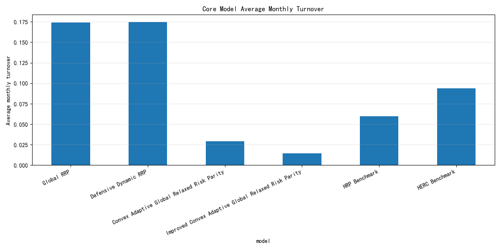

换手率图展示凸优化约束对组合可实施性和交易成本敏感性的影响。

#### CVaR / 尾部风险比较

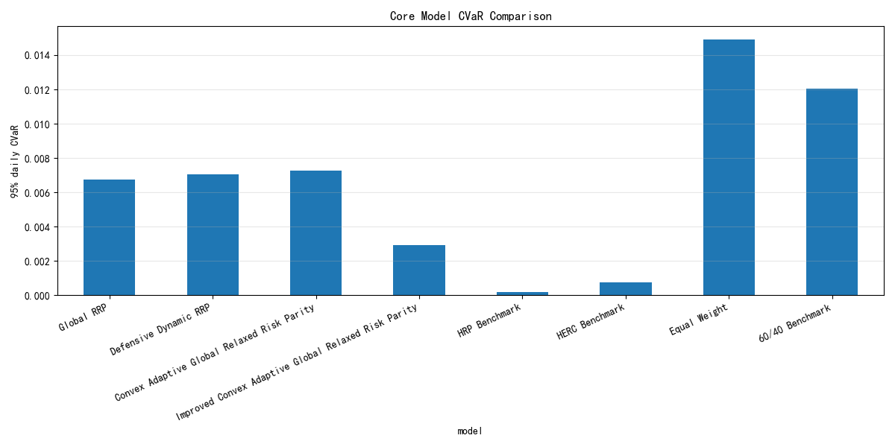

CVaR 图用于观察不同模型在尾部风险控制方面的差异。

### 鲁棒性测试

本仓库的鲁棒性测试不是单一检验，而是一组诊断层：子区间表现、交易成本敏感性、压力期表现、参数扰动、无前视审计、求解器稳定性、block bootstrap、过拟合诊断，以及协方差估计敏感性。它们共同用于验证结论是否依赖特定样本、成本假设、参数设定、求解器状态或风险估计方法；不用于重新调参、重新排序或替换主绩效表。

协方差估计稳健性是其中的一个子项，覆盖样本协方差、Ledoit-Wolf 收缩估计，以及 20、60、120 日半衰期的 EWMA 估计。它回答的是“模型结果是否过度依赖某一种协方差估计方法”。

主要鲁棒性输出包括 `results/tables/robustness_overall_summary.csv`、`results/tables/robustness_subperiod_summary.csv`、`results/tables/robustness_transaction_cost_summary.csv`、`results/tables/robustness_stress_period_summary.csv`、`results/tables/robustness_parameter_perturbation.csv`、`results/tables/robustness_no_lookahead_audit.csv`、`results/tables/robustness_solver_stability.csv`、`results/tables/robustness_block_bootstrap_summary.csv`、`results/tables/robustness_overfitting_diagnostic.csv`，以及新增的 `results/tables/covariance_robustness_summary.csv` 和 `results/tables/covariance_estimator_diagnostics.csv`。

#### 子区间与交易成本

子区间图用于观察模型在不同市场阶段的 Sharpe 和回撤稳定性；交易成本图用于检验净收益对成本假设的敏感性。

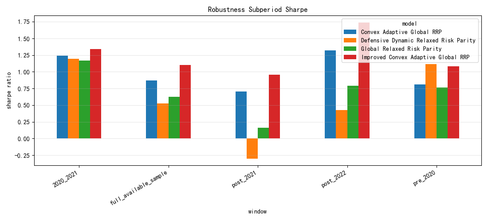
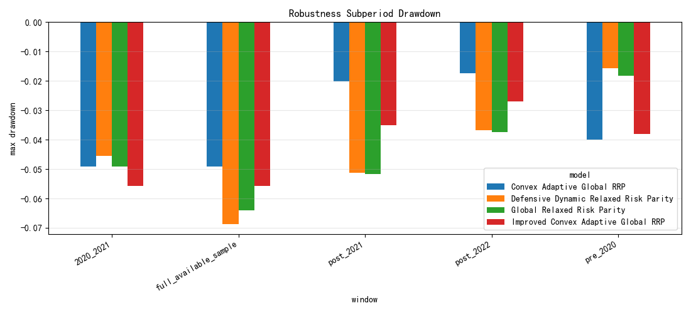
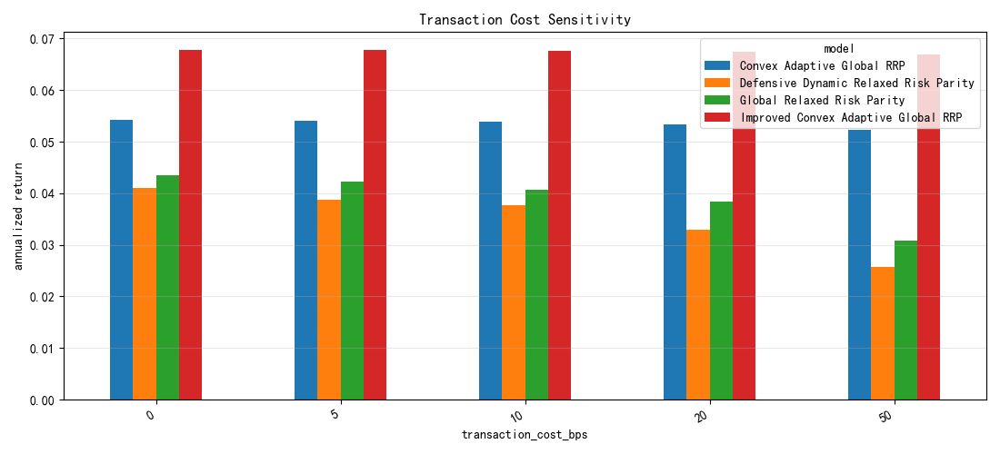

#### 压力期、参数与协方差

压力期图用于比较极端市场阶段的表现；参数敏感性和协方差对比用于检查模型是否过度依赖单一参数或单一风险估计设定。

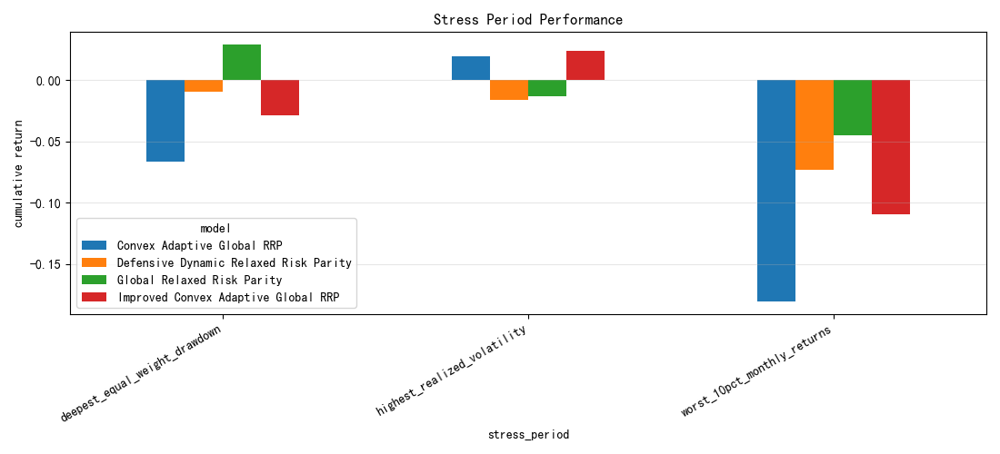
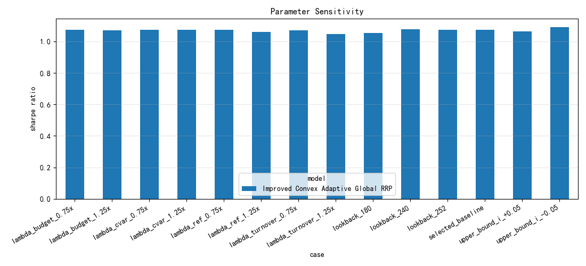
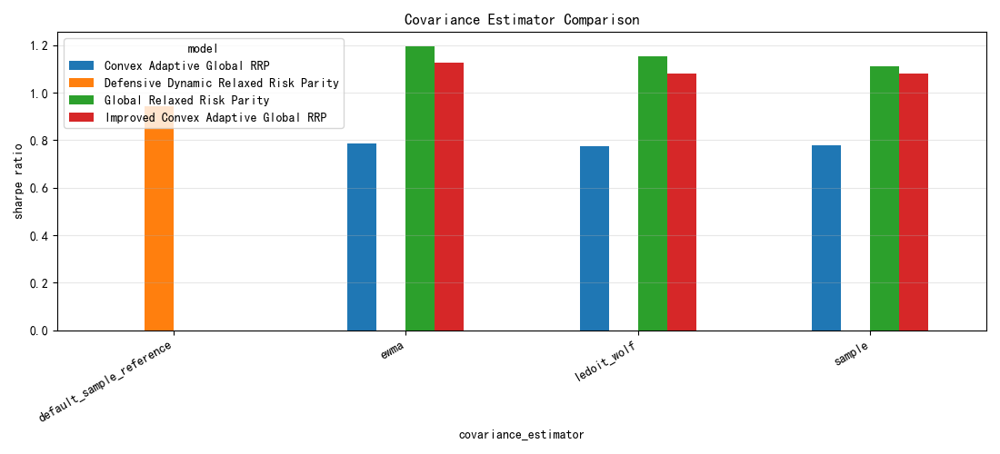

#### Bootstrap、过拟合与协方差估计器

Bootstrap 和过拟合诊断用于评估样本不确定性与选择偏误；新增协方差估计器图进一步比较样本协方差、Ledoit-Wolf 和不同 EWMA 半衰期下的 Sharpe、回撤与换手。

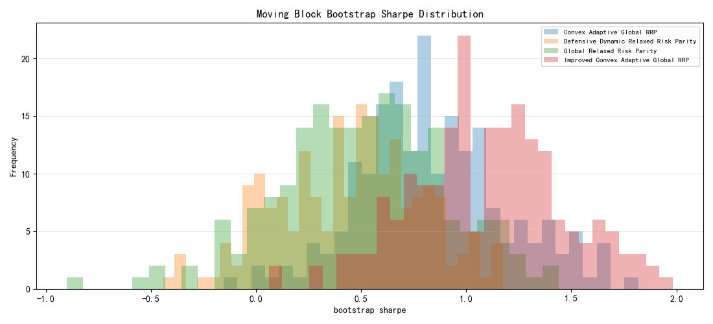
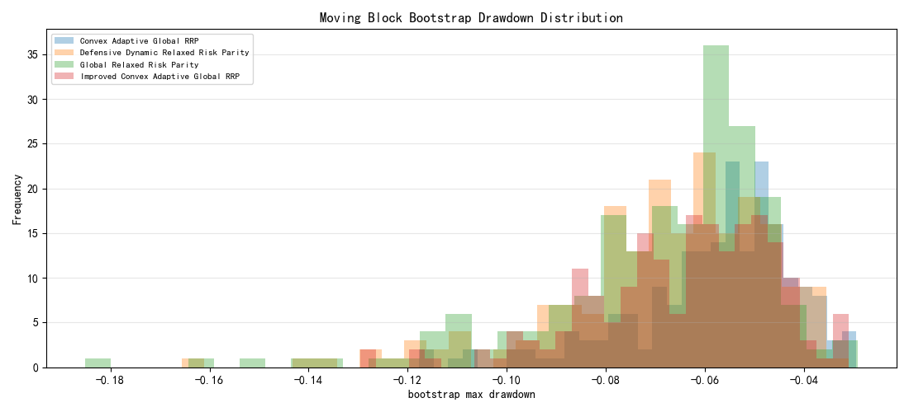
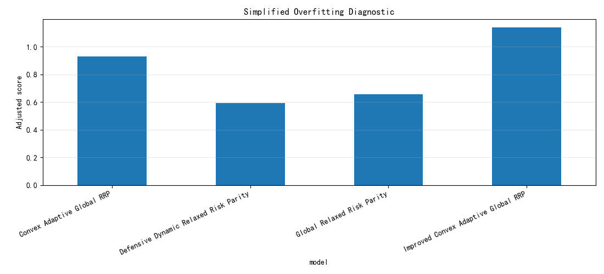
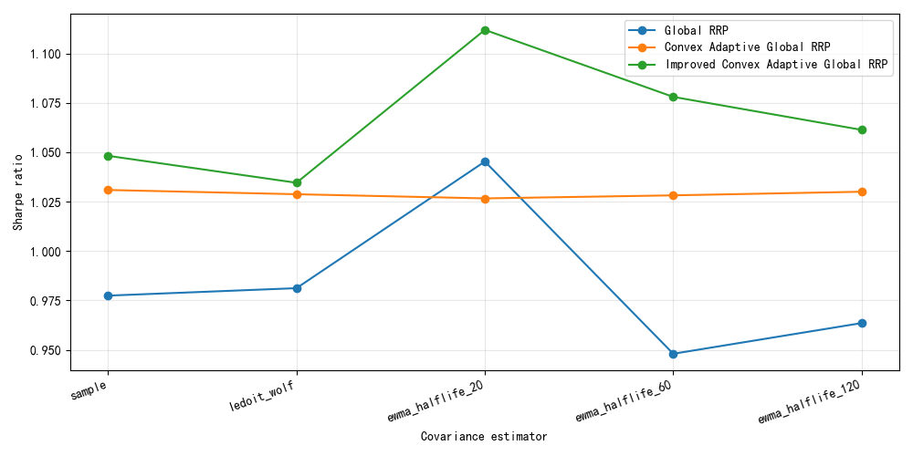
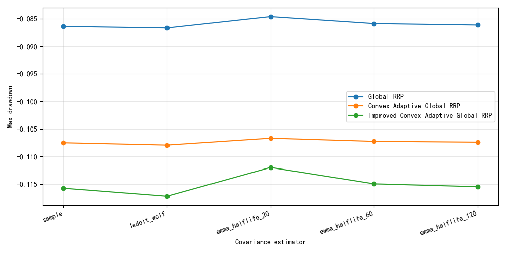
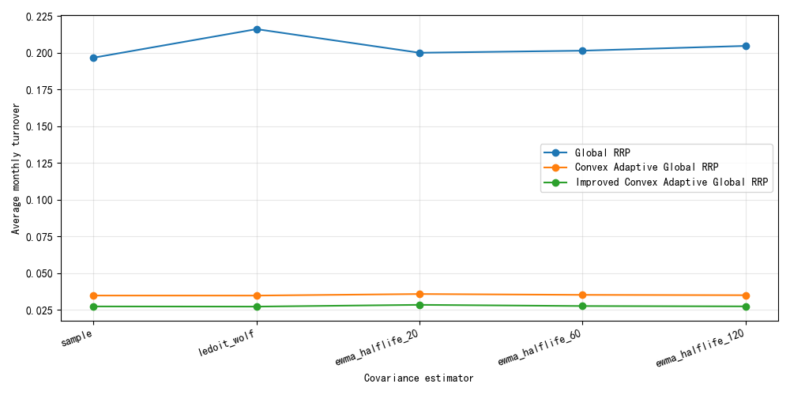

### 验证框架与结果

关于未来函数、候选参数筛选和研究过拟合风险，见 [`docs/OVERFITTING_AUDIT.md`](docs/OVERFITTING_AUDIT.md)。

该验证层围绕现有 Convex Adaptive Global RRP 与 Improved Convex Adaptive Global RRP 研究线展开，只做样本外诊断与参数敏感性检查，不替换主模型、不使用测试窗口重新调参。Walk-forward 与 nested split 将候选参数选择限制在训练 / 验证窗口，随后才报告未见测试窗口表现；CSCV/PBO 用于估计候选选择偏差；Frozen OOS 默认从 `2025-01-01` 后第一个可交易日开始，若该时期已在前期研究中被观察过，则应解释为 pseudo-frozen；参数敏感性只做单因素扰动诊断。

已实现脚本：

```bash
python scripts/run_walkforward_validation.py
python scripts/run_nested_validation.py
python scripts/run_cscv_pbo.py
python scripts/run_frozen_oos_validation.py --frozen-start 2025-01-01
python scripts/run_parameter_sensitivity.py
```

已执行验证运行：

- `python scripts/run_cscv_pbo.py --max-candidates 4 --num-blocks 6 --max-combinations 6`
  - 运行类型：intermediate validation
  - 结果解读：这是一个有意义的 CSCV/PBO 诊断运行，但由于候选数与组合数被限制，它只提供 intermediate validation evidence，不能当作 formal full validation。
  - 仍需保留的表述：candidate-selection overfitting risk remains；PBO is a diagnostic, not proof；不能声称 "no overfitting" 或 "fully validated"。
- `python scripts/run_frozen_oos_validation.py`
  - 运行类型：formal（但如果 2025+ 区间在开发时已被观察过，则应按 pseudo-frozen 解读）
  - 结果解读：这是一个冻结样本外区间报告，但其结论强度取决于该时期是否真正未被开发过程接触过。

对 Improved Convex Adaptive Global RRP 的定位：除非后续 formal validation 结果足够强，否则仍应披露为受约束的研究细化版本，而不是已经完成冻结样本外验证的最终结论。

#### 验证结果

##### CSCV/PBO 诊断结果

| 指标 | 值 |
|---|---|
| 验证类型 | intermediate |
| 候选数 | 4 |
| 块数 | 6 |
| 分割数 | 6 |
| 评估区间 | 2021-01-01 至 2026-04-30 |
| PBO | 0.3333 |
| Median Logit Rank | 0.6931 |
| Mean Relative Rank | 0.5833 |
| 选择规则 | 每分割下 IS 得分最高的候选 |
| 限制 | PBO is a diagnostic, not proof |

##### Frozen OOS 结果

| 指标 | 值 |
|---|---|
| 验证类型 | formal（pseudo-frozen） |
| 请求冻结起点 | 2025-01-01 |
| 实际测试起点 | 2025-01-02 |
| 测试终点 | 2026-04-30 |
| 入选候选 | candidate_07 |
| Test Net Annual Return | 10.74% |
| Test Sharpe | 1.81 |
| Test Max Drawdown | -4.27% |
| Test Total Return | 14.38% |
| 限制 | 若该区间在开发期间已被观察则为 pseudo-frozen |

| 输出文件 | 说明 |
|---|---|
| [`results/tables/cscv_pbo_results.csv`](results/tables/cscv_pbo_results.csv) | 本次执行的 CSCV/PBO split-level 结果，包含运行类型与范围元数据 |
| [`results/tables/cscv_pbo_summary.csv`](results/tables/cscv_pbo_summary.csv) | 本次执行的 CSCV/PBO 汇总，包含 PBO、块数、分割数、候选数、选择规则与限制说明 |
| [`results/tables/frozen_oos_validation.csv`](results/tables/frozen_oos_validation.csv) | 本次执行的 frozen OOS 区间表现，包含运行类型、冻结起点与候选元数据 |
| [`results/tables/frozen_oos_validation_notes.csv`](results/tables/frozen_oos_validation_notes.csv) | 本次执行的 frozen OOS 解释限制 |
| [`results/tables/walkforward_validation.csv`](results/tables/walkforward_validation.csv) | 已实现的 walk-forward 分割级结果 |
| [`results/tables/walkforward_validation_summary.csv`](results/tables/walkforward_validation_summary.csv) | 已实现的 walk-forward 指标汇总 |
| [`results/tables/nested_validation.csv`](results/tables/nested_validation.csv) | 已实现的 nested train/validation/test 结果 |
| [`results/tables/nested_validation_summary.csv`](results/tables/nested_validation_summary.csv) | 已实现的 nested 验证到测试衰减汇总 |
| [`results/tables/parameter_sensitivity.csv`](results/tables/parameter_sensitivity.csv) | 已实现的单因素参数扰动明细 |
| [`results/tables/parameter_sensitivity_summary.csv`](results/tables/parameter_sensitivity_summary.csv) | 已实现的参数稳健性 / 脆弱性汇总 |

### 输出与报告

| 文件 | 内容 |
|---|---|
| `results/tables/convex_adaptive_performance_summary.csv` | 凸自适应模型绩效汇总 |
| `results/tables/convex_adaptive_improvement_candidates.csv` | 改进候选参数审计 |
| `results/tables/walkforward_validation.csv` | 初步 walk-forward 验证输出 |
| `results/tables/showcase_performance_summary.csv` | 展示模型绩效汇总 |
| `results/tables/convex_adaptive_transaction_cost_summary.csv` | 交易成本敏感性结果 |
| `results/tables/convex_adaptive_solver_diagnostics.csv` | 凸优化求解诊断 |
| `results/tables/asset_graph_diagnostics.csv` | 资产图诊断 |
| `results/tables/online_regime_diagnostics.csv` | 在线状态识别诊断 |
| `results/tables/robustness_overall_summary.csv` | 综合鲁棒性结论 |
| `results/tables/robustness_subperiod_summary.csv` | 子区间鲁棒性 |
| `results/tables/robustness_transaction_cost_summary.csv` | 交易成本敏感性 |
| `results/tables/robustness_stress_period_summary.csv` | 压力期表现 |
| `results/tables/robustness_parameter_perturbation.csv` | 参数扰动测试 |
| `results/tables/robustness_no_lookahead_audit.csv` | 无前视审计 |
| `results/tables/robustness_solver_stability.csv` | 求解器稳定性 |
| `results/tables/robustness_block_bootstrap_summary.csv` | Block bootstrap 稳健性 |
| `results/tables/robustness_overfitting_diagnostic.csv` | 过拟合诊断 |
| `results/tables/covariance_robustness_summary.csv` | 协方差估计鲁棒性汇总 |
| `results/tables/covariance_estimator_diagnostics.csv` | 协方差估计诊断 |
| `report/asset_pricing_interpretation.md` | 资产定价解释 |
| `report/methodology_notes.md` | 方法论说明 |
| `report/insurance_allocation_perspective.md` | 保险资金配置视角 |
| `report/thesis_figures_and_tables.md` | 论文图表索引 |
| `docs/OVERFITTING_AUDIT.md` | 过拟合审计与验证路线 |

### 复现命令

```bash
python scripts/update_etf_data.py
python scripts/run_rrp_pipeline.py --mode full
python scripts/optimize_showcase_rrp.py
python scripts/run_hrp_comparison.py
python scripts/run_convex_adaptive_rrp.py
python scripts/run_walkforward_validation.py
python scripts/run_benchmark_suite.py
python scripts/run_covariance_robustness.py --quick
python scripts/run_full_research_pipeline.py --quick
python -m pytest
```

<a id="en"></a>

## English

### Project Overview

This repository is a thesis-oriented global multi-asset allocation research project built around Relaxed Risk Parity, global asset extension, convex approximation, CVaR tail-risk control, turnover constraints, and robustness validation. It is not a short-term trading strategy repository; the emphasis is long-term institutional and insurance-style allocation interpretation.

Final portfolio weights are generated by transparent optimization. Machine learning, graph, and regime modules are used as diagnostics or constraint inputs; they do not directly generate portfolio weights.

### Research Framework

| Model / Module | Public Label | Research Role |
|---|---|---|
| Classical risk parity | Standard Risk Parity | Baseline risk-budgeting reference |
| Local relaxed risk parity | Local Relaxed Risk Parity | Relaxed risk parity in the local asset universe |
| Global relaxed risk parity | Global RRP | Main return-efficient showcase model |
| Defensive dynamic relaxed risk parity | Defensive Dynamic RRP | Defensive risk-overlay experiment, not the main return-maximizing model |
| Convex adaptive global relaxed risk parity | Convex Adaptive Global RRP | Convexified relaxed risk-budgeting approximation |
| Improved convex adaptive global relaxed risk parity | Improved Convex Adaptive Global RRP | Implementable convex refinement emphasizing low turnover, CVaR control, and stable allocation |
| Hierarchical risk parity | HRP Benchmark | Hierarchical risk-allocation benchmark |
| Hierarchical equal risk contribution | HERC Benchmark | Hierarchical risk-allocation benchmark |

In model hierarchy, Global RRP, Defensive Dynamic RRP, and Convex Adaptive Global RRP are the current baseline / primary model group. Improved Convex Adaptive Global RRP is a research extension that illustrates a constrained parameter refinement toward implementable low-turnover allocation.

### Data And Method

| Item | Description |
|---|---|
| Price cache | `data/processed/etf_prices_updated.csv` |
| Asset map | `data/processed/etf_asset_mapping.csv` |
| Data range | `2018-01-02` to `2026-04-30` |
| Evaluation start | `2021-01-01` |
| Rebalancing | Monthly |
| Transaction cost | Default 3 bps, with gross and net return separated |

At each monthly rebalance, the optimizer uses only ETFs with sufficient point-in-time history. Not-yet-listed or history-insufficient ETFs are excluded from optimization. Historical results do not imply future performance.

### Core Optimization Forms

**Point-in-time rebalance inputs.** Each rebalance uses only observations available before the rebalance date.

$$
R_t = {r_s | s < t, s in H_t}
$$

$$
I_t = {i | A_i,t = 1, O_i,t ≥ O_min}
$$

$$
μ_t = mean(R_t) × N_trading,    Σ_t = Cov(R_t) × N_trading
$$

Here, `H_t` is the trailing lookback window, `A_i,t` is the tradability flag, and `O_i,t` is the available observation count.

**Global RRP.** This model keeps the risk-budgeting structure while adding a return target and relaxed risk-parity constraints.

$$
minimize ψ - γ over x, ζ, ψ, γ, ρ
$$

Constraints:

$$
ζ = Σ_t x
$$

$$
Σ_i x_i = 1,  x_i ≥ 0
$$

$$
x_i ζ_i ≥ γ²
$$

$$
ρ² ≥ λ_pen · xᵀΘ_t x
$$

$$
n(ψ² - ρ²) ≥ xᵀΣ_t x
$$

$$
μ_tᵀx ≥ m · max(μ_bar,t, 0)
$$

**Bounded bond leverage.** Bond assets may use bounded leverage, while non-bond assets remain at one-times exposure.

$$
w_i = x_i · lev_i
$$

$$
1 ≤ lev_i ≤ lev_max for i in B
$$

$$
lev_i = 1 for i not in B
$$

**Convex Adaptive Global RRP.** This layer is a convexified relaxed risk-budgeting approximation with turnover, CVaR, asset-cap, and group constraints.

$$
min_w J(w)
$$

$$
J(w) = J_var + J_budget + J_turnover + J_CVaR - J_return
$$

$$
J_var = λ_var · wᵀΣ_t w
$$

$$
J_budget = λ_budget · ||w - b_t||₂²
$$

$$
J_turnover = λ_turnover · ||w - w_(t-1)||₁
$$

$$
J_CVaR = λ_cvar · CVaR_α(-R_t w)
$$

$$
J_return = λ_return · μ_tᵀw
$$

Constraints: weights sum to 1, `0≤w_i≤u_i`; group exposure satisfies `L_g≤Σ_{i∈g}w_i≤U_g`; turnover satisfies `||w-w_(t-1)||_1≤τ`.

**CVaR tail loss.** The CVaR term penalizes historical tail losses in the trailing window; it is not a future-return forecast.

$$
CVaR_α(L) = min over η of [η + 1 / ((1 - α)T) · Σ_t max(L_t - η, 0)]
$$

$$
L_t = -r_tᵀw
$$

**Covariance-estimator robustness.** This layer is a sensitivity diagnostic and does not change the main model ranking.

$$
Σ_sample = Cov(R_t)
$$

$$
Σ_LW = δF + (1 - δ)Σ_sample
$$

$$
Σ_EWMA = EWCov(R_t, h),  h in {20, 60, 120}
$$

**HRP/HERC benchmarks.** Hierarchical models are benchmark allocations based on correlation clustering and recursive allocation.

$$
R_t → (Σ_t, Corr_t) → C_t → q_t → w_benchmark
$$

Here, `C_t` denotes the hierarchical clustering tree and `q_t` denotes recursive allocation.

### ETF Asset Pool

The asset universe represents major risk sources through tradable ETFs, including bonds, China equities, Hong Kong equities, global equities, and commodities. Some original indices or continuous futures series are replaced with tradable ETFs to keep the backtest aligned with implementable portfolio construction.

| ETF | Ticker | Asset Class | Allocation Role |
|---|---|---|---|
| Short-Term Financing ETF | 511360.SH | Short-duration credit | Defensive bond and liquidity allocation |
| Convertible Bond ETF | 511380.SH | Convertible bond | Hybrid equity-bond convexity exposure |
| CSI 300 ETF | 510300.SH | China equity | Core China large-cap exposure |
| CSI 1000 ETF | 512100.SH | China equity | China small-cap and growth exposure |
| STAR 50 ETF | 588000.SH | China equity | STAR Market growth exposure |
| Dividend ETF | 510880.SH | China equity dividend | High-dividend and value-style exposure |
| Shanghai Composite ETF | 510210.SH | China equity | Broad A-share market exposure |
| Hang Seng ETF | 159920.SZ | Hong Kong equity | Hong Kong equity market exposure |
| Hang Seng Tech ETF | 513180.SH | Hong Kong technology | Hong Kong technology growth exposure |
| Nasdaq ETF | 159941.SZ | Global equity | U.S. technology and growth equity exposure |
| S&P 500 ETF | 513500.SH | Global equity | U.S. large-cap equity exposure |
| Nikkei 225 ETF | 513880.SH | Global equity | Japan equity market exposure |
| Gold ETF | 518880.SH | Commodity | Precious-metal and defensive asset exposure |
| Non-Ferrous Metals ETF | 159980.SZ | Commodity / resources | Metals and resource-cycle exposure |
| Soybean Meal ETF | 159985.SZ | Commodity | Agricultural commodity exposure |

### Latest Performance Dashboard

Core model results:

| Model | Net Annual Return | Sharpe | Max Drawdown | Calmar | Avg Monthly Turnover |
|---|---:|---:|---:|---:|---:|
| Global RRP | 5.90% | 1.15 | -4.38% | 1.35 | 22.45% |
| Defensive Dynamic RRP | 3.88% | 0.48 | -6.51% | 0.60 | 20.22% |
| Convex Adaptive Global RRP | 5.36% | 0.58 | -8.15% | 0.66 | 1.03% |
| Improved Convex Adaptive Global RRP | 6.45% | 0.96 | -4.98% | 1.30 | 0.52% |

Benchmark results:

| Benchmark | Net Annual Return | Sharpe | Max Drawdown | Calmar | Avg Monthly Turnover |
|---|---:|---:|---:|---:|---:|
| HRP Benchmark | -0.12% | -6.36 | -0.73% | -0.16 | 1.56% |
| HERC Benchmark | -0.10% | -6.30 | -0.73% | -0.14 | 1.60% |

Global RRP remains the main return-efficient global multi-asset model. Improved Convex Adaptive Global RRP achieves a competitive risk-return profile while reducing average monthly turnover to 0.52%, highlighting the value of convex constraints for implementable, low-turnover portfolio construction. HRP/HERC are included only as hierarchical risk-allocation benchmarks; in the current asset universe, correlation clustering and recursive allocation alone are insufficient to replace the Global RRP and Convex Adaptive RRP framework.

Important caveat: Improved Convex Adaptive Global RRP is a constrained in-sample parameter-refinement research extension selected from candidate settings using historical evaluation metrics. It should not be interpreted as a completed frozen out-of-sample result.

### Key Findings

The central implementation conclusion is that final portfolio weights should come from transparent optimization rather than directly from machine-learning, graph-feature, or regime modules. Global RRP is the main return-efficient showcase model; Improved Convex Adaptive Global RRP is the implementable convex refinement emphasizing low turnover, CVaR-aware tail-risk control, and stable allocation; Defensive Dynamic RRP is best interpreted as a defensive risk-overlay experiment.

The current evidence suggests that convex constraints, turnover control, and CVaR penalties move the framework from return demonstration toward implementable portfolio construction. HRP/HERC remain useful hierarchical benchmarks, but in the current ETF universe they do not replace the Global RRP and Convex Adaptive RRP framework. Robustness, transaction-cost, subperiod, and covariance-estimation tests are validation layers only, not model-selection or ranking engines.

### Figures

#### NAV Curve


The NAV curve compares the cumulative performance of Global RRP, Convex Adaptive Global RRP, and Improved Convex Adaptive Global RRP.

#### Drawdown Curve


The drawdown curve compares model risk control during stressed periods.

#### Turnover Comparison


The turnover chart shows how convex optimization constraints affect implementability and transaction-cost sensitivity.

#### CVaR / Tail-Risk Comparison


The CVaR chart helps compare tail-risk control across models.

### Robustness Tests

Robustness testing in this repository is a diagnostic stack, not a single check. It includes subperiod performance, transaction-cost sensitivity, stress-period performance, parameter perturbation, no-lookahead audit, solver stability, block bootstrap, overfitting diagnostics, and covariance-estimator sensitivity. These tests validate whether conclusions depend on a specific sample, cost assumption, parameter setting, solver state, or risk-estimation method; they do not retune, rerank, or replace the main performance table.

Covariance robustness is one subtest within that stack. It tests sample covariance, Ledoit-Wolf shrinkage, and EWMA estimates with 20-, 60-, and 120-day halflives to check whether conclusions are overly dependent on one covariance estimator.

#### Subperiods And Transaction Costs

Subperiod figures show Sharpe and drawdown stability across market windows. The transaction-cost chart checks whether net performance is sensitive to cost assumptions.


#### Stress, Parameters, And Covariance

Stress-period results compare behavior in difficult market windows. Parameter sensitivity and covariance comparison figures check whether conclusions rely on one parameter or one risk-estimation setup.


#### Bootstrap, Overfitting, And Estimators

Bootstrap and overfitting diagnostics assess sample uncertainty and selection bias. The added covariance-estimator figures compare sample covariance, Ledoit-Wolf, and EWMA halflife variants on Sharpe, drawdown, and turnover.


### Validation Framework and Results

For the look-ahead, candidate-selection, and research-overfitting audit, see [`docs/OVERFITTING_AUDIT.md`](docs/OVERFITTING_AUDIT.md).

This validation layer is additive to the existing Convex Adaptive Global RRP stack. It does not replace the main models and does not use test-window results for candidate selection. Walk-forward and nested validation select candidates only on declared training/validation windows before reporting unseen test windows. CSCV/PBO is a diagnostic estimate of selection bias, not proof of future performance. Frozen OOS defaults to the first trading day on or after `2025-01-01`; if 2025+ data was already visible in prior research, it should be read as pseudo-frozen. Parameter sensitivity is one-at-a-time validation, not retuning.

Implemented scripts:

```bash
python scripts/run_walkforward_validation.py
python scripts/run_nested_validation.py
python scripts/run_cscv_pbo.py
python scripts/run_frozen_oos_validation.py --frozen-start 2025-01-01
python scripts/run_parameter_sensitivity.py
```

Executed validation runs:

- `python scripts/run_cscv_pbo.py --max-candidates 4 --num-blocks 6 --max-combinations 6`
  - Validation type: intermediate validation
  - Interpretation: this is meaningful CSCV/PBO diagnostic evidence, but with reduced candidates and capped combinations it is intermediate, not formal full validation.
  - Guardrails: candidate-selection overfitting risk remains; PBO is a diagnostic, not proof.
- `python scripts/run_frozen_oos_validation.py`
  - Validation type: formal (but pseudo-frozen if 2025+ was observed during development)
  - Interpretation: this is a frozen OOS period report; its strength depends on whether the period was genuinely untouched.

Improved Convex Adaptive Global RRP should continue to be disclosed as a constrained research refinement unless a future formal validation package supports a stronger public claim.

#### Validation Results

##### CSCV/PBO Diagnostic Results

| Metric | Value |
|---|---|
| Validation kind | intermediate |
| Candidates | 4 |
| Blocks | 6 |
| Splits | 6 |
| Evaluation range | 2021-01-01 to 2026-04-30 |
| PBO | 0.3333 |
| Median Logit Rank | 0.6931 |
| Mean Relative Rank | 0.5833 |
| Selection rule | highest IS-score candidate per split |
| Limitation | PBO is a diagnostic, not proof |

##### Frozen OOS Results

| Metric | Value |
|---|---|
| Validation kind | formal (pseudo-frozen) |
| Requested frozen start | 2025-01-01 |
| Actual test start | 2025-01-02 |
| Test end | 2026-04-30 |
| Selected candidate | candidate_07 |
| Test Net Annual Return | 10.74% |
| Test Sharpe | 1.81 |
| Test Max Drawdown | -4.27% |
| Test Total Return | 14.38% |
| Limitation | Pseudo-frozen if the period was already inspected during development |

| Output | Description |
|---|---|
| [`results/tables/cscv_pbo_results.csv`](results/tables/cscv_pbo_results.csv) | Executed CSCV/PBO split diagnostics with run metadata |
| [`results/tables/cscv_pbo_summary.csv`](results/tables/cscv_pbo_summary.csv) | Executed CSCV/PBO summary with PBO, block count, split count, candidate count, selection rule, and limitations |
| [`results/tables/frozen_oos_validation.csv`](results/tables/frozen_oos_validation.csv) | Executed frozen OOS period metrics with run metadata |
| [`results/tables/frozen_oos_validation_notes.csv`](results/tables/frozen_oos_validation_notes.csv) | Executed frozen OOS interpretation limits |
| [`results/tables/walkforward_validation.csv`](results/tables/walkforward_validation.csv) | Implemented walk-forward split-level test results |
| [`results/tables/walkforward_validation_summary.csv`](results/tables/walkforward_validation_summary.csv) | Implemented walk-forward metric summary |
| [`results/tables/nested_validation.csv`](results/tables/nested_validation.csv) | Implemented nested train/validation/test results |
| [`results/tables/nested_validation_summary.csv`](results/tables/nested_validation_summary.csv) | Implemented nested validation-to-test decay summary |
| [`results/tables/parameter_sensitivity.csv`](results/tables/parameter_sensitivity.csv) | Implemented one-at-a-time perturbation details |
| [`results/tables/parameter_sensitivity_summary.csv`](results/tables/parameter_sensitivity_summary.csv) | Implemented parameter robustness / fragility summary |

### Outputs And Reports

| File | Content |
|---|---|
| `results/tables/convex_adaptive_performance_summary.csv` | Convex adaptive model performance summary |
| `results/tables/convex_adaptive_improvement_candidates.csv` | Improved candidate-parameter audit |
| `results/tables/walkforward_validation.csv` | Preliminary walk-forward validation output |
| `results/tables/showcase_performance_summary.csv` | Showcase model performance summary |
| `results/tables/convex_adaptive_transaction_cost_summary.csv` | Transaction-cost sensitivity results |
| `results/tables/convex_adaptive_solver_diagnostics.csv` | Convex solver diagnostics |
| `results/tables/asset_graph_diagnostics.csv` | Asset graph diagnostics |
| `results/tables/online_regime_diagnostics.csv` | Online regime diagnostics |
| `results/tables/robustness_overall_summary.csv` | Overall robustness summary |
| `results/tables/robustness_subperiod_summary.csv` | Subperiod robustness |
| `results/tables/robustness_transaction_cost_summary.csv` | Transaction-cost sensitivity |
| `results/tables/robustness_stress_period_summary.csv` | Stress-period performance |
| `results/tables/robustness_parameter_perturbation.csv` | Parameter perturbation |
| `results/tables/robustness_no_lookahead_audit.csv` | No-lookahead audit |
| `results/tables/robustness_solver_stability.csv` | Solver stability |
| `results/tables/robustness_block_bootstrap_summary.csv` | Block-bootstrap robustness |
| `results/tables/robustness_overfitting_diagnostic.csv` | Overfitting diagnostics |
| `results/tables/covariance_robustness_summary.csv` | Covariance-estimator robustness summary, with annualized volatility and daily CVaR clearly separated |
| `results/tables/covariance_estimator_diagnostics.csv` | Covariance diagnostics covering PSD repair, condition number, fallback, and point-in-time flags |
| `report/asset_pricing_interpretation.md` | Asset-pricing interpretation |
| `report/methodology_notes.md` | Methodology notes |
| `report/insurance_allocation_perspective.md` | Insurance allocation perspective |
| `report/thesis_figures_and_tables.md` | Thesis figures and tables index |
| `docs/OVERFITTING_AUDIT.md` | Overfitting audit and validation roadmap |

### Reproduction Commands

```bash
python scripts/update_etf_data.py
python scripts/run_rrp_pipeline.py --mode full
python scripts/optimize_showcase_rrp.py
python scripts/run_hrp_comparison.py
python scripts/run_convex_adaptive_rrp.py
python scripts/run_walkforward_validation.py
python scripts/run_benchmark_suite.py
python scripts/run_covariance_robustness.py --quick
python scripts/run_full_research_pipeline.py --quick
python -m pytest
```

## License

MIT License.
