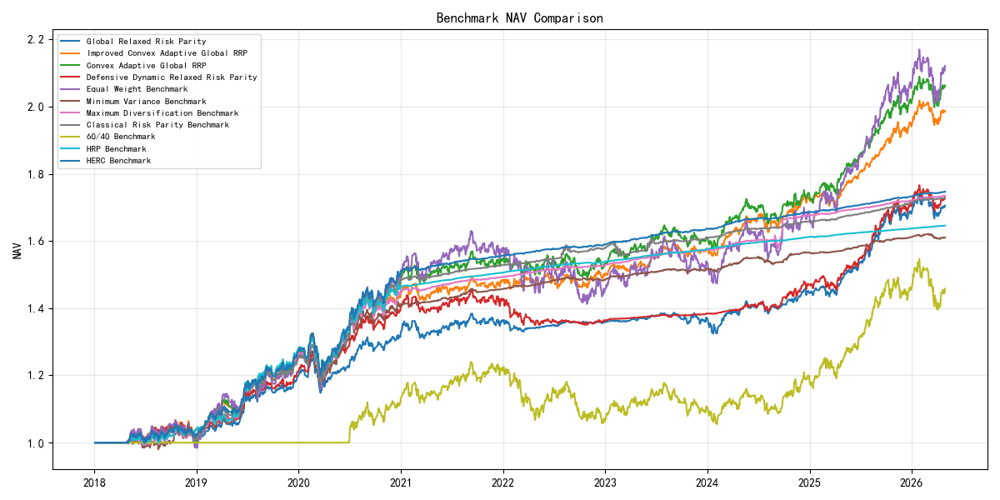

# 宽松风险平价全球资产配置框架 | Relaxed Risk Parity Framework for Global Asset Allocation

<p align="center">
  <a href="#zh"></a>
  <a href="#en"></a>
</p>

<a id="zh"></a>

## 中文

### 项目概览
本仓库是一个面向论文研究的全球多资产配置回测框架，核心问题是宽松风险平价在真实可交易 ETF 资产池中的应用。最终组合权重由透明优化流程生成；ML、图特征和状态识别模块只作为诊断或约束输入，不直接生成组合权重。

研究定位保持如下：

| 模型 | 定位 |
|---|---|
| Standard Risk Parity | 传统风险平价基准 |
| Local Relaxed Risk Parity | 本地资产池宽松风险平价 |
| Global RRP | 主要的收益效率展示模型 |
| Defensive Dynamic RRP | 防御型风险覆盖实验，不是主收益最大化模型 |
| Convex Adaptive Global RRP | 凸化的宽松风险预算近似 |
| Improved Convex Adaptive Global RRP | 低换手、CVaR 感知、可实施的凸优化改进 |
| HRP Benchmark / HERC Benchmark | 层次化风险配置基准 |

### ETF 资产池

| ETF 名称 | 代码 | 资产类别 | 经济暴露 | 替换原资产 | 替换原因 |
|---|---|---|---|---|---|
| 短融ETF | 511360.SH | 债券 | 短久期信用债 | 0-5中高信用票 | 用可交易 ETF 替代信用债指数 |
| 可转债ETF | 511380.SH | 债券 | 可转债 | 中证转债 | 用可交易 ETF 替代转债指数 |
| 沪深300ETF | 510300.SH | 股票 | A 股大盘 | 沪深300ETF | 保留可交易 ETF |
| 中证1000ETF | 512100.SH | 股票 | A 股小盘 | 中证1000ETF | 保留可交易 ETF |
| 科创50ETF | 588000.SH | 股票 | 科创板 | 科创50ETF | 保留可交易 ETF |
| 红利ETF | 510880.SH | 股票 | 高股息 | 红利ETF | 保留可交易 ETF |
| 上证指数ETF | 510210.SH | 股票 | 上证综指 | 上证指数ETF | 保留可交易 ETF |
| 恒生ETF | 159920.SZ | 股票 | 香港股票 | 恒生ETF | 保留可交易 ETF |
| 恒生科技ETF | 513180.SH | 股票 | 香港科技 | 恒生科技ETF | 保留可交易 ETF |
| 纳指ETF | 159941.SZ | 股票 | 纳斯达克 | 纳指ETF | 保留可交易 ETF |
| 标普500ETF | 513500.SH | 股票 | 标普500 | 标普500ETF | 保留可交易 ETF |
| 日经225ETF | 513880.SH | 股票 | 日本股票 | 日经225ETF | 保留可交易 ETF |
| 黄金ETF | 518880.SH | 商品 | 黄金 | 黄金ETF | 保留可交易 ETF |
| 有色ETF | 159980.SZ | 商品/资源 | 有色金属 | 有色ETF | 保留可交易 ETF |
| 豆粕ETF | 159985.SZ | 商品 | 豆粕 | 豆粕连续 | 用可交易 ETF 替代期货连续合约 |

### 数据更新
最新 ETF 价格文件为 `data/processed/etf_prices_updated.csv`，映射文件为 `data/processed/etf_asset_mapping.csv`。本次数据区间为 `2018-01-02` 至 `2026-04-30`。

数据更新脚本优先支持 Tushare `fund_daily` 与 `fund_adj`，通过环境变量 `TUSHARE_TOKEN` 读取授权，不提交任何真实 token。本次执行环境未设置 `TUSHARE_TOKEN`，因此使用 `yfinance` 作为无凭证 ETF 数据回退源完成刷新。价格在上市后才前向填充，不进行上市前 backward-fill；不可投资资产在再平衡时权重为 0。

### 回测方法
回测采用月度再平衡。每个再平衡日只使用当时已有足够历史观测的 ETF 估计信号、协方差和权重；尚未上市或历史不足的 ETF 不参与优化。交易成本默认为 3 bps，结果区分 gross 与 net return。历史结果不代表未来表现。

### 最新结果
以下结果来自重新生成的 `results/tables/convex_adaptive_performance_summary.csv`，评估起点为 `2021-01-01`。

| Model | Net Annual Return | Sharpe | Max Drawdown | Calmar | Avg Monthly Turnover |
|---|---:|---:|---:|---:|---:|
| Global RRP | 4.74% | 0.63 | -4.49% | 1.05 | 21.33% |
| Defensive Dynamic RRP | 4.06% | 0.47 | -7.22% | 0.56 | 17.53% |
| Convex Adaptive Global RRP | 6.26% | 0.75 | -5.04% | 1.24 | 0.90% |
| Improved Convex Adaptive Global RRP | 6.11% | 0.89 | -3.62% | 1.69 | 1.63% |

| Benchmark | Net Annual Return | Sharpe | Max Drawdown | Calmar | Avg Monthly Turnover |
|---|---:|---:|---:|---:|---:|
| HRP Benchmark | 2.22% | 1.54 | -0.25% | 8.79 | 0.09% |
| HERC Benchmark | 2.77% | 1.38 | -0.66% | 4.19 | 1.61% |

Global RRP remains the main return-efficient RRP showcase. Improved Convex Adaptive Global RRP emphasizes implementability, low turnover, CVaR tail-risk control, and stable allocation.

### 图表




### 复现
```bash
python scripts/update_etf_data.py
python scripts/run_rrp_pipeline.py --mode full
python scripts/optimize_showcase_rrp.py
python scripts/run_hrp_comparison.py
python scripts/run_convex_adaptive_rrp.py
python scripts/run_benchmark_suite.py
python scripts/run_full_research_pipeline.py --quick
python -m pytest
```

### 变更记录
- 将 `0-5中高信用票`、`中证转债`、`豆粕连续` 替换为可交易 ETF。
- 新增 ETF 资产映射与数据刷新脚本。
- 修正上市前缺失值处理和再平衡时的可投资资产筛选。
- 重新生成核心结果、benchmark 结果和主要图表。

<a id="en"></a>

## English

### Project Overview
This repository is a thesis-oriented global multi-asset allocation backtest for Relaxed Risk Parity on tradable ETFs. Final portfolio weights are generated by transparent optimization. ML, graph, and regime modules are diagnostic or constraint inputs; they do not directly generate portfolio weights.

### Data And Method
The current ETF price cache is `data/processed/etf_prices_updated.csv`; the asset map is `data/processed/etf_asset_mapping.csv`. The refreshed data run covers `2018-01-02` to `2026-04-30`.

The update script supports Tushare `fund_daily` plus `fund_adj` through the `TUSHARE_TOKEN` environment variable. Because no token was available in this execution environment, the refreshed cache was generated with the script's `yfinance` fallback. Prices are forward-filled only after listing, never backward-filled before listing. At each monthly rebalance, optimization uses only ETFs with sufficient point-in-time history; non-investable ETFs receive zero weight.

### Latest Results
Generated from `results/tables/convex_adaptive_performance_summary.csv`, evaluated from `2021-01-01`.

| Model | Net Annual Return | Sharpe | Max Drawdown | Calmar | Avg Monthly Turnover |
|---|---:|---:|---:|---:|---:|
| Global RRP | 4.74% | 0.63 | -4.49% | 1.05 | 21.33% |
| Defensive Dynamic RRP | 4.06% | 0.47 | -7.22% | 0.56 | 17.53% |
| Convex Adaptive Global RRP | 6.26% | 0.75 | -5.04% | 1.24 | 0.90% |
| Improved Convex Adaptive Global RRP | 6.11% | 0.89 | -3.62% | 1.69 | 1.63% |
| HRP Benchmark | 2.22% | 1.54 | -0.25% | 8.79 | 0.09% |
| HERC Benchmark | 2.77% | 1.38 | -0.66% | 4.19 | 1.61% |

### Figures


### Reproducibility
```bash
python scripts/update_etf_data.py
python scripts/run_rrp_pipeline.py --mode full
python scripts/optimize_showcase_rrp.py
python scripts/run_hrp_comparison.py
python scripts/run_convex_adaptive_rrp.py
python scripts/run_benchmark_suite.py
python scripts/run_full_research_pipeline.py --quick
python -m pytest
```

## License
MIT License.
