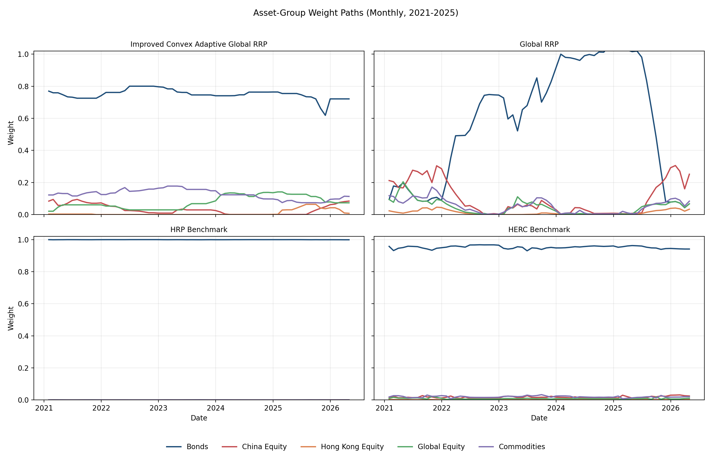

# 宽松风险平价在全球 ETF 资产配置中的改进与实证研究

> Improvements and Empirical Study of Relaxed Risk Parity in Global ETF Asset Allocation

<p align="center">
  <a href="#zh"></a>
  <a href="#en"></a>
  <a href="LICENSE"></a>
  <a href="src/convex_adaptive_rrp.py"></a>
</p>

<a id="zh"></a>

## 中文

### 目录

- [项目概览](#项目概览) · [本科论文初稿](#本科论文初稿) · [研究框架](#研究框架) · [数据与方法](#数据与方法) · [核心算法](#核心算法与优化形式) · [ETF 资产池](#etf-资产池) · [绩效看板](#最新绩效看板) · [图表展示](#图表展示) · [鲁棒性测试](#鲁棒性测试) · [验证框架与结果](#验证框架与结果) · [输出与报告](#输出与报告) · [复现命令](#复现命令)
- [English](#en) · [Overview](#project-overview) · [Thesis Draft](#thesis-draft) · [Research Framework](#research-framework) · [Data](#data-and-method) · [Core Optimization](#core-optimization-forms) · [ETF Pool](#etf-asset-pool) · [Performance](#latest-performance-dashboard) · [Figures](#figures) · [Robustness](#robustness-tests) · [Validation](#validation-framework-and-results) · [Outputs](#outputs-and-reports) · [Reproduction](#reproduction-commands)

### 项目概览

本仓库是一个面向论文研究的全球多资产配置框架，围绕宽松风险平价、全球资产扩展、凸优化近似、CVaR 尾部风险控制、换手约束和稳健性验证展开。项目目标不是短期交易信号，而是构建可解释、可复现、可实施的长期机构型资产配置研究流程。

最终组合权重由透明优化流程生成（核心优化器：[`src/convex_adaptive_rrp.py`](src/convex_adaptive_rrp.py)、[`src/backtest.py`](src/backtest.py)）。机器学习、图特征和状态识别模块仅作为诊断信息或约束输入，不直接生成组合权重。

### 本科论文初稿

论文初稿位于 [`report/thesis_latex/main.tex`](report/thesis_latex/main.tex)，采用西南财经大学本科毕业论文 LaTeX 模板（当前 45 页，47 条参考文献），题目为**宽松风险平价在全球 ETF 资产配置中的改进与实证研究**。论文共七章及附录，覆盖绪论、文献综述（5 节，47 篇文献）、理论框架（含协方差估计方法专节）、数据与研究设计、实证结果（含因子暴露与收益归因专节）、稳健性检验（含分块自助法专节）与结论，附录为主要评价指标定义汇总。Global RRP 是基础宽松风险预算展示模型，Improved Convex Adaptive Global RRP 是低换手、CVaR 约束可实施改进方案，Defensive Dynamic RRP 为绩效表中的补充对比模型，HRP/HERC 为层次化基准模型。

**章节结构**

论文共设七章及附录。第一章（绪论）阐明研究背景与意义，界定宽松风险平价的理论定位，概述研究问题与边际贡献。第二章（文献综述）分五节梳理均值-方差框架与估计误差、风险平价与宽松风险预算、CVaR 与交易成本、HRP/HERC 与国内实践，以及文献定位与切入点，共引用 47 篇文献。第三章（理论框架）推导标准风险平价目标函数、建立 Global RRP 与凸自适应近似的优化体系，并专设一节说明样本协方差、Ledoit-Wolf 收缩与 EWMA 三类协方差估计方法。第四章（数据与研究设计）描述 30 支 ETF 资产池构建、数据来源处理、换手率与交易成本定义、评价指标体系及无前视回测流程，包含资产描述性统计表。第五章（实证结果）比较各模型绩效、净值路径、回撤与换手，并专设因子暴露与收益归因一节（五因子回归 R²=0.895，商品/黄金收益贡献 43.2%，权益方差贡献 59.1%）及 CVaR 尾部风险分析。第六章（稳健性检验）涵盖子区间与压力期检验、CVaR 参数敏感性（12 变体，Sharpe 范围 1.08—1.16）、协方差估计与过拟合诊断（CSCV/PBO PBO=0.429），以及分块自助法检验（200 样本，块长 21 日，Improved Convex P5 Sharpe=0.510）。第七章（结论）总结四个研究问题的实证回答、研究局限，以及包含因子配置与机器学习方向的后续研究展望。附录为主要评价指标定义汇总。

**资产宇宙**

资产池包含 30 支境内外 ETF，覆盖七个类别：债券类（可转债 ETF、国债 ETF、信用债 ETF、日利 ETF）、A 股宽基与风格（沪深 300、中证 500、中证 1000、科创 50、红利）、中国科技与增长（半导体、人工智能、机器人、新能源、消费电子、通信、云计算）、中国行业与消费（证券、军工、消费）、港股（恒生、恒生科技）、全球股票（纳指、标普 500、日经 225、欧洲）和大宗商品（黄金、有色、豆粕、煤炭、原油）。数据使用 Tushare 复权后日频价格序列，时间范围自 2010-01-04 至 2026-04-30；有效评估期自 2019-01-01 起，月度再平衡，3 bps 单边交易成本，使用逐点时间宇宙过滤以避免前视。

**实证结果**

评估区间自 2019-01-01 至 2026-04-30，月度再平衡，3 bps 单边交易成本。最早的 ETF 上市于 2018-01-30，评估起点后移至 2019-01-01 以确保全部 30 支资产同步可投。各核心模型绩效如下（净年化收益已扣除交易成本）：

| 模型 | 净年化收益 | 年化波动率 | Sharpe | Sortino | 最大回撤 | Calmar | 月均换手率 |
|---|---|---|---|---|---|---|---|
| Improved Convex Adaptive Global RRP | **5.94%** | 2.73% | **1.511** | 2.243 | -3.74% | 1.588 | **3.28%** |
| Convex Adaptive Global RRP | 6.83% | 5.19% | 0.964 | 1.500 | -5.78% | 1.181 | 1.09% |
| Global RRP | 3.93% | 3.92% | 0.538 | 0.615 | -5.89% | 0.666 | 20.38% |
| Defensive Dynamic RRP | 3.71% | 3.99% | 0.473 | 0.536 | -6.34% | 0.584 | 18.86% |
| HERC Benchmark | 2.29% | 0.50% | 0.943 | 1.419 | -0.39% | 5.822 | 5.33% |
| HRP Benchmark | 1.68% | 0.18% | -0.780 | -1.230 | -0.08% | 20.675 | 0.94% |
| Equal Weight | 9.11% | 11.17% | 0.653 | 1.038 | -17.34% | 0.526 | 1.53% |
| 60/40 Benchmark | 6.82% | 9.07% | 0.551 | 0.879 | -17.93% | 0.380 | 1.66% |

- **Improved Convex Adaptive Global RRP** 是论文的低换手可实施改进方案。CVaR 约束与换手惩罚将月均换手率控制在 3.28%，在 5.94% 净年化收益下实现 Sharpe 1.511、Sortino 2.243、最大回撤 -3.74%，综合风险调整绩效最优。CVaR 参数敏感性分析（β ∈ {0.90, 0.95, 0.975, 0.99}，回望窗口 ∈ {126, 252, 504} 天）下均值 Sharpe 1.12，区间 1.08–1.16，参数稳健性强。
- **Convex Adaptive Global RRP** 月均换手率 1.09%，Sharpe 0.964，最大回撤 -5.78%，凸自适应近似保持稳健风险控制，净年化 6.83%。
- **Global RRP** 保留完整风险预算弹性，月均换手率 20.38%，净年化 3.93%，Sharpe 0.538。高换手率来源于基准宽松风险预算对月度市场状态变化的动态响应。
- **Defensive Dynamic RRP** 在 Global RRP 基础上叠加防御型风险覆盖层，换手率与 Global RRP 相近（18.86%），净年化 3.71%、Sharpe 0.473，防御设计以降低弹性为代价。
- **HERC** 层次化风险贡献基准，Sharpe 0.943，但极低波动率（0.50%）源于对债券类资产的高度集中，绝对收益受制于债券收益上限，月均换手 5.33%。
- **HRP** 层次化风险平价基准，净收益 1.68% 略低于无风险利率，Sharpe -0.780；极低波动率（0.18%）与近零最大回撤（-0.08%）表明其在本宇宙下高度集中于货币市场类 ETF，绝对风险控制能力强但无超额收益，月均换手 0.94%。
- **Equal Weight** 名义收益最高（9.11%），但最大回撤 -17.34%、Sharpe 0.653，风险调整后仍明显劣于改进凸模型。

**稳健性检验**

系统运行子区间分析（2021—2022、2023—2024）、交易成本敏感性扫描（0—15bps）、参数扰动、协方差矩阵稳健性（样本协方差、Ledoit-Wolf 收缩、DCC）、Bootstrap 分布、CSCV/PBO 过拟合验证（36 候选、35 块、PBO = 0.429）、CVaR 参数敏感性（β × 回望窗口共 12 变体，均值 Sharpe 1.12）、Walk-Forward 外推、Nested CV、Frozen OOS 和 Holdout 切片，形成多层次过拟合诊断与无前视证据体系。

LaTeX 模板资源位于 [`report/thesis_latex/thesisSWUFE.cls`](report/thesis_latex/thesisSWUFE.cls)、[`report/thesis_latex/fonts`](report/thesis_latex/fonts) 与 [`report/thesis_latex/swufe`](report/thesis_latex/swufe)，来源为 Marquis03/SWUFE-Thesis，并保留模板许可证文件。

主要复现命令：

```powershell
python scripts/run_rrp_pipeline.py --mode full
python scripts/run_convex_adaptive_rrp.py
python scripts/run_benchmark_suite.py
python scripts/run_robustness_tests.py
python scripts/run_walkforward_validation.py
python scripts/run_nested_validation.py
python scripts/run_cscv_pbo.py --max-candidates 4 --num-blocks 6 --max-combinations 6
python scripts/run_enhanced_cscv_pbo.py
python scripts/run_frozen_oos_validation.py
python scripts/run_holdout_validation.py
python scripts/run_parameter_sensitivity.py
python scripts/run_cvar_sensitivity.py
python scripts/run_extended_sample_robustness.py
python scripts/run_covariance_robustness.py
python scripts/run_asset_descriptive_statistics.py
python scripts/run_weight_path_diagnostics.py
```

PDF 编译命令：

```powershell
cd report/thesis_latex
latexmk -xelatex -interaction=nonstopmode main.tex
```

主要输出位于 [`results/tables`](results/tables) 与 [`results/figures`](results/figures)，其中 [`results/tables/asset_descriptive_statistics.csv`](results/tables/asset_descriptive_statistics.csv) 用于论文第四章资产描述性统计，[`results/tables/weight_path_stage_summary.csv`](results/tables/weight_path_stage_summary.csv) 与 [`results/figures/weight_path_asset_group_comparison.png`](results/figures/weight_path_asset_group_comparison.png) 用于论文第五章权重路径解释。CSCV/PBO 默认运行（4 候选、6 块、6 组合）为 intermediate validation evidence；增强版 CSCV/PBO（10 块、12 组合）提供额外诊断覆盖但仍有限。Frozen OOS 若 2025+ 区间已在开发中被观察过，应按 pseudo-frozen 条件性证据解读；回顾性 holdout 切片补充时间切片透明度。延长样本稳健性、CVaR 参数敏感性和模型治理文档（[`docs/MODEL_GOVERNANCE.md`](docs/MODEL_GOVERNANCE.md)）属于当前研究框架。所有回测结果均不代表未来收益保证。

### 研究框架

| 模型 / 模块 | 公开标签 | 研究定位 |
|---|---|---|
| 传统风险平价 | Standard Risk Parity | 基础风险预算参照 |
| 本地宽松风险平价 | Local Relaxed Risk Parity | 本地资产池中的宽松风险平价模型 |
| 全球宽松风险平价 | Global RRP | 主要的收益效率展示模型 |
| 防御型动态宽松风险平价 | Defensive Dynamic RRP | 防御型风险覆盖实验，不是主要收益最大化模型 |
| 凸自适应全球宽松风险平价 | Convex Adaptive Global RRP | 凸化的宽松风险预算近似 |
| 改进凸自适应全球宽松风险平价 | Improved Convex Adaptive Global RRP | 强调低换手、CVaR 尾部风险控制和可实施性的凸优化改进 |
| 层次风险平价基准 | HRP Benchmark | 层次化风险配置基准 |
| 层次等风险贡献基准 | HERC Benchmark | 层次化风险配置基准 |

模型层级上，Global RRP 是主要的收益效率展示模型；Convex Adaptive Global RRP 是凸化宽松风险预算近似；Improved Convex Adaptive Global RRP 是低换手、CVaR-aware、可实施约束下的改进方案；Defensive Dynamic RRP 是防御型风险覆盖实验。HRP/HERC 仅作为层次化风险配置基准。

核心源码：[`src/backtest.py`](src/backtest.py)（RRP 优化器与回测引擎）· [`src/convex_adaptive_rrp.py`](src/convex_adaptive_rrp.py)（凸自适应优化器）· [`src/validation.py`](src/validation.py)（验证库）· [`scripts/run_convex_adaptive_rrp.py`](scripts/run_convex_adaptive_rrp.py)（改进候选搜索）· [`scripts/run_hrp_comparison.py`](scripts/run_hrp_comparison.py)（HRP/HERC 基准）

### 数据与方法

| 项目 | 说明 |
|---|---|
| 价格数据 | [`data/processed/etf_prices_updated.csv`](data/processed/etf_prices_updated.csv) |
| 资产映射 | [`data/processed/etf_asset_mapping.csv`](data/processed/etf_asset_mapping.csv) |
| 数据区间 | `2018-01-30` 至 `2026-05-07` |
| 评估区间 | `2019-01-01` 至 `2026-05-07`（最早 ETF 上市 2018-01-30，评估起点后移至 2019-01-01 确保全部 30 支资产同步可投） |
| 再平衡频率 | 月度再平衡 |
| 交易成本 | 默认 3 bps 单边，并区分 gross return 与 net return |

每个再平衡日采用逐点时间宇宙过滤，只使用当时已具备足够历史观测的 ETF 估计信号、协方差和权重；尚未上市或历史不足的 ETF 不参与优化。历史结果不代表未来表现。

### 核心算法与优化形式

**Point-in-time 再平衡输入。** 每个再平衡日只使用该日期之前的历史窗口，避免未来信息泄露。

$$
R_t = {r_s | s < t, s in H_t}
$$

$$
I_t = {i | A_i,t = 1, O_i,t ≥ O_min}
$$

$$
μ_t = mean(R_t) × N_trading,    Σ_t = Cov(R_t) × N_trading
$$

其中，`H_t` 为回看窗口，`A_i,t` 表示资产在 `t` 时点可交易，`O_i,t` 为可用历史观测数。

**Global RRP。** 该模型保留风险预算思想，同时加入收益目标和宽松风险平价约束，是主要的收益效率展示模型。

$$
minimize ψ - γ over x, ζ, ψ, γ, ρ
$$

约束条件：

$$
ζ = Σ_t x
$$

$$
Σ_i x_i = 1,  x_i ≥ 0
$$

$$
x_i ζ_i ≥ γ²
$$

$$
ρ² ≥ λ_pen · xᵀΘ_t x
$$

$$
n(ψ² - ρ²) ≥ xᵀΣ_t x
$$

$$
μ_tᵀx ≥ m · max(μ_bar,t, 0)
$$

**债券受限杠杆。** 债券类资产可使用受限杠杆，非债券资产保持 1 倍暴露。

$$
w_i = x_i · lev_i
$$

$$
1 ≤ lev_i ≤ lev_max for i in B
$$

$$
lev_i = 1 for i not in B
$$

**Convex Adaptive Global RRP。** 该层是凸化的宽松风险预算近似，可同时纳入换手、CVaR、资产上限和组别约束。

$$
min_w J(w)
$$

$$
J(w) = J_var + J_budget + J_turnover + J_CVaR - J_return
$$

$$
J_var = λ_var · wᵀΣ_t w
$$

$$
J_budget = λ_budget · ||w - b_t||₂²
$$

$$
J_turnover = λ_turnover · ||w - w_(t-1)||₁
$$

$$
J_CVaR = λ_cvar · CVaR_α(-R_t w)
$$

$$
J_return = λ_return · μ_tᵀw
$$

约束条件：权重和为 1，`0≤w_i≤u_i`；组别暴露满足 `L_g≤Σ_{i∈g}w_i≤U_g`；换手满足 `||w-w_(t-1)||_1≤τ`。

**CVaR 尾部损失。** CVaR 惩罚控制历史窗口中的组合尾部损失，不用于预测未来收益。

$$
CVaR_α(L) = min over η of [η + 1 / ((1 - α)T) · Σ_t max(L_t - η, 0)]
$$

$$
L_t = -r_tᵀw
$$

**协方差估计稳健性。** 协方差层只做敏感性诊断，不改变主模型排序。

$$
Σ_sample = Cov(R_t)
$$

$$
Σ_LW = δF + (1 - δ)Σ_sample
$$

$$
Σ_EWMA = EWCov(R_t, h),  h in {20, 60, 120}
$$

**HRP/HERC 基准。** 层次化模型只作为 benchmark，使用相关结构和递归分配生成对照权重。

$$
R_t → (Σ_t, Corr_t) → C_t → q_t → w_benchmark
$$

其中，`C_t` 为层次聚类树，`q_t` 为递归分配过程。

### ETF 资产池

资产池使用可交易 ETF 表达债券、中国股票、港股、全球股票和商品等主要风险来源。部分原始指数或连续合约被替换为可交易 ETF，以保持回测与可实施组合之间的一致性。

| ETF | 代码 | 资产类别 | 配置角色 |
|---|---|---|---|
| 可转债ETF | 511380.SH | 可转债 | 股债混合弹性暴露 |
| 国债ETF | 511010.SH | 利率债 | 久期债券风险平价锚 |
| 信用债ETF | 511030.SH | 信用债 | 信用利差债券收益增厚 |
| 日利ETF | 511880.SH | 货币市场 | 超短久期现金管理层 |
| 沪深300ETF | 510300.SH | 中国股票 | A 股大盘核心暴露 |
| 中证500ETF | 510500.SH | 中国股票 | A 股中盘暴露 |
| 中证1000ETF | 512100.SH | 中国股票 | A 股小盘与成长暴露 |
| 科创50ETF | 588000.SH | 中国股票 | 科创板成长暴露 |
| 红利ETF | 510880.SH | 中国股票红利 | 高股息与价值风格暴露 |
| 半导体ETF | 512480.SH | 中国科技股票 | 半导体硬件因子弹性 |
| 人工智能ETF | 159819.SZ | 中国科技股票 | AI / 软件与算法暴露 |
| 机器人ETF | 562500.SH | 中国先进制造 | 工业机器人与智能制造因子 |
| 新能源ETF | 516160.SH | 中国新能源 | 新能源车 / 储能 / 太阳能宽基 |
| 消费电子ETF | 159839.SZ | 中国科技股票 | 手机零部件与终端消费电子 |
| 通信ETF | 159695.SZ | 中国科技股票 | 5G / 基站 / 光通信基础设施 |
| 云计算ETF | 516980.SH | 中国科技股票 | SaaS / 云基础设施暴露 |
| 证券ETF | 512880.SH | 中国金融 | 券商 / 金融市场周期 Beta |
| 军工ETF | 512660.SH | 中国国防 | 国防军工与高端装备制造周期暴露 |
| 消费ETF | 159928.SZ | 中国消费 | 食品饮料 / 家电 / 内需主线 |
| 恒生ETF | 159920.SZ | 港股 | 香港股票整体市场暴露 |
| 恒生科技ETF | 513180.SH | 港股 | 港股互联网与科技龙头暴露 |
| 纳指ETF | 159941.SZ | 全球股票 | 美国科技与成长股暴露 |
| 标普500ETF | 513500.SH | 全球股票 | 美国大盘股票暴露 |
| 日经225ETF | 513880.SH | 全球股票 | 日本股票市场暴露 |
| 欧洲ETF | 513030.SH | 全球股票 | 欧洲发达市场地区分散化 |
| 黄金ETF | 518880.SH | 商品 | 贵金属与避险资产暴露 |
| 有色ETF | 159980.SZ | 商品 / 资源 | 有色金属与资源周期暴露 |
| 豆粕ETF | 159985.SZ | 商品 | 农产品商品暴露 |
| 煤炭ETF | 515220.SH | 商品 | 传统能源独立供需因子 |
| 原油ETF | 162411.SZ | 商品 | 全球原油与天然气价格暴露 |

### 最新绩效看板

核心模型结果（评估区间 2019-01-01 至 2026-04-30，月度再平衡，3 bps 交易成本，逐点时间宇宙过滤，30 支 ETF）：

| Model | Net Annual Return | Annual Vol | Sharpe | Sortino | Max Drawdown | Calmar | Avg Monthly Turnover |
|---|---:|---:|---:|---:|---:|---:|---:|
| Improved Convex Adaptive Global RRP | **5.94%** | 2.73% | **1.511** | 2.243 | -3.74% | 1.588 | **3.28%** |
| Convex Adaptive Global RRP | 6.83% | 5.19% | 0.964 | 1.500 | -5.78% | 1.181 | 1.09% |
| Global RRP | 3.93% | 3.92% | 0.538 | 0.615 | -5.89% | 0.666 | 20.38% |
| Defensive Dynamic RRP | 3.71% | 3.99% | 0.473 | 0.536 | -6.34% | 0.584 | 18.86% |

基准结果：

| Benchmark | Net Annual Return | Annual Vol | Sharpe | Sortino | Max Drawdown | Calmar | Avg Monthly Turnover |
|---|---:|---:|---:|---:|---:|---:|---:|
| HERC Benchmark | 2.29% | 0.50% | 0.943 | 1.419 | -0.39% | 5.822 | 5.33% |
| HRP Benchmark | 1.68% | 0.18% | -0.78 | -1.23 | -0.08% | 20.67 | 0.94% |
| Equal Weight | 9.11% | 11.17% | 0.653 | 1.038 | -17.34% | 0.526 | 1.53% |
| 60/40 Benchmark | 6.82% | 9.07% | 0.551 | 0.879 | -17.93% | 0.380 | 1.66% |

Improved Convex Adaptive Global RRP 在 2019-01-01 至 2026-04-30 评估区间下实现 5.94% 净年化收益，Sharpe 1.511，Sortino 2.243，平均月度换手率 3.28%，最大回撤 -3.74%，体现了凸约束在低换手、尾部风险控制和稳定配置之间取得的均衡。HRP 与 HERC 在样本期内仍维持几乎全仓债券的配置，因此其低波动主要反映债券头寸而非充分的多资产分散，仅适合作为基准对照。评估区间从 2019-01-01 开始是因为部分早期 ETF 自 2018-01-30 起开始交易；价格序列向前可追溯至 2010 年。

### 代码与实证结论

本仓库的核心结论是：最终组合权重应由透明优化流程生成，而不是由机器学习、图特征或状态识别模块直接给出。Global RRP 是主要的收益效率展示模型；Improved Convex Adaptive Global RRP 是低换手、CVaR 感知和可实施约束下的凸优化改进；Defensive Dynamic RRP 更适合作为防御型风险覆盖实验，而不是主收益模型。

从现有回测看，凸约束、换手约束和 CVaR 惩罚能够把研究重点从单纯收益展示推进到可实施组合构建。HRP/HERC 在当前 ETF 资产池中作为基准有比较价值，但不能单独替代 Global RRP 与 Convex Adaptive RRP 框架。稳健性、交易成本、子区间和协方差估计测试均作为验证层，不用于重新选择官方主模型。

### 图表展示

#### 净值曲线


净值曲线展示 Global RRP、Convex Adaptive Global RRP 与 Improved Convex Adaptive Global RRP 的累计表现差异。

#### 回撤曲线


回撤曲线用于比较不同模型在压力阶段的风险控制能力。

#### 换手率比较


换手率图展示凸优化约束对组合可实施性和交易成本敏感性的影响。

#### CVaR / 尾部风险比较


CVaR 图用于观察不同模型在尾部风险控制方面的差异。

#### 权重路径与模型行为



权重路径图按债券、中国权益、港股、全球权益和商品五个资产组汇总 Improved Convex Adaptive Global RRP、Global RRP、HRP Benchmark 与 HERC Benchmark 的月度权重。它用于补充绩效表背后的机制解释，区分“更平滑的低换手路径”和“对阶段性市场结构变化响应更强的路径”。

### 鲁棒性测试

本仓库的鲁棒性测试不是单一检验，而是一组诊断层：子区间表现、交易成本敏感性、压力期表现、参数扰动、无前视审计、求解器稳定性、block bootstrap、过拟合诊断，以及协方差估计敏感性。它们共同用于验证结论是否依赖特定样本、成本假设、参数设定、求解器状态或风险估计方法；不用于重新调参、重新排序或替换主绩效表。

协方差估计稳健性是其中的一个子项，覆盖样本协方差、Ledoit-Wolf 收缩估计，以及 20、60、120 日半衰期的 EWMA 估计。它回答的是“模型结果是否过度依赖某一种协方差估计方法”。

主要鲁棒性输出包括 [`results/tables/robustness_overall_summary.csv`](results/tables/robustness_overall_summary.csv)、[`results/tables/robustness_subperiod_summary.csv`](results/tables/robustness_subperiod_summary.csv)、[`results/tables/robustness_transaction_cost_summary.csv`](results/tables/robustness_transaction_cost_summary.csv)、[`results/tables/robustness_stress_period_summary.csv`](results/tables/robustness_stress_period_summary.csv)、[`results/tables/robustness_parameter_perturbation.csv`](results/tables/robustness_parameter_perturbation.csv)、[`results/tables/robustness_no_lookahead_audit.csv`](results/tables/robustness_no_lookahead_audit.csv)、[`results/tables/robustness_solver_stability.csv`](results/tables/robustness_solver_stability.csv)、[`results/tables/robustness_block_bootstrap_summary.csv`](results/tables/robustness_block_bootstrap_summary.csv)、[`results/tables/robustness_overfitting_diagnostic.csv`](results/tables/robustness_overfitting_diagnostic.csv)，以及新增的 [`results/tables/covariance_robustness_summary.csv`](results/tables/covariance_robustness_summary.csv) 和 [`results/tables/covariance_estimator_diagnostics.csv`](results/tables/covariance_estimator_diagnostics.csv)。

#### 子区间与交易成本

子区间图用于观察模型在不同市场阶段的 Sharpe 和回撤稳定性；交易成本图用于检验净收益对成本假设的敏感性。


#### 压力期、参数与协方差

压力期图用于比较极端市场阶段的表现；参数敏感性和协方差对比用于检查模型是否过度依赖单一参数或单一风险估计设定。


#### Bootstrap、过拟合与协方差估计器

Bootstrap 和过拟合诊断用于评估样本不确定性与选择偏误；新增协方差估计器图进一步比较样本协方差、Ledoit-Wolf 和不同 EWMA 半衰期下的 Sharpe、回撤与换手。


### 验证框架与结果

关于未来函数、候选参数筛选和研究过拟合风险，见 [`docs/OVERFITTING_AUDIT.md`](docs/OVERFITTING_AUDIT.md)。

该验证层围绕现有 Convex Adaptive Global RRP 与 Improved Convex Adaptive Global RRP 研究线展开，只做样本外诊断与参数敏感性检查，不替换主模型、不使用测试窗口重新调参。Walk-forward 与 nested split 将候选参数选择限制在训练 / 验证窗口，随后才报告未见测试窗口表现；CSCV/PBO 用于估计候选选择偏差；增强版 CSCV/PBO 使用更多块和组合；Frozen OOS 默认从 `2025-01-01` 后第一个可交易日开始，若该时期已在前期研究中被观察过，则应解释为 pseudo-frozen；回顾性 holdout 切片补充时间透明度；CVaR 敏感性和延长样本稳健性进一步限定诊断范围。

验证脚本：

| 脚本 | 说明 |
|---|---|
| [`scripts/run_walkforward_validation.py`](scripts/run_walkforward_validation.py) | Walk-forward 滚动验证 |
| [`scripts/run_nested_validation.py`](scripts/run_nested_validation.py) | Nested train/validation/test |
| [`scripts/run_cscv_pbo.py`](scripts/run_cscv_pbo.py) | CSCV/PBO 过拟合概率诊断（基线） |
| [`scripts/run_enhanced_cscv_pbo.py`](scripts/run_enhanced_cscv_pbo.py) | 增强版 CSCV/PBO（更多块和组合） |
| [`scripts/run_frozen_oos_validation.py`](scripts/run_frozen_oos_validation.py) | Frozen OOS 区间验证 |
| [`scripts/run_holdout_validation.py`](scripts/run_holdout_validation.py) | 回顾性 holdout 切片验证 |
| [`scripts/run_parameter_sensitivity.py`](scripts/run_parameter_sensitivity.py) | 单因素参数敏感性 |
| [`scripts/run_cvar_sensitivity.py`](scripts/run_cvar_sensitivity.py) | CVaR 置信水平与回看窗口敏感性 |
| [`scripts/run_extended_sample_robustness.py`](scripts/run_extended_sample_robustness.py) | 延长样本（2018 起）点对点稳健性 |

验证运行：

- `python scripts/run_cscv_pbo.py --max-candidates 4 --num-blocks 6 --max-combinations 6`
  - 运行类型：intermediate validation
  - 结果解读：这是一个有意义的 CSCV/PBO 诊断运行，但由于候选数与组合数被限制，它只提供 intermediate validation evidence，不能当作 formal full validation。
  - 仍需保留的表述：candidate-selection overfitting risk remains；PBO is a diagnostic, not proof；不能声称 "no overfitting" 或 "fully validated"。
- `python scripts/run_frozen_oos_validation.py`
  - 运行类型：formal（但如果 2025+ 区间在开发时已被观察过，则应按 pseudo-frozen 解读）
  - 结果解读：这是一个冻结样本外区间报告，但其结论强度取决于该时期是否真正未被开发过程接触过。

对 Improved Convex Adaptive Global RRP 的定位：除非后续 formal validation 结果足够强，否则仍应披露为受约束的研究细化版本，而不是已经完成冻结样本外验证的最终结论。

#### 验证结果

##### CSCV/PBO 诊断结果

| 指标 | 值 |
|---|---|
| 验证类型 | intermediate |
| 候选数 | 4 |
| 块数 | 6 |
| 分割数 | 6 |
| 评估区间 | 2015-01-01 至 2026-05-07 |
| PBO | 0.3333 |
| Median Logit Rank | 0.6931 |
| Mean Relative Rank | 0.5833 |
| 选择规则 | 每分割下 IS 得分最高的候选 |
| 限制 | PBO is a diagnostic, not proof |

##### Frozen OOS 结果

| 指标 | 值 |
|---|---|
| 验证类型 | formal（pseudo-frozen） |
| 请求冻结起点 | 2025-01-01 |
| 实际测试起点 | 2025-01-02 |
| 测试终点 | 2026-04-30 |
| 入选候选 | candidate_09 |
| Test Net Annual Return | 13.56% |
| Test Sharpe | 2.48 |
| Test Max Drawdown | -3.32% |
| Test Total Return | 18.23% |
| 限制 | 若该区间在开发期间已被观察则为 pseudo-frozen |

| 输出文件 | 说明 |
|---|---|
| [`results/tables/cscv_pbo_results.csv`](results/tables/cscv_pbo_results.csv) | 本次执行的 CSCV/PBO split-level 结果，包含运行类型与范围元数据 |
| [`results/tables/cscv_pbo_summary.csv`](results/tables/cscv_pbo_summary.csv) | 本次执行的 CSCV/PBO 汇总，包含 PBO、块数、分割数、候选数、选择规则与限制说明 |
| [`results/tables/frozen_oos_validation.csv`](results/tables/frozen_oos_validation.csv) | 本次执行的 frozen OOS 区间表现，包含运行类型、冻结起点与候选元数据 |
| [`results/tables/frozen_oos_validation_notes.csv`](results/tables/frozen_oos_validation_notes.csv) | 本次执行的 frozen OOS 解释限制 |
| [`results/tables/walkforward_validation.csv`](results/tables/walkforward_validation.csv) | 已实现的 walk-forward 分割级结果 |
| [`results/tables/walkforward_validation_summary.csv`](results/tables/walkforward_validation_summary.csv) | 已实现的 walk-forward 指标汇总 |
| [`results/tables/nested_validation.csv`](results/tables/nested_validation.csv) | 已实现的 nested train/validation/test 结果 |
| [`results/tables/nested_validation_summary.csv`](results/tables/nested_validation_summary.csv) | 已实现的 nested 验证到测试衰减汇总 |
| [`results/tables/parameter_sensitivity.csv`](results/tables/parameter_sensitivity.csv) | 已实现的单因素参数扰动明细 |
| [`results/tables/parameter_sensitivity_summary.csv`](results/tables/parameter_sensitivity_summary.csv) | 已实现的参数稳健性 / 脆弱性汇总 |
| [`results/tables/cvar_sensitivity.csv`](results/tables/cvar_sensitivity.csv) | 已实现的 CVaR 敏感性网格明细 |
| [`results/tables/cvar_sensitivity_summary.csv`](results/tables/cvar_sensitivity_summary.csv) | 已实现的 CVaR 敏感性（beta × lookback）汇总 |
| [`results/tables/cscv_pbo_enhanced_results.csv`](results/tables/cscv_pbo_enhanced_results.csv) | 增强版 CSCV/PBO split-level 结果 |
| [`results/tables/cscv_pbo_enhanced_summary.csv`](results/tables/cscv_pbo_enhanced_summary.csv) | 增强版 CSCV/PBO 汇总（更多块和组合） |
| [`results/tables/extended_sample_robustness_summary.csv`](results/tables/extended_sample_robustness_summary.csv) | 延长样本稳健性汇总 |
| [`results/tables/extended_sample_robustness_universe_timeline.csv`](results/tables/extended_sample_robustness_universe_timeline.csv) | 点对点可投资资产池时间线 |
| [`results/tables/holdout_validation.csv`](results/tables/holdout_validation.csv) | 回顾性 holdout 切片结果 |
| [`results/tables/holdout_validation_summary.csv`](results/tables/holdout_validation_summary.csv) | 回顾性 holdout 切片汇总 |

### 模型治理

关于参数组、允许范围、选择规则、验证证据和变更记录模板，见 [`docs/MODEL_GOVERNANCE.md`](docs/MODEL_GOVERNANCE.md)。

### 输出与报告

| 文件 | 内容 |
|---|---|
| [`results/tables/convex_adaptive_performance_summary.csv`](results/tables/convex_adaptive_performance_summary.csv) | 凸自适应模型绩效汇总 |
| [`results/tables/convex_adaptive_improvement_candidates.csv`](results/tables/convex_adaptive_improvement_candidates.csv) | 改进候选参数审计 |
| [`results/tables/walkforward_validation.csv`](results/tables/walkforward_validation.csv) | 初步 walk-forward 验证输出 |
| [`results/tables/showcase_performance_summary.csv`](results/tables/showcase_performance_summary.csv) | 展示模型绩效汇总 |
| [`results/tables/convex_adaptive_transaction_cost_summary.csv`](results/tables/convex_adaptive_transaction_cost_summary.csv) | 交易成本敏感性结果 |
| [`results/tables/convex_adaptive_solver_diagnostics.csv`](results/tables/convex_adaptive_solver_diagnostics.csv) | 凸优化求解诊断 |
| [`results/tables/asset_graph_diagnostics.csv`](results/tables/asset_graph_diagnostics.csv) | 资产图诊断 |
| [`results/tables/online_regime_diagnostics.csv`](results/tables/online_regime_diagnostics.csv) | 在线状态识别诊断 |
| [`results/tables/robustness_overall_summary.csv`](results/tables/robustness_overall_summary.csv) | 综合鲁棒性结论 |
| [`results/tables/robustness_subperiod_summary.csv`](results/tables/robustness_subperiod_summary.csv) | 子区间鲁棒性 |
| [`results/tables/robustness_transaction_cost_summary.csv`](results/tables/robustness_transaction_cost_summary.csv) | 交易成本敏感性 |
| [`results/tables/robustness_stress_period_summary.csv`](results/tables/robustness_stress_period_summary.csv) | 压力期表现 |
| [`results/tables/robustness_parameter_perturbation.csv`](results/tables/robustness_parameter_perturbation.csv) | 参数扰动测试 |
| [`results/tables/robustness_no_lookahead_audit.csv`](results/tables/robustness_no_lookahead_audit.csv) | 无前视审计 |
| [`results/tables/robustness_solver_stability.csv`](results/tables/robustness_solver_stability.csv) | 求解器稳定性 |
| [`results/tables/robustness_block_bootstrap_summary.csv`](results/tables/robustness_block_bootstrap_summary.csv) | Block bootstrap 稳健性 |
| [`results/tables/robustness_overfitting_diagnostic.csv`](results/tables/robustness_overfitting_diagnostic.csv) | 过拟合诊断 |
| [`results/tables/covariance_robustness_summary.csv`](results/tables/covariance_robustness_summary.csv) | 协方差估计鲁棒性汇总 |
| [`results/tables/covariance_estimator_diagnostics.csv`](results/tables/covariance_estimator_diagnostics.csv) | 协方差估计诊断 |
| [`results/tables/asset_descriptive_statistics.csv`](results/tables/asset_descriptive_statistics.csv) | ETF 资产描述性统计 |
| [`docs/OVERFITTING_AUDIT.md`](docs/OVERFITTING_AUDIT.md) | 过拟合审计与验证路线 |
| [`docs/MODEL_GOVERNANCE.md`](docs/MODEL_GOVERNANCE.md) | 模型治理：参数组、选择规则、验证证据、变更模板 |

### 复现命令

```bash
python scripts/update_etf_data.py
python scripts/run_rrp_pipeline.py --mode full
python scripts/optimize_showcase_rrp.py
python scripts/run_hrp_comparison.py
python scripts/run_convex_adaptive_rrp.py
python scripts/run_walkforward_validation.py
python scripts/run_benchmark_suite.py
python scripts/run_covariance_robustness.py --quick
python scripts/run_asset_descriptive_statistics.py
python scripts/run_full_research_pipeline.py --quick
python -m pytest
```

> 脚本源码：[`scripts/update_etf_data.py`](scripts/update_etf_data.py) · [`scripts/run_rrp_pipeline.py`](scripts/run_rrp_pipeline.py) · [`scripts/run_convex_adaptive_rrp.py`](scripts/run_convex_adaptive_rrp.py) · [`scripts/run_walkforward_validation.py`](scripts/run_walkforward_validation.py) · [`scripts/run_benchmark_suite.py`](scripts/run_benchmark_suite.py) · [`scripts/run_covariance_robustness.py`](scripts/run_covariance_robustness.py) · [`scripts/run_full_research_pipeline.py`](scripts/run_full_research_pipeline.py) · [`tests/`](tests/)

### 可靠性与诊断

本仓库新增一套独立的可靠性诊断层，目的是把过去隐藏在求解器内部的失败、协方差不稳健与可投资集合变化显式记录下来，不影响任何模型参数与排序。诊断结果集中输出到 [`results/tables/`](results/tables/)，由 [`scripts/run_reliability_diagnostics.py`](scripts/run_reliability_diagnostics.py) 一键生成。

- **求解器诊断（solver diagnostics）**：[`src/risk_parity.py`](src/risk_parity.py) 中 `solve_standard_rp` / `solve_relaxed_rp` / `optimize_with_leverage` 删除了 `except: pass` 写法，改为捕获具体的 `ValueError` / `LinAlgError` / `RuntimeError`，并通过可选的 `diagnostics` 字典向上回传 `solver_success`、`solver_status`、`solver_message`、`objective_value`、`fallback_used`、`fallback_method` 与异常信息。SLSQP 未收敛时使用与原实现一致的兜底（标准 RP 退化为等权、宽松 RP 退化为标准 RP 解、带杠杆求解退化为等权且杠杆为 1），仅会被显式打上 fallback 标签并写入日志。`results/tables/static_backtest_solver_diagnostics.csv` 与已有的 `results/tables/convex_adaptive_solver_diagnostics.csv` 分别覆盖静态回测路径和凸自适应路径。
- **求解器重试层（opt-in）**：`optimize_with_leverage` 内置一组可选重试梯（warm-start + Sigma Tikhonov 微扰），针对 SLSQP `Positive directional derivative for linesearch`（status=8）这一结构性失败模式。重试层默认**关闭**（`optim_leverage_retry_enabled=False`），此时函数行为与历史完全一致，Global RRP 的看板数字（净年化 3.93%、Sharpe 0.538、最大回撤 -5.89%、Calmar 0.666）保持精确稳定。研究者可通过 `config_overrides={"optim_leverage_retry_enabled": True}` 启用，启用后在该静态回测路径上把求解器 fallback 率从约 44.3% 降到约 42.3%（97 个再平衡日中两次额外的优化成功）；启用后业绩会发生小幅漂移（净年化下移约 13bp），应理解为求解器层的可选研究开关而非主模型默认配置。诊断字段 `retry_count` / `retry_jitter_strength` / `retry_x0_source` 一同写入 solver CSV。
- **协方差诊断（covariance diagnostics）**：[`src/backtest.py`](src/backtest.py) 在每个再平衡日通过 [`src/covariance_estimators.py`](src/covariance_estimators.py) 的 `estimate_covariance(..., return_diagnostics=True)` 收集 `covariance_observations`、`covariance_assets`、`covariance_condition_number`、`covariance_psd_repaired`、`covariance_method` 等字段，并附加 `n_obs_to_n_assets_ratio` 以及两个旗标：`low_sample_warning`（`n_obs/n_assets < 3` 时触发）与 `ill_conditioned_warning`（PSD 修复后条件数 > 1e8 时触发）。诊断结果写入 `results/tables/static_backtest_covariance_diagnostics.csv`，作为稳健性披露层，不参与模型选择与官方排序。
- **可投资资产池冻结（universe freezing）**：再平衡时使用的窗口为 `returns.index < d` 切片，仅基于该窗口的非空观测数与正方差判定纳入集合，决策不依赖未来观测；纳入集合在下一次再平衡前保持不变。每个再平衡日的纳入与剔除明细及剔除原因写入 `results/tables/static_backtest_universe_diagnostics.csv`。新增的回归测试 `test_universe_diagnostic_invariant_under_future_perturbation` 通过对再平衡日之后的收益做大规模扰动并断言诊断结果不变，验证了严格的"前向不依赖"不变量。
- **数据元数据清单（data manifest）**：[`src/data_loader.py`](src/data_loader.py) 每次加载价格缓存时写入 `data/MANIFEST.json`，记录 `schema_version`、`generated_at_utc`、源文件 mtime 与 sha256、行数、资产数、起止日期、各资产观测数与缺失率、各资产首末有效日期。复现实验时可读取该文件确认所用数据快照。
- **风险叠加层敏感性扫描（overlay sensitivity sweep）**：[`scripts/run_overlay_sensitivity.py`](scripts/run_overlay_sensitivity.py) 对 `drawdown_low/high/severe`、`drawdown_medium_scale/severe_scale`、`momentum_lookback`、`momentum_confirm_lookback` 等阈值做单参数扰动扫描（共 12 个变体 + baseline），写入 `results/tables/overlay_sensitivity.csv`。所有阈值本就通过 `RiskOverlayConfig.from_config()` 暴露在配置层，扫描脚本只读取诊断信息，不修改主表数字。
- **参数选择 train/validation 拆分（opt-in）**：[`src/dynamic_selection.py`](src/dynamic_selection.py) 中 `run_dynamic_rrp_selection` 新增 `selection_validation_months` 参数，默认 0 表示沿用历史在训练窗内打分逻辑；设为正值时把训练窗切为 fitting tail（权重拟合）与 validation tail（候选打分），实现训练-验证分离。默认 0 时 Defensive Dynamic RRP 看板数字（净 3.71%、Sharpe 0.473、最大回撤 -6.34%、Calmar 0.584）保持 bit-for-bit 一致。
- **配对夏普差异显著性检验**：[`src/statistical_tests.py`](src/statistical_tests.py) 实现移动分块自助法（Politis & Romano 1994）的配对夏普差异检验，输出观察差、95% 置信区间与双侧 $p$ 值。[`scripts/run_sharpe_diff_tests.py`](scripts/run_sharpe_diff_tests.py) 对 Improved Convex Adaptive RRP 与 Global RRP / Defensive Dynamic RRP / Equal Weight 配对运行 2000 次重抽（块长 21 日）并写入 `results/tables/sharpe_difference_tests.csv`；当前样本上三个主对比均在 95% 水平显著（$p$ ≤ 0.021），与点估计排序一致。论文第六章新增 \emph{成对夏普差异显著性检验} 小节直接引用该 CSV 结果。
- **论文数字与 CSV 自动联动**：[`scripts/generate_thesis_numbers.py`](scripts/generate_thesis_numbers.py) 读取 `results/tables/convex_adaptive_performance_summary.csv`、`results/tables/sharpe_difference_tests.csv` 与 `data/MANIFEST.json`，生成 [`report/thesis_latex/generated_numbers.tex`](report/thesis_latex/generated_numbers.tex)，定义形如 `\improvedSharpe`、`\globalNetReturn`、`\improvedVsGlobalCILow` 的 LaTeX 宏。`main.tex` 通过 `\input{generated_numbers}` 引用，核心绩效表与 HRP/HERC 基准表以及配对夏普差异表均改用宏引用，从而消除手敲数字的来源。每次重跑主管线后只需运行该生成脚本即可同步论文数字。
- **adjusted Sharpe / penalized Sharpe 的定位**：[`src/validation.py`](src/validation.py) 中的 `adjusted_sharpe` 实为 `penalized_sharpe`（保留兼容别名）。该函数对 Sharpe 施加 `0.10·sqrt(log(n_trials))` 的多重检验惩罚和 `0.025·|skew| + 0.005·max(kurtosis-3, 0)` 的非正态性惩罚，系数为本仓库内的启发式权重，**并非 Bailey & López de Prado (2014) 的 Deflated Sharpe Ratio**。该指标仅用于本仓库内候选参数集合的相对比较，不在论文主结果中引用，也不应跨论文/跨仓库引用为标准 DSR。
- **`return_reward` 的定位**：[`src/convex_adaptive_rrp.py`](src/convex_adaptive_rrp.py) 中的 `return_reward` 系数默认 0.05，相对 `variance_penalty=1.0` 与 `budget_penalty=0.35` 小一到两个量级。该项在目标函数中只构成弱收益倾斜（weak return-tilt），凸优化主体仍由方差约束、风险预算靠近项与可实施性项主导。论文与本说明因此将该模型表述为带弱收益倾斜的受约束风险预算优化器（constrained risk-budgeting framework），而不是强 return-aware 优化器。
- **复现命令**：

  ```powershell
  python scripts/run_reliability_diagnostics.py
  ```

  脚本会在 `results/tables/` 写入 `static_backtest_solver_diagnostics.csv`、`static_backtest_covariance_diagnostics.csv`、`static_backtest_universe_diagnostics.csv` 和聚合表 `reliability_summary.csv`。新增的回归测试位于 [`tests/test_solver_diagnostics.py`](tests/test_solver_diagnostics.py)。本轮改动仅暴露已有失败、不修改求解器的回退行为，因此核心绩效表数字不变。

### 复现与审计说明

为提高论文复现性和文本一致性，本文在最终整理阶段使用自动化检查与大模型辅助审稿，对图表编号、结果数字一致性、路径残留、过强表述和无前视说明进行交叉检查。该过程仅用于文本审阅与质量控制，不参与模型参数选择、回测结果生成或实证结论判断。

<a id="en"></a>

## English

> **Thesis title:** Improvements and Empirical Study of Relaxed Risk Parity in Global ETF Asset Allocation
> （宽松风险平价在全球 ETF 资产配置中的改进与实证研究）

### Project Overview

This repository is a thesis-oriented global multi-asset allocation research project built around Relaxed Risk Parity, global asset extension, convex approximation, CVaR tail-risk control, turnover constraints, and robustness validation. It is not a short-term trading strategy repository; the emphasis is long-term institutional and insurance-style allocation interpretation.

Final portfolio weights are generated by transparent optimization (core optimizers: [`src/convex_adaptive_rrp.py`](src/convex_adaptive_rrp.py), [`src/backtest.py`](src/backtest.py)). Machine learning, graph, and regime modules are used as diagnostics or constraint inputs; they do not directly generate portfolio weights.

### Thesis Draft

The undergraduate thesis draft is in [`report/thesis_latex/main.tex`](report/thesis_latex/main.tex) (45 pages, 47 references). It uses the SWUFE undergraduate thesis LaTeX template. The thesis title is **"Improvements and Empirical Study of Relaxed Risk Parity in Global ETF Asset Allocation"** (宽松风险平价在全球 ETF 资产配置中的改进与实证研究). The thesis has seven chapters and one appendix: introduction; literature review (5 sections, 47 references); theoretical framework including a dedicated covariance estimation section (sample covariance, Ledoit-Wolf shrinkage, EWMA); data and research design; empirical results including a dedicated factor exposure and return attribution section; robustness diagnostics including block bootstrap tests; and conclusions with future directions spanning factor allocation and ML/RL methods. Global RRP is the baseline relaxed risk-budgeting showcase model, Improved Convex Adaptive Global RRP is the low-turnover CVaR-constrained implementable refinement, Defensive Dynamic RRP is a supplementary comparison model retained in the core performance table, and HRP/HERC are hierarchical benchmarks.

**Chapter Structure**

The thesis has seven chapters and one appendix. Chapter 1 (Introduction) states the research background and motivation, defines the theoretical positioning of relaxed risk parity, and outlines the research questions and marginal contributions. Chapter 2 (Literature Review) surveys in five sections: mean-variance theory and estimation error; risk parity and relaxed risk budgeting; CVaR and transaction costs; HRP/HERC and domestic practice; and literature positioning. 47 references are cited. Chapter 3 (Theoretical Framework) derives the standard risk-parity objective, constructs the Global RRP and convex adaptive optimization forms in full, and devotes a dedicated section to three covariance estimators: sample covariance, Ledoit-Wolf linear shrinkage, and EWMA. Chapter 4 (Data and Research Design) describes the 30-ETF asset universe, data processing, return and turnover definitions, constraint structure, evaluation metrics, no-lookahead backtest protocol, and asset descriptive statistics. Chapter 5 (Empirical Results) compares model performance, NAV paths, drawdowns, and weight structures; a dedicated section on factor exposure and return attribution presents five-factor regressions (Improved Convex R²=0.895, α=1.87%), rolling betas, and a decomposition showing commodity/gold contributes 43.2% of returns while equity drives 59.1% of variance. Chapter 6 (Robustness Diagnostics) covers subperiod and stress tests, a CVaR parameter sensitivity table (12 variants, Sharpe range 1.08–1.16), covariance and overfitting diagnostics (CSCV/PBO with PBO=0.429, Walk-Forward, Frozen OOS), and a block bootstrap section (200 samples, block size 21 days, Improved Convex P5 Sharpe=0.510). Chapter 7 (Conclusions) answers the four research questions with empirical evidence, states limitations, and outlines future directions including factor-layer allocation and ML/RL-based dynamic allocation methods. The appendix contains a summary of key performance metric definitions.

**Asset Universe**

The pool spans 30 ETFs across eight categories: bonds (short-duration, convertible, government, credit, money market), China broad/style equity (CSI 300, CSI 500, CSI 1000, STAR 50, dividend), China tech equity (semiconductor, chip, AI, satellite), China advanced manufacturing (robotics), China new energy (solar/PV, new energy vehicle), China finance (securities sector), Hong Kong equity (Hang Seng), China pharma (innovative drug), China defense (military industry), global equity (NASDAQ-100, S&P 500, Nikkei 225, Dow Jones), and commodities (gold, nonferrous metals, soybean meal, oil & gas, coal). Earliest ETF entered trading 2018-01-30; the evaluation window begins 2019-01-01 (when all 30 assets are simultaneously investable) through 2026-04-30. Monthly rebalancing and 3 bps one-way transaction cost.

**Empirical Results**

Evaluated from 2019-01-01 to 2026-04-30 (net returns after 3 bps transaction cost; earliest ETF trading date 2018-01-30, evaluation start shifted to 2019-01-01 for complete universe; point-in-time universe filtering applied):

| Model | Net Annual Return | Annual Vol | Sharpe | Sortino | Max Drawdown | Calmar | Avg Monthly TO |
|---|---|---|---|---|---|---|---|
| Improved Convex Adaptive Global RRP | **5.94%** | 2.73% | **1.511** | 2.243 | -3.74% | 1.588 | **3.28%** |
| Convex Adaptive Global RRP | 6.83% | 5.19% | 0.964 | 1.500 | -5.78% | 1.181 | 1.09% |
| Global RRP | 3.93% | 3.92% | 0.538 | 0.615 | -5.89% | 0.666 | 20.38% |
| Defensive Dynamic RRP | 3.71% | 3.99% | 0.473 | 0.536 | -6.34% | 0.584 | 18.86% |
| HERC Benchmark | 2.29% | 0.50% | 0.943 | 1.419 | -0.39% | 5.822 | 5.33% |
| HRP Benchmark | 1.68% | 0.18% | -0.780 | -1.230 | -0.08% | 20.675 | 0.94% |
| Equal Weight | 9.11% | 11.17% | 0.653 | 1.038 | -17.34% | 0.526 | 1.53% |
| 60/40 Benchmark | 6.82% | 9.07% | 0.551 | 0.879 | -17.93% | 0.380 | 1.66% |

- **Improved Convex Adaptive Global RRP**: The thesis's implementable refinement. CVaR constraints and turnover penalties control average monthly turnover to 3.28%, delivering 5.94% net annualized return, Sharpe 1.511, Sortino 2.243, and max drawdown −3.74%—the best risk-adjusted outcome across all models. CVaR parameter sensitivity (β ∈ {0.90, 0.95, 0.975, 0.99}, lookbacks ∈ {126, 252, 504} days; 12 variants) yields mean Sharpe 1.12 with range 1.08–1.16, confirming parameter robustness.
- **Convex Adaptive Global RRP**: Monthly turnover 1.09%, Sharpe 0.964, max drawdown −5.78%; the convex adaptive approximation maintains robust risk control, net annual return 6.83%.
- **Global RRP**: Full risk-budgeting flexibility; monthly turnover 20.38%, net annual return 3.93%, Sharpe 0.538. High turnover reflects dynamic reallocation as the baseline relaxed risk budget responds to monthly market-condition changes.
- **Defensive Dynamic RRP**: Defensive risk overlay on top of Global RRP logic; similar turnover (18.86%) but net return 3.71% and Sharpe 0.473, as the defensive design trades upside elasticity for tail protection.
- **HERC**: Sharpe 0.943 but near-zero volatility (0.50%) driven by heavy bond concentration; absolute return is capped by the bond yield level in this universe, monthly turnover 5.33%.
- **HRP**: Net return 1.68% marginally below the risk-free rate, producing Sharpe −0.780. Extremely low volatility (0.18%) and near-zero max drawdown (−0.08%) indicate near-cash behavior dominated by money-market ETFs; strong absolute risk control but no excess return, monthly turnover 0.94%.
- **Equal Weight**: Highest nominal return (9.11%) but max drawdown −17.34% and Sharpe 0.653; risk-adjusted performance is clearly inferior to the improved convex models.

**Robustness Diagnostics**

Chapter 6 runs subperiod analysis (2021–2022, 2023–2024), transaction cost sweeps (0–15 bps), parameter perturbation, covariance robustness (sample, Ledoit-Wolf shrinkage, DCC), bootstrap return distributions, CSCV/PBO overfitting tests (36 candidates, 35 splits, PBO = 0.429), CVaR parameter sensitivity (12 variants, mean Sharpe 1.12, range 1.08–1.16), Walk-Forward out-of-sample projection, Nested CV, Frozen OOS, and holdout slices, forming a multi-layer evidence framework with explicit no-lookahead documentation.

The LaTeX template assets are under [`report/thesis_latex/thesisSWUFE.cls`](report/thesis_latex/thesisSWUFE.cls), [`report/thesis_latex/fonts`](report/thesis_latex/fonts), and [`report/thesis_latex/swufe`](report/thesis_latex/swufe). They are based on Marquis03/SWUFE-Thesis, with the template license retained.

Main reproduction commands:

```powershell
python scripts/run_rrp_pipeline.py --mode full
python scripts/run_convex_adaptive_rrp.py
python scripts/run_benchmark_suite.py
python scripts/run_robustness_tests.py
python scripts/run_walkforward_validation.py
python scripts/run_nested_validation.py
python scripts/run_cscv_pbo.py --max-candidates 4 --num-blocks 6 --max-combinations 6
python scripts/run_frozen_oos_validation.py
python scripts/run_parameter_sensitivity.py
python scripts/run_covariance_robustness.py
python scripts/run_asset_descriptive_statistics.py
python scripts/run_weight_path_diagnostics.py
```

PDF build command:

```powershell
cd report/thesis_latex
latexmk -xelatex -interaction=nonstopmode main.tex
```

Primary outputs are under [`results/tables`](results/tables) and [`results/figures`](results/figures). [`results/tables/asset_descriptive_statistics.csv`](results/tables/asset_descriptive_statistics.csv) supports the thesis research-design chapter, while [`results/tables/weight_path_stage_summary.csv`](results/tables/weight_path_stage_summary.csv) and [`results/figures/weight_path_asset_group_comparison.png`](results/figures/weight_path_asset_group_comparison.png) support the empirical mechanism discussion in Chapter 5. CSCV/PBO is intermediate evidence because the current run uses reduced candidates and capped combinations. Frozen OOS should be read as pseudo-frozen if the 2025+ period was visible during development. Backtest results do not guarantee future performance.

### Research Framework

| Model / Module | Public Label | Research Role |
|---|---|---|
| Classical risk parity | Standard Risk Parity | Baseline risk-budgeting reference |
| Local relaxed risk parity | Local Relaxed Risk Parity | Relaxed risk parity in the local asset universe |
| Global relaxed risk parity | Global RRP | Main return-efficient showcase model |
| Defensive dynamic relaxed risk parity | Defensive Dynamic RRP | Defensive risk-overlay experiment, not the main return-maximizing model |
| Convex adaptive global relaxed risk parity | Convex Adaptive Global RRP | Convexified relaxed risk-budgeting approximation |
| Improved convex adaptive global relaxed risk parity | Improved Convex Adaptive Global RRP | Implementable convex refinement emphasizing low turnover, CVaR control, and stable allocation |
| Hierarchical risk parity | HRP Benchmark | Hierarchical risk-allocation benchmark |
| Hierarchical equal risk contribution | HERC Benchmark | Hierarchical risk-allocation benchmark |

In model hierarchy, Global RRP is the main return-efficient showcase model; Convex Adaptive Global RRP is the convexified relaxed risk-budgeting approximation; Improved Convex Adaptive Global RRP is the low-turnover, CVaR-aware implementable refinement; Defensive Dynamic RRP is a defensive overlay experiment. HRP/HERC are hierarchical risk-allocation benchmarks only.

Core source: [`src/backtest.py`](src/backtest.py) (RRP optimizer & backtest engine) · [`src/convex_adaptive_rrp.py`](src/convex_adaptive_rrp.py) (convex adaptive optimizer) · [`src/validation.py`](src/validation.py) (validation library) · [`scripts/run_convex_adaptive_rrp.py`](scripts/run_convex_adaptive_rrp.py) (improvement candidate search) · [`scripts/run_hrp_comparison.py`](scripts/run_hrp_comparison.py) (HRP/HERC benchmarks)

### Data And Method

| Item | Description |
|---|---|
| Price cache | [`data/processed/etf_prices_updated.csv`](data/processed/etf_prices_updated.csv) |
| Asset map | [`data/processed/etf_asset_mapping.csv`](data/processed/etf_asset_mapping.csv) |
| Data range | `2018-01-30` to `2026-05-07` |
| Evaluation window | `2019-01-01` to `2026-05-07` (earliest ETF trading date 2018-01-30; evaluation start shifted to 2019-01-01 to ensure all 30 assets are simultaneously investable) |
| Rebalancing | Monthly with point-in-time universe filtering |
| Transaction cost | Default 3 bps one-way, with gross and net return separated |

At each monthly rebalance, the optimizer uses only ETFs with sufficient point-in-time history; not-yet-listed or history-insufficient ETFs are excluded from the portfolio. This prevents lookahead bias. Historical results do not imply future performance.

### Core Optimization Forms

**Point-in-time rebalance inputs.** Each rebalance uses only observations available before the rebalance date.

$$
R_t = {r_s | s < t, s in H_t}
$$

$$
I_t = {i | A_i,t = 1, O_i,t ≥ O_min}
$$

$$
μ_t = mean(R_t) × N_trading,    Σ_t = Cov(R_t) × N_trading
$$

Here, `H_t` is the trailing lookback window, `A_i,t` is the tradability flag, and `O_i,t` is the available observation count.

**Global RRP.** This model keeps the risk-budgeting structure while adding a return target and relaxed risk-parity constraints.

$$
minimize ψ - γ over x, ζ, ψ, γ, ρ
$$

Constraints:

$$
ζ = Σ_t x
$$

$$
Σ_i x_i = 1,  x_i ≥ 0
$$

$$
x_i ζ_i ≥ γ²
$$

$$
ρ² ≥ λ_pen · xᵀΘ_t x
$$

$$
n(ψ² - ρ²) ≥ xᵀΣ_t x
$$

$$
μ_tᵀx ≥ m · max(μ_bar,t, 0)
$$

**Bounded bond leverage.** Bond assets may use bounded leverage, while non-bond assets remain at one-times exposure.

$$
w_i = x_i · lev_i
$$

$$
1 ≤ lev_i ≤ lev_max for i in B
$$

$$
lev_i = 1 for i not in B
$$

**Convex Adaptive Global RRP.** This layer is a convexified relaxed risk-budgeting approximation with turnover, CVaR, asset-cap, and group constraints.

$$
min_w J(w)
$$

$$
J(w) = J_var + J_budget + J_turnover + J_CVaR - J_return
$$

$$
J_var = λ_var · wᵀΣ_t w
$$

$$
J_budget = λ_budget · ||w - b_t||₂²
$$

$$
J_turnover = λ_turnover · ||w - w_(t-1)||₁
$$

$$
J_CVaR = λ_cvar · CVaR_α(-R_t w)
$$

$$
J_return = λ_return · μ_tᵀw
$$

Constraints: weights sum to 1, `0≤w_i≤u_i`; group exposure satisfies `L_g≤Σ_{i∈g}w_i≤U_g`; turnover satisfies `||w-w_(t-1)||_1≤τ`.

**CVaR tail loss.** The CVaR term penalizes historical tail losses in the trailing window; it is not a future-return forecast.

$$
CVaR_α(L) = min over η of [η + 1 / ((1 - α)T) · Σ_t max(L_t - η, 0)]
$$

$$
L_t = -r_tᵀw
$$

**Covariance-estimator robustness.** This layer is a sensitivity diagnostic and does not change the main model ranking.

$$
Σ_sample = Cov(R_t)
$$

$$
Σ_LW = δF + (1 - δ)Σ_sample
$$

$$
Σ_EWMA = EWCov(R_t, h),  h in {20, 60, 120}
$$

**HRP/HERC benchmarks.** Hierarchical models are benchmark allocations based on correlation clustering and recursive allocation.

$$
R_t → (Σ_t, Corr_t) → C_t → q_t → w_benchmark
$$

Here, `C_t` denotes the hierarchical clustering tree and `q_t` denotes recursive allocation.

### ETF Asset Pool

The asset universe represents major risk sources through tradable ETFs, including bonds, China equities, Hong Kong equities, global equities, and commodities. Some original indices or continuous futures series are replaced with tradable ETFs to keep the backtest aligned with implementable portfolio construction.

| ETF | Ticker | Asset Class | Allocation Role |
|---|---|---|---|
| Short-Term Financing ETF | 511360.SH | Short-duration credit | Defensive bond and liquidity allocation |
| Convertible Bond ETF | 511380.SH | Convertible bond | Hybrid equity-bond convexity exposure |
| Government Bond ETF | 511010.SH | Government bond | Duration bond anchor; critical for risk parity |
| Credit Bond ETF | 511030.SH | Credit bond | Credit spread yield pickup over government bonds |
| Yinhua Daily Li ETF | 511880.SH | Money market | Ultra-short duration cash management layer |
| CSI 300 ETF | 510300.SH | China equity | Core China large-cap exposure |
| CSI 500 ETF | 510500.SH | China equity | China mid-cap exposure |
| CSI 1000 ETF | 512100.SH | China equity | China small-cap and growth exposure |
| STAR 50 ETF | 588000.SH | China equity | STAR Market growth exposure |
| Dividend ETF | 510880.SH | China equity dividend | High-dividend and value-style exposure |
| Semiconductor ETF | 512480.SH | China tech equity | Semiconductor factor upside elasticity |
| Chip ETF | 159995.SZ | China tech equity | Chip cluster upside elasticity |
| Robotics ETF | 562500.SH | China advanced manufacturing | Industrial robotics and intelligent manufacturing growth exposure |
| AI ETF | 159819.SZ | China tech equity | AI / new-economy upside elasticity |
| Satellite ETF | 159206.SZ | China tech equity | Aerospace / low-orbit satellite technology upside |
| Solar/PV ETF | 515790.SH | China new energy | Clean energy factor exposure |
| New Energy ETF | 516160.SH | China new energy | NEV / storage / solar broad exposure |
| Securities ETF | 512880.SH | China finance | Broker / financial market-cycle beta |
| Hang Seng ETF | 159920.SZ | Hong Kong equity | Hong Kong equity market exposure |
| Innovative Drug ETF | 516080.SH | China pharma | Biotech and innovative pharma growth exposure |
| Nasdaq ETF | 159941.SZ | Global equity | U.S. technology and growth equity exposure |
| Defense ETF | 512660.SH | China defense | Defense and military industry cyclical exposure |
| S&P 500 ETF | 513500.SH | Global equity | U.S. large-cap equity exposure |
| Nikkei 225 ETF | 513880.SH | Global equity | Japan equity market exposure |
| Dow Jones ETF | 513400.SH | Global equity | U.S. large-cap blue-chip equity exposure |
| Gold ETF | 518880.SH | Commodity | Precious-metal and defensive asset exposure |
| Non-Ferrous Metals ETF | 159980.SZ | Commodity / resources | Metals and resource-cycle exposure |
| Soybean Meal ETF | 159985.SZ | Commodity | Agricultural commodity exposure |
| Oil & Gas ETF | 513350.SH | Commodity | Energy commodity / inflation-hedge exposure |
| Coal ETF | 515220.SH | Commodity | Traditional energy independent supply factor |

### Latest Performance Dashboard

Core model results (evaluation window 2019-01-01 through 2026-04-30; monthly rebalancing, 3 bps transaction cost, point-in-time universe filtering):

| Model | Net Annual Return | Annual Vol | Sharpe | Sortino | Max Drawdown | Calmar | Avg Monthly Turnover |
|---|---:|---:|---:|---:|---:|---:|---:|
| Improved Convex Adaptive Global RRP | **5.94%** | 2.73% | **1.511** | 2.243 | -3.74% | 1.588 | **3.28%** |
| Convex Adaptive Global RRP | 6.83% | 5.19% | 0.964 | 1.500 | -5.78% | 1.181 | 1.09% |
| Global RRP | 3.93% | 3.92% | 0.538 | 0.615 | -5.89% | 0.666 | 20.38% |
| Defensive Dynamic RRP | 3.71% | 3.99% | 0.473 | 0.536 | -6.34% | 0.584 | 18.86% |

Benchmark results:

| Benchmark | Net Annual Return | Annual Vol | Sharpe | Sortino | Max Drawdown | Calmar | Avg Monthly Turnover |
|---|---:|---:|---:|---:|---:|---:|---:|
| HERC Benchmark | 2.29% | 0.50% | 0.943 | 1.419 | -0.39% | 5.822 | 5.33% |
| HRP Benchmark | 1.68% | 0.18% | -0.780 | -1.230 | -0.08% | 20.675 | 0.94% |
| Equal Weight | 9.11% | 11.17% | 0.653 | 1.038 | -17.34% | 0.526 | 1.53% |
| 60/40 Benchmark | 6.82% | 9.07% | 0.551 | 0.879 | -17.93% | 0.380 | 1.66% |

Global RRP remains the main return-efficient global multi-asset model. Under the evaluation window 2019-01-01 to 2026-04-30, Improved Convex Adaptive Global RRP achieves 5.94% net annual return with Sharpe 1.511, Sortino 2.243, and average monthly turnover of 3.28%—highlighting the value of convex constraints for implementable portfolio construction with strong risk-adjusted performance. CVaR sensitivity analysis across 12 parameter variants (β and lookback dimensions) yields mean Sharpe 1.12 with range 1.08–1.16, confirming parameter stability. CSCV/PBO overfitting diagnostic (36 candidates, 35 splits) yields PBO = 0.429, below 0.5, meaning the in-sample selected candidate tends to outperform the out-of-sample median—a favorable indicator. HRP/HERC are included only as hierarchical risk-allocation benchmarks; their performance depends on the asset universe, sample window, and constraints, and they do not replace the Global RRP and Convex Adaptive RRP framework.

HERC shows Sharpe 0.943 in the current sample, but its near-zero volatility (0.50%) driven by heavy bond concentration keeps it in the role of a benchmark rather than a replacement for the main model line. The evaluation window begins 2019-01-01 because the earliest ETFs in the 30-asset universe entered trading 2018-01-30; before January 2019, not all 30 assets were simultaneously available.

Important caveat: Improved Convex Adaptive Global RRP is a constrained in-sample parameter-refinement research extension selected from candidate settings using historical evaluation metrics. It should not be interpreted as a completed frozen out-of-sample result.

### Key Findings

The central implementation conclusion is that final portfolio weights should come from transparent optimization rather than directly from machine-learning, graph-feature, or regime modules. Global RRP is the main return-efficient showcase model; Improved Convex Adaptive Global RRP is the implementable convex refinement emphasizing low turnover, CVaR-aware tail-risk control, and stable allocation; Defensive Dynamic RRP is best interpreted as a defensive risk-overlay experiment.

The current evidence suggests that convex constraints, turnover control, and CVaR penalties move the framework from return demonstration toward implementable portfolio construction. HRP/HERC remain useful hierarchical benchmarks, but in the current ETF universe they do not replace the Global RRP and Convex Adaptive RRP framework. Robustness, transaction-cost, subperiod, and covariance-estimation tests are validation layers only, not model-selection or ranking engines.

### Figures

#### NAV Curve


The NAV curve compares the cumulative performance of Global RRP, Convex Adaptive Global RRP, and Improved Convex Adaptive Global RRP.

#### Drawdown Curve


The drawdown curve compares model risk control during stressed periods.

#### Turnover Comparison


The turnover chart shows how convex optimization constraints affect implementability and transaction-cost sensitivity.

#### CVaR / Tail-Risk Comparison


The CVaR chart helps compare tail-risk control across models.

#### Weight-Path Behavior


This chart aggregates weights into bonds, China equity, Hong Kong equity, global equity, and commodities for Improved Convex Adaptive Global RRP, Global RRP, HRP Benchmark, and HERC Benchmark. It supports the thesis discussion of empirical mechanism, smoother low-turnover behavior, and stage-dependent shifts after the 2021-2022 stress period.

### Robustness Tests

Robustness testing in this repository is a diagnostic stack, not a single check. It includes subperiod performance, transaction-cost sensitivity, stress-period performance, parameter perturbation, no-lookahead audit, solver stability, block bootstrap, overfitting diagnostics, and covariance-estimator sensitivity. These tests validate whether conclusions depend on a specific sample, cost assumption, parameter setting, solver state, or risk-estimation method; they do not retune, rerank, or replace the main performance table.

Covariance robustness is one subtest within that stack. It tests sample covariance, Ledoit-Wolf shrinkage, and EWMA estimates with 20-, 60-, and 120-day halflives to check whether conclusions are overly dependent on one covariance estimator.

#### Subperiods And Transaction Costs

Subperiod figures show Sharpe and drawdown stability across market windows. The transaction-cost chart checks whether net performance is sensitive to cost assumptions.


#### Stress, Parameters, And Covariance

Stress-period results compare behavior in difficult market windows. Parameter sensitivity and covariance comparison figures check whether conclusions rely on one parameter or one risk-estimation setup.


#### Bootstrap, Overfitting, And Estimators

Bootstrap and overfitting diagnostics assess sample uncertainty and selection bias. The added covariance-estimator figures compare sample covariance, Ledoit-Wolf, and EWMA halflife variants on Sharpe, drawdown, and turnover.


### Validation Framework and Results

For the look-ahead, candidate-selection, and research-overfitting audit, see [`docs/OVERFITTING_AUDIT.md`](docs/OVERFITTING_AUDIT.md).

This validation layer is additive to the existing Convex Adaptive Global RRP stack. It does not replace the main models and does not use test-window results for candidate selection. Walk-forward and nested validation select candidates only on declared training/validation windows before reporting unseen test windows. CSCV/PBO is a diagnostic estimate of selection bias, not proof of future performance. Frozen OOS defaults to the first trading day on or after `2025-01-01`; if 2025+ data was already visible in prior research, it should be read as pseudo-frozen. Parameter sensitivity is one-at-a-time validation, not retuning.

Implemented scripts:

| Script | Description |
|---|---|
| [`scripts/run_walkforward_validation.py`](scripts/run_walkforward_validation.py) | Walk-forward rolling validation |
| [`scripts/run_nested_validation.py`](scripts/run_nested_validation.py) | Nested train/validation/test |
| [`scripts/run_cscv_pbo.py`](scripts/run_cscv_pbo.py) | CSCV/PBO overfitting probability diagnostic |
| [`scripts/run_frozen_oos_validation.py`](scripts/run_frozen_oos_validation.py) | Frozen OOS period validation |
| [`scripts/run_parameter_sensitivity.py`](scripts/run_parameter_sensitivity.py) | One-at-a-time parameter sensitivity |

Executed validation runs:

- `python scripts/run_cscv_pbo.py --max-candidates 4 --num-blocks 6 --max-combinations 6`
  - Validation type: intermediate validation
  - Interpretation: this is meaningful CSCV/PBO diagnostic evidence, but with reduced candidates and capped combinations it is intermediate, not formal full validation.
  - Guardrails: candidate-selection overfitting risk remains; PBO is a diagnostic, not proof.
- `python scripts/run_frozen_oos_validation.py`
  - Validation type: formal (but pseudo-frozen if 2025+ was observed during development)
  - Interpretation: this is a frozen OOS period report; its strength depends on whether the period was genuinely untouched.

Improved Convex Adaptive Global RRP should continue to be disclosed as a constrained research refinement unless a future formal validation package supports a stronger public claim.

#### Validation Results

##### CSCV/PBO Diagnostic Results

| Metric | Value |
|---|---|
| Validation kind | intermediate |
| Candidates | 4 |
| Blocks | 6 |
| Splits | 6 |
| Evaluation range | 2015-01-01 to 2026-05-07 |
| PBO | 0.3333 |
| Median Logit Rank | 0.6931 |
| Mean Relative Rank | 0.5833 |
| Selection rule | highest IS-score candidate per split |
| Limitation | PBO is a diagnostic, not proof |

##### Frozen OOS Results

| Metric | Value |
|---|---|
| Validation kind | formal (pseudo-frozen) |
| Requested frozen start | 2025-01-01 |
| Actual test start | 2025-01-02 |
| Test end | 2026-04-30 |
| Selected candidate | candidate_09 |
| Test Net Annual Return | 13.56% |
| Test Sharpe | 2.48 |
| Test Max Drawdown | -3.32% |
| Test Total Return | 18.23% |
| Limitation | Pseudo-frozen if the period was already inspected during development |

| Output | Description |
|---|---|
| [`results/tables/cscv_pbo_results.csv`](results/tables/cscv_pbo_results.csv) | Executed CSCV/PBO split diagnostics with run metadata |
| [`results/tables/cscv_pbo_summary.csv`](results/tables/cscv_pbo_summary.csv) | Executed CSCV/PBO summary with PBO, block count, split count, candidate count, selection rule, and limitations |
| [`results/tables/frozen_oos_validation.csv`](results/tables/frozen_oos_validation.csv) | Executed frozen OOS period metrics with run metadata |
| [`results/tables/frozen_oos_validation_notes.csv`](results/tables/frozen_oos_validation_notes.csv) | Executed frozen OOS interpretation limits |
| [`results/tables/walkforward_validation.csv`](results/tables/walkforward_validation.csv) | Implemented walk-forward split-level test results |
| [`results/tables/walkforward_validation_summary.csv`](results/tables/walkforward_validation_summary.csv) | Implemented walk-forward metric summary |
| [`results/tables/nested_validation.csv`](results/tables/nested_validation.csv) | Implemented nested train/validation/test results |
| [`results/tables/nested_validation_summary.csv`](results/tables/nested_validation_summary.csv) | Implemented nested validation-to-test decay summary |
| [`results/tables/parameter_sensitivity.csv`](results/tables/parameter_sensitivity.csv) | Implemented one-at-a-time perturbation details |
| [`results/tables/parameter_sensitivity_summary.csv`](results/tables/parameter_sensitivity_summary.csv) | Implemented parameter robustness / fragility summary |

### Outputs And Reports

| File | Content |
|---|---|
| [`results/tables/convex_adaptive_performance_summary.csv`](results/tables/convex_adaptive_performance_summary.csv) | Convex adaptive model performance summary |
| [`results/tables/convex_adaptive_improvement_candidates.csv`](results/tables/convex_adaptive_improvement_candidates.csv) | Improved candidate-parameter audit |
| [`results/tables/walkforward_validation.csv`](results/tables/walkforward_validation.csv) | Preliminary walk-forward validation output |
| [`results/tables/showcase_performance_summary.csv`](results/tables/showcase_performance_summary.csv) | Showcase model performance summary |
| [`results/tables/convex_adaptive_transaction_cost_summary.csv`](results/tables/convex_adaptive_transaction_cost_summary.csv) | Transaction-cost sensitivity results |
| [`results/tables/convex_adaptive_solver_diagnostics.csv`](results/tables/convex_adaptive_solver_diagnostics.csv) | Convex solver diagnostics |
| [`results/tables/asset_graph_diagnostics.csv`](results/tables/asset_graph_diagnostics.csv) | Asset graph diagnostics |
| [`results/tables/online_regime_diagnostics.csv`](results/tables/online_regime_diagnostics.csv) | Online regime diagnostics |
| [`results/tables/robustness_overall_summary.csv`](results/tables/robustness_overall_summary.csv) | Overall robustness summary |
| [`results/tables/robustness_subperiod_summary.csv`](results/tables/robustness_subperiod_summary.csv) | Subperiod robustness |
| [`results/tables/robustness_transaction_cost_summary.csv`](results/tables/robustness_transaction_cost_summary.csv) | Transaction-cost sensitivity |
| [`results/tables/robustness_stress_period_summary.csv`](results/tables/robustness_stress_period_summary.csv) | Stress-period performance |
| [`results/tables/robustness_parameter_perturbation.csv`](results/tables/robustness_parameter_perturbation.csv) | Parameter perturbation |
| [`results/tables/robustness_no_lookahead_audit.csv`](results/tables/robustness_no_lookahead_audit.csv) | No-lookahead audit |
| [`results/tables/robustness_solver_stability.csv`](results/tables/robustness_solver_stability.csv) | Solver stability |
| [`results/tables/robustness_block_bootstrap_summary.csv`](results/tables/robustness_block_bootstrap_summary.csv) | Block-bootstrap robustness |
| [`results/tables/robustness_overfitting_diagnostic.csv`](results/tables/robustness_overfitting_diagnostic.csv) | Overfitting diagnostics |
| [`results/tables/covariance_robustness_summary.csv`](results/tables/covariance_robustness_summary.csv) | Covariance-estimator robustness summary, with annualized volatility and daily CVaR clearly separated |
| [`results/tables/covariance_estimator_diagnostics.csv`](results/tables/covariance_estimator_diagnostics.csv) | Covariance diagnostics covering PSD repair, condition number, fallback, and point-in-time flags |
| [`results/tables/asset_descriptive_statistics.csv`](results/tables/asset_descriptive_statistics.csv) | ETF asset descriptive statistics |
| [`docs/OVERFITTING_AUDIT.md`](docs/OVERFITTING_AUDIT.md) | Overfitting audit and validation roadmap |

### Reproduction Commands

```bash
python scripts/update_etf_data.py
python scripts/run_rrp_pipeline.py --mode full
python scripts/optimize_showcase_rrp.py
python scripts/run_hrp_comparison.py
python scripts/run_convex_adaptive_rrp.py
python scripts/run_walkforward_validation.py
python scripts/run_benchmark_suite.py
python scripts/run_covariance_robustness.py --quick
python scripts/run_asset_descriptive_statistics.py
python scripts/run_full_research_pipeline.py --quick
python -m pytest
```

> Script sources: [`scripts/update_etf_data.py`](scripts/update_etf_data.py) · [`scripts/run_rrp_pipeline.py`](scripts/run_rrp_pipeline.py) · [`scripts/run_convex_adaptive_rrp.py`](scripts/run_convex_adaptive_rrp.py) · [`scripts/run_walkforward_validation.py`](scripts/run_walkforward_validation.py) · [`scripts/run_benchmark_suite.py`](scripts/run_benchmark_suite.py) · [`scripts/run_covariance_robustness.py`](scripts/run_covariance_robustness.py) · [`scripts/run_full_research_pipeline.py`](scripts/run_full_research_pipeline.py) · [`tests/`](tests/)

### Reliability and Diagnostics

A dedicated reliability layer surfaces previously-hidden solver failures, covariance instability, and changes to the investable universe. Diagnostics are written to [`results/tables/`](results/tables/) and produced by [`scripts/run_reliability_diagnostics.py`](scripts/run_reliability_diagnostics.py). The layer is intentionally additive: it does not modify any model parameters, model ordering, or headline performance numbers.

- **Solver diagnostics.** `solve_standard_rp`, `solve_relaxed_rp`, and `optimize_with_leverage` in [`src/risk_parity.py`](src/risk_parity.py) no longer use `except: pass`. They catch the specific numerical exceptions (`ValueError`, `LinAlgError`, `RuntimeError`), and on either an exception or a non-converged SLSQP exit they emit a `logging.WARNING` and populate an optional `diagnostics` dict with `solver_success`, `solver_status`, `solver_message`, `objective_value`, `fallback_used`, `fallback_method`, and exception details. Fallback behaviour is unchanged (standard RP → equal weights; relaxed RP → standard RP solution; leverage solver → equal weights with unit leverage), so the headline numbers are unchanged. Outputs live in `results/tables/static_backtest_solver_diagnostics.csv` (static path) and the existing `results/tables/convex_adaptive_solver_diagnostics.csv` (convex path).
- **Opt-in solver retry layer.** `optimize_with_leverage` carries an optional retry ladder (warm start from the standard RP solution + small Tikhonov diagonal jitter on Sigma) to address the structural `Positive directional derivative for linesearch` (status=8) failure mode in SLSQP. The retry layer is **disabled by default** (`optim_leverage_retry_enabled=False`); under the default the function reproduces the legacy single-attempt behaviour exactly and the published Global RRP dashboard numbers (net 3.93%, Sharpe 0.538, max drawdown −5.89%, Calmar 0.666) are bit-for-bit stable. Researchers may opt-in via `config_overrides={"optim_leverage_retry_enabled": True}`; this reduces the static-path fallback rate from ≈44.3% to ≈42.3% (two additional optimizer successes out of 97 rebalance dates) at the cost of a small headline drift (net return shifts down ~13 bp). The retry layer should therefore be treated as a research switch, not a default configuration change. The diagnostics CSV records `retry_count`, `retry_jitter_strength`, and `retry_x0_source` per rebalance.
- **Covariance diagnostics.** [`src/backtest.py`](src/backtest.py) now calls [`src/covariance_estimators.py`](src/covariance_estimators.py) with `return_diagnostics=True` and stores `covariance_observations`, `covariance_assets`, `covariance_condition_number`, `covariance_psd_repaired`, `covariance_method`, plus a derived `n_obs_to_n_assets_ratio` and two warning flags: `low_sample_warning` (triggered when `n_obs/n_assets < 3`) and `ill_conditioned_warning` (triggered when the post-repair condition number exceeds 1e8). The output (`results/tables/static_backtest_covariance_diagnostics.csv`) is a disclosure layer only and never feeds back into model selection or model ordering.
- **Investable universe freezing.** Each rebalance uses the strictly prior window `returns.index < d`; inclusion is determined only by non-missing observation count and positive within-window variance, so no future information leaks. The universe is frozen between rebalance dates. Per-rebalance inclusion and exclusion details (with reasons) are written to `results/tables/static_backtest_universe_diagnostics.csv`. A regression test (`test_universe_diagnostic_invariant_under_future_perturbation`) perturbs returns on every date *after* the rebalance and asserts that the universe diagnostic at every prior rebalance is unchanged — a tight point-in-time invariant.
- **Data manifest.** [`src/data_loader.py`](src/data_loader.py) writes `data/MANIFEST.json` on every load with `schema_version`, `generated_at_utc`, the source file mtime and sha256, row count, asset count, the overall date range, per-asset observation counts and NaN ratios, and per-asset first/last valid date. Reproductions can confirm which data snapshot fed a given run by reading this file.
- **Risk overlay sensitivity sweep.** [`scripts/run_overlay_sensitivity.py`](scripts/run_overlay_sensitivity.py) sweeps the drawdown thresholds (`drawdown_low/high/severe`), scaling intensities, and the momentum / confirmation lookbacks one at a time around the defaults (12 variants + baseline). Output is written to `results/tables/overlay_sensitivity.csv`. The thresholds were already exposed via `RiskOverlayConfig.from_config()`; the new script makes the dependency on those constants empirically visible without changing them.
- **Train/validation split in dynamic selection (opt-in).** `run_dynamic_rrp_selection` in [`src/dynamic_selection.py`](src/dynamic_selection.py) accepts a `selection_validation_months` argument. The default is 0 — the legacy in-sample scoring path, which preserves the published Defensive Dynamic RRP dashboard numbers (net 3.71%, Sharpe 0.473, max drawdown −6.34%, Calmar 0.584) bit-for-bit. Passing a positive value splits the training window into a fitting tail (where candidate weights are fit) and a strictly later validation tail (where candidate scores are computed), implementing the proper train/validation separation flagged by the audit.
- **Paired Sharpe-difference significance tests.** [`src/statistical_tests.py`](src/statistical_tests.py) implements the moving block bootstrap of Politis & Romano (1994) for paired Sharpe-ratio differences and reports the observed difference, 95% percentile confidence interval, and two-sided $p$-value. [`scripts/run_sharpe_diff_tests.py`](scripts/run_sharpe_diff_tests.py) drives 2000 resamples with a 21-day block size against Improved Convex Adaptive RRP versus Global RRP, Defensive Dynamic RRP, and Equal Weight; the results are written to `results/tables/sharpe_difference_tests.csv`. On the current sample the three headline comparisons are all significant at 95% ($p \le 0.021$), consistent with the point estimates. The thesis Chapter 6 gains a corresponding "成对夏普差异显著性检验" subsection that references the CSV directly.
- **Thesis numbers auto-generated from CSVs.** [`scripts/generate_thesis_numbers.py`](scripts/generate_thesis_numbers.py) reads `results/tables/convex_adaptive_performance_summary.csv`, `results/tables/sharpe_difference_tests.csv`, and `data/MANIFEST.json`, then writes [`report/thesis_latex/generated_numbers.tex`](report/thesis_latex/generated_numbers.tex) with LaTeX macros such as `\improvedSharpe`, `\globalNetReturn`, `\improvedVsGlobalCILow`. `main.tex` includes the file via `\input{generated_numbers}`; the core performance table, HRP/HERC benchmark table, and the new Sharpe-difference table all reference the macros instead of hand-typed values. Rerunning the generator after each pipeline run keeps the thesis numbers synchronised with the source CSVs without manual editing.
- **`adjusted_sharpe` / `penalized_sharpe` positioning.** The function in [`src/validation.py`](src/validation.py) has been clearly documented and renamed to `penalized_sharpe` (with `adjusted_sharpe` retained as a backwards-compatible alias). It applies hand-chosen heuristic penalties (`0.10·sqrt(log(n_trials))` for multiple testing; `0.025·|skew| + 0.005·max(kurtosis-3, 0)` for non-normality) and is **not** the Deflated Sharpe Ratio of Bailey & López de Prado (2014). It is used only as an internal comparator across candidate parameter sets and is not cited in the thesis main results.
- **`return_reward` positioning.** The default `return_reward = 0.05` in [`src/convex_adaptive_rrp.py`](src/convex_adaptive_rrp.py) is one to two orders of magnitude smaller than the variance penalty (1.0) and budget penalty (0.35). The return term therefore acts only as a weak return-tilt; the convex program is best described as a constrained risk-budgeting / variance-minimization optimizer with a weak return tilt, not a strong return-aware optimizer. The README and the in-code comment have been aligned on this language.
- **Reproduction.**

  ```powershell
  python scripts/run_reliability_diagnostics.py
  ```

  This writes `static_backtest_solver_diagnostics.csv`, `static_backtest_covariance_diagnostics.csv`, `static_backtest_universe_diagnostics.csv`, and an aggregate `reliability_summary.csv` under `results/tables/`. The regression tests for this layer are in [`tests/test_solver_diagnostics.py`](tests/test_solver_diagnostics.py). Because no fallback rule was changed, the model performance dashboard remains untouched.

### Reproducibility and Audit Note

To improve reproducibility and internal consistency, the final manuscript was cross-checked using automated tools and LLM-assisted review for figure/table numbering, numerical consistency across figures, tables, and text, residual paths, and overstated claims. This process was used solely for text review and quality control; it was not involved in model parameter selection, backtest result generation, or empirical conclusion judgment.

## License

MIT License.
