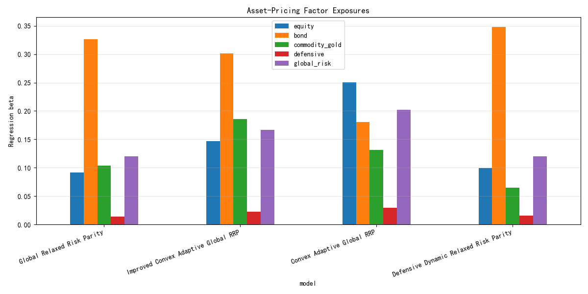
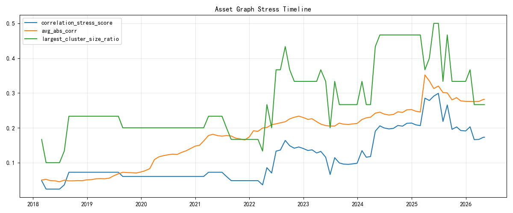
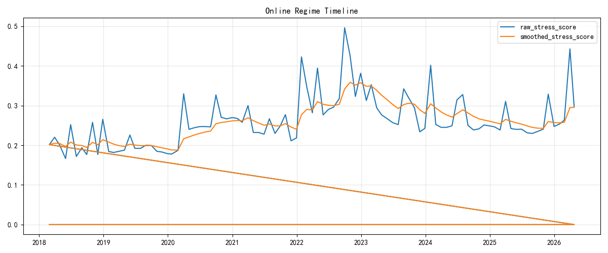
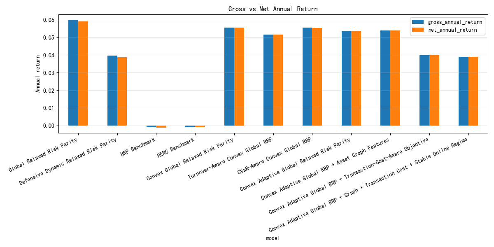

# Relaxed Risk Parity Framework | 宽松风险平价全球资产配置框架

[](#中文)
[](#english)
[](requirements.txt)
[](results/tables/performance_summary.csv)
[](#研究框架)
[](results/tables/convex_adaptive_solver_diagnostics.csv)

<a id="中文"></a>
## 中文

本仓库是一个面向全球多资产配置的 Relaxed Risk Parity 研究框架。当前研究主线为：

`Relaxed Risk Parity -> Global multi-asset extension -> convex optimization enhancement -> transaction cost and tail-risk constraints -> robustness validation`

框架保留传统风险平价的风险预算思想，同时放宽严格等风险贡献要求，使组合能够在风险分散、收益效率、换手控制和尾部风险约束之间做更实际的权衡。本项目不构成投资建议；数据质量、滑点、流动性、税费和实盘可交易性需要独立复核。

## 研究框架

| 模型 | 定位 |
|---|---|
| Standard Risk Parity | 基础风险预算基准。 |
| Local Relaxed Risk Parity | 局部放宽风险贡献约束，提升风险预算弹性。 |
| Global Relaxed Risk Parity | 主要收益效率模型，用全局多资产约束扩展宽松风险平价。 |
| Defensive Dynamic Relaxed Risk Parity | 防御型风险控制模型，强调回撤与风险状态响应。 |
| Convex Adaptive Global Relaxed Risk Parity | 实用优化增强版本，加入凸优化、约束、稳健协方差和自适应预算机制。 |
| HRP / HERC Benchmarks | 层次化组合基准，用于对照风险聚类方法。 |

## 最新结果

评估样本从 `2021-01-01` 开始。下表使用现有 CSV 结果四舍五入展示，详细数据见 `results/tables/`。

| 模型 | 净年化收益 | Sharpe | 最大回撤 | Calmar | 月均换手 |
|---|---:|---:|---:|---:|---:|
| Global Relaxed Risk Parity | 5.90% | 1.15 | -4.38% | 1.35 | 22.45% |
| Defensive Dynamic Relaxed Risk Parity | 3.88% | 0.48 | -6.51% | 0.60 | 20.22% |
| Convex Adaptive Global Relaxed Risk Parity | 5.36% | 0.58 | -8.15% | 0.66 | 1.03% |
| Improved Convex Adaptive Global Relaxed Risk Parity | 6.45% | 0.96 | -4.98% | 1.30 | 0.52% |
| HRP Benchmark | -0.12% | -6.36 | -0.73% | -0.16 | 1.56% |
| HERC Benchmark | -0.10% | -6.30 | -0.73% | -0.14 | 1.60% |

Improved Convex Adaptive Global Relaxed Risk Parity 是对凸自适应优化器的受约束参数细化版本，并采用回撤和换手约束感知的标准进行选择。

## 资产定价解释层

资产定价解释层只用于解释现有组合结果，不新增组合模型、不改变回测逻辑、不调参，也不使用因子诊断结果生成权重。

- [解释报告](report/asset_pricing_interpretation.md)
- [因子暴露汇总表](results/tables/asset_pricing_factor_exposure_summary.csv)
- [收益归因表](results/tables/asset_pricing_return_attribution.csv)



## 方法说明

Convex Adaptive Global Relaxed Risk Parity 使用的是凸化后的宽松风险预算近似，而不是把经典精确风险平价问题直接表述为全局凸优化问题。最终组合权重始终由凸优化层生成。

优化层覆盖以下机制：

- Long-only、fully invested 权重约束。
- 单资产 box constraints 与资产组 group constraints。
- 换手惩罚和换手上限。
- 基于辅助变量的 CVaR 尾部风险惩罚。
- 稳健协方差估计选项。
- 根据风险状态调整的自适应风险预算。

滚动资产图特征只调整有界风险状态输入、预算乘数和惩罚行为；它们不直接选择资产，也不直接生成权重。

## 图表






交易成本与换手主题的附加图表：



## 鲁棒性测试

鲁棒性测试为验证性诊断，不新增模型、不重新调参，也不改变主结果表。运行 `python scripts/run_robustness_tests.py` 会生成 [汇总表](results/tables/robustness_overall_summary.csv)、[子区间检验](results/tables/robustness_subperiod_summary.csv)、[协方差检验](results/tables/robustness_covariance_summary.csv)、[交易成本检验](results/tables/robustness_transaction_cost_summary.csv)、[压力期检验](results/tables/robustness_stress_period_summary.csv)、[参数扰动检验](results/tables/robustness_parameter_perturbation.csv)、[无前视审计](results/tables/robustness_no_lookahead_audit.csv) 和 [求解器稳定性](results/tables/robustness_solver_stability.csv)。


## 诊断与复现

- `cvxpy` 版本：`1.8.2`
- `python -m pytest`：`14 passed`
- 凸优化求解器 fallback rate：`0.0%`
- 所有凸优化运行均使用 `cvxpy` 求解器，`fallback_used=False`
- 稳定在线风险状态诊断：`99` 条再平衡诊断中发生 `2` 次状态切换

常用命令：

```bash
pip install -r requirements.txt
python -m pytest
python scripts/run_rrp_pipeline.py --mode full
python scripts/optimize_showcase_rrp.py
python scripts/run_hrp_comparison.py
python scripts/run_convex_adaptive_rrp.py
```

关键输出：

- `results/tables/convex_adaptive_performance_summary.csv`
- `results/tables/convex_adaptive_transaction_cost_summary.csv`
- `results/tables/asset_graph_diagnostics.csv`
- `results/tables/online_regime_diagnostics.csv`
- `results/tables/convex_adaptive_solver_diagnostics.csv`

<a id="english"></a>
## English

This repository is a Relaxed Risk Parity research framework for global multi-asset allocation. The current research line is:

`Relaxed Risk Parity -> Global multi-asset extension -> convex optimization enhancement -> transaction cost and tail-risk constraints -> robustness validation`

The framework keeps the risk-budgeting intuition of classical risk parity while relaxing strict equal-risk-contribution requirements, allowing a more practical trade-off among diversification, return efficiency, turnover control, and tail-risk constraints. This repository is not investment advice; data quality, slippage, liquidity, taxes, and live tradability require independent validation.

## Research Framework

| Model | Role |
|---|---|
| Standard Risk Parity | Baseline risk-budgeting model. |
| Local Relaxed Risk Parity | Locally relaxes risk-contribution constraints for more flexible budgeting. |
| Global Relaxed Risk Parity | Main return-efficient model with global multi-asset constraints. |
| Defensive Dynamic Relaxed Risk Parity | Defensive risk-control model focused on drawdown and risk-state response. |
| Convex Adaptive Global Relaxed Risk Parity | Practical optimization enhancement with convex constraints, robust covariance, and adaptive budgets. |
| HRP / HERC Benchmarks | Hierarchical allocation benchmarks for comparison. |

## Latest Results

The evaluation sample starts on `2021-01-01`. The table below rounds the existing CSV outputs for readability; full values are in `results/tables/`.

| Model | Net Annual Return | Sharpe | Max Drawdown | Calmar | Avg Monthly Turnover |
|---|---:|---:|---:|---:|---:|
| Global Relaxed Risk Parity | 5.90% | 1.15 | -4.38% | 1.35 | 22.45% |
| Defensive Dynamic Relaxed Risk Parity | 3.88% | 0.48 | -6.51% | 0.60 | 20.22% |
| Convex Adaptive Global Relaxed Risk Parity | 5.36% | 0.58 | -8.15% | 0.66 | 1.03% |
| Improved Convex Adaptive Global Relaxed Risk Parity | 6.45% | 0.96 | -4.98% | 1.30 | 0.52% |
| HRP Benchmark | -0.12% | -6.36 | -0.73% | -0.16 | 1.56% |
| HERC Benchmark | -0.10% | -6.30 | -0.73% | -0.14 | 1.60% |

Improved Convex Adaptive Global Relaxed Risk Parity is a constrained parameter refinement of the convex adaptive optimizer, selected with drawdown and turnover-aware criteria.

## Asset-Pricing Interpretation Layer

The asset-pricing interpretation layer is explanatory only: it adds no portfolio model, changes no backtest logic, tunes no parameters, and never uses factor diagnostics to generate weights.

- [Interpretation report](report/asset_pricing_interpretation.md)
- [Factor exposure summary table](results/tables/asset_pricing_factor_exposure_summary.csv)
- [Return attribution table](results/tables/asset_pricing_return_attribution.csv)


## Method

Convex Adaptive Global Relaxed Risk Parity is a convexified relaxed risk-budgeting approximation. It is not an exact classical risk parity problem reformulated as a globally convex program. Final portfolio weights are always generated by the convex optimization layer.

The optimization layer covers:

- Long-only and fully invested constraints.
- Single-asset box constraints and asset-group constraints.
- Turnover penalties and turnover caps.
- CVaR tail-risk penalties implemented with auxiliary variables.
- Robust covariance options.
- Adaptive risk budgets driven by bounded risk-state inputs.

Rolling asset-graph features only adjust bounded risk-state inputs, budget multipliers, and penalty behavior. They do not directly select assets or generate weights.

## Figures


Additional transaction-cost and turnover figure:


## Robustness Tests

Robustness tests are validation-only diagnostics. They add no models, retune no parameters, and do not change the main performance tables. Running `python scripts/run_robustness_tests.py` writes the [overall summary](results/tables/robustness_overall_summary.csv), [subperiod tests](results/tables/robustness_subperiod_summary.csv), [covariance tests](results/tables/robustness_covariance_summary.csv), [transaction-cost tests](results/tables/robustness_transaction_cost_summary.csv), [stress-period tests](results/tables/robustness_stress_period_summary.csv), [parameter perturbations](results/tables/robustness_parameter_perturbation.csv), [no-look-ahead audit](results/tables/robustness_no_lookahead_audit.csv), and [solver stability](results/tables/robustness_solver_stability.csv).


## Diagnostics And Reproduction

- `cvxpy` version: `1.8.2`
- `python -m pytest`: `14 passed`
- Convex solver fallback rate: `0.0%`
- All convex runs used `cvxpy` solvers with `fallback_used=False`
- Stable online regime diagnostics: `2` switches across `99` rebalance diagnostics

Common commands:

```bash
pip install -r requirements.txt
python -m pytest
python scripts/run_rrp_pipeline.py --mode full
python scripts/optimize_showcase_rrp.py
python scripts/run_hrp_comparison.py
python scripts/run_convex_adaptive_rrp.py
```

Key outputs:

- `results/tables/convex_adaptive_performance_summary.csv`
- `results/tables/convex_adaptive_transaction_cost_summary.csv`
- `results/tables/asset_graph_diagnostics.csv`
- `results/tables/online_regime_diagnostics.csv`
- `results/tables/convex_adaptive_solver_diagnostics.csv`

## License

MIT License.
