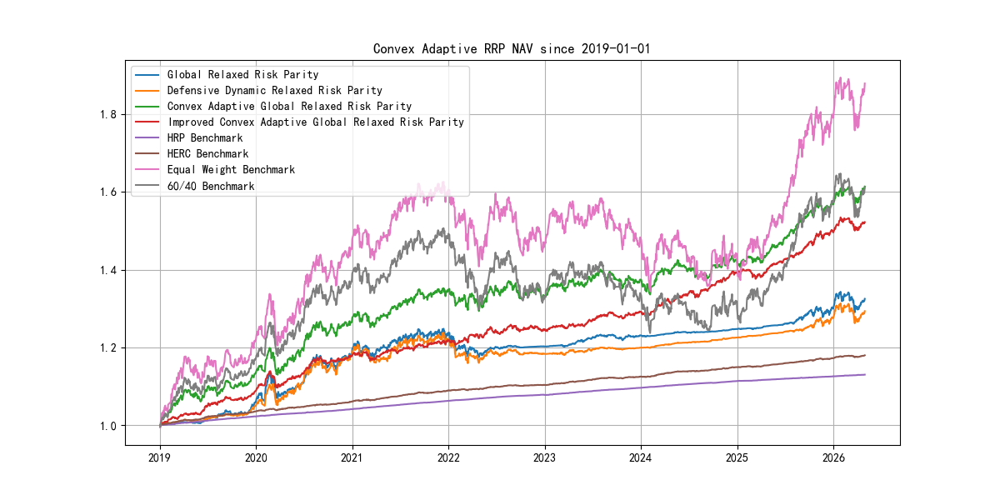
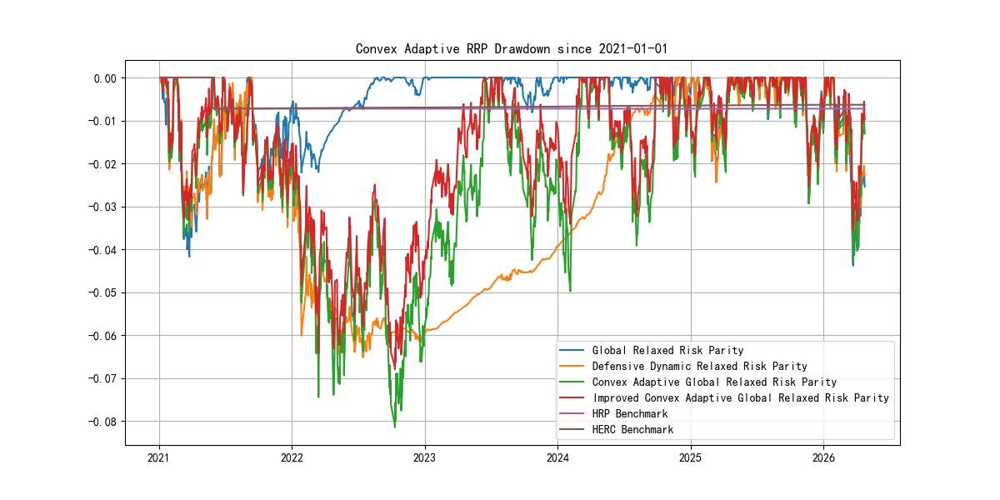

# 宽松风险平价全球资产配置框架 | Relaxed Risk Parity Framework for Global Asset Allocation

<p align="center">
  <a href="#zh"></a>
  <a href="#en"></a>
</p>

<a id="zh"></a>

## 中文

### 项目概览

本仓库是一个面向论文研究的全球多资产配置框架，围绕宽松风险平价、全球资产扩展、凸优化近似、CVaR 尾部风险控制、换手约束和稳健性验证展开。项目目标不是短期交易信号，而是构建可解释、可复现、可实施的长期机构型资产配置研究流程。

最终组合权重由透明优化流程生成。机器学习、图特征和状态识别模块仅作为诊断信息或约束输入，不直接生成组合权重。

### 研究框架

| 模型 / 模块 | 公开标签 | 研究定位 |
|---|---|---|
| 传统风险平价 | Standard Risk Parity | 基础风险预算参照 |
| 本地宽松风险平价 | Local Relaxed Risk Parity | 本地资产池中的宽松风险平价模型 |
| 全球宽松风险平价 | Global RRP | 主要的收益效率展示模型 |
| 防御型动态宽松风险平价 | Defensive Dynamic RRP | 防御型风险覆盖实验，不是主要收益最大化模型 |
| 凸自适应全球宽松风险平价 | Convex Adaptive Global RRP | 凸化的宽松风险预算近似 |
| 改进凸自适应全球宽松风险平价 | Improved Convex Adaptive Global RRP | 强调低换手、CVaR 尾部风险控制和可实施性的凸优化改进 |
| 层次风险平价基准 | HRP Benchmark | 层次化风险配置基准 |
| 层次等风险贡献基准 | HERC Benchmark | 层次化风险配置基准 |

### 数据与方法

| 项目 | 说明 |
|---|---|
| 价格数据 | `data/processed/etf_prices_updated.csv` |
| 资产映射 | `data/processed/etf_asset_mapping.csv` |
| 数据区间 | `2018-01-02` 至 `2026-04-30` |
| 评估起点 | `2021-01-01` |
| 再平衡频率 | 月度再平衡 |
| 交易成本 | 默认 3 bps，并区分 gross return 与 net return |

每个再平衡日只使用当时已具备足够历史观测的 ETF 估计信号、协方差和权重；尚未上市或历史不足的 ETF 不参与优化。历史结果不代表未来表现。

### 最新绩效看板

核心模型结果：

| Model | Net Annual Return | Sharpe | Max Drawdown | Calmar | Avg Monthly Turnover |
|---|---:|---:|---:|---:|---:|
| Global RRP | 5.90% | 1.15 | -4.38% | 1.35 | 22.45% |
| Defensive Dynamic RRP | 3.88% | 0.48 | -6.51% | 0.60 | 20.22% |
| Convex Adaptive Global RRP | 5.36% | 0.58 | -8.15% | 0.66 | 1.03% |
| Improved Convex Adaptive Global RRP | 6.45% | 0.96 | -4.98% | 1.30 | 0.52% |

基准结果：

| Benchmark | Net Annual Return | Sharpe | Max Drawdown | Calmar | Avg Monthly Turnover |
|---|---:|---:|---:|---:|---:|
| HRP Benchmark | -0.12% | -6.36 | -0.73% | -0.16 | 1.56% |
| HERC Benchmark | -0.10% | -6.30 | -0.73% | -0.14 | 1.60% |

Global RRP 是主要的收益效率展示模型。Improved Convex Adaptive Global RRP 在保持有竞争力风险收益特征的同时，将平均月度换手率降至 0.52%，体现了凸约束在低换手、尾部风险控制和稳定配置中的价值。HRP/HERC 仅作为层次化风险配置基准；在当前资产池中，相关性聚类和递归配置本身不足以替代 Global RRP 与 Convex Adaptive RRP 框架。

### 图表





### 输出与报告

| 文件 | 内容 |
|---|---|
| `results/tables/convex_adaptive_performance_summary.csv` | 凸自适应模型绩效汇总 |
| `results/tables/showcase_performance_summary.csv` | 展示模型绩效汇总 |
| `results/tables/convex_adaptive_transaction_cost_summary.csv` | 交易成本敏感性结果 |
| `results/tables/convex_adaptive_solver_diagnostics.csv` | 凸优化求解诊断 |
| `results/tables/asset_graph_diagnostics.csv` | 资产图诊断 |
| `results/tables/online_regime_diagnostics.csv` | 在线状态识别诊断 |
| `report/asset_pricing_interpretation.md` | 资产定价解释 |
| `report/methodology_notes.md` | 方法论说明 |
| `report/insurance_allocation_perspective.md` | 保险资金配置视角 |
| `report/thesis_figures_and_tables.md` | 论文图表索引 |

### 复现命令

```bash
python scripts/update_etf_data.py
python scripts/run_rrp_pipeline.py --mode full
python scripts/optimize_showcase_rrp.py
python scripts/run_hrp_comparison.py
python scripts/run_convex_adaptive_rrp.py
python scripts/run_benchmark_suite.py
python scripts/run_full_research_pipeline.py --quick
python -m pytest
```

<a id="en"></a>

## English

### Project Overview

This repository is a thesis-oriented global multi-asset allocation research project built around Relaxed Risk Parity, global asset extension, convex approximation, CVaR tail-risk control, turnover constraints, and robustness validation. It is not a short-term trading strategy repository; the emphasis is long-term institutional and insurance-style allocation interpretation.

Final portfolio weights are generated by transparent optimization. Machine learning, graph, and regime modules are used as diagnostics or constraint inputs; they do not directly generate portfolio weights.

### Research Framework

| Model / Module | Public Label | Research Role |
|---|---|---|
| Classical risk parity | Standard Risk Parity | Baseline risk-budgeting reference |
| Local relaxed risk parity | Local Relaxed Risk Parity | Relaxed risk parity in the local asset universe |
| Global relaxed risk parity | Global RRP | Main return-efficient showcase model |
| Defensive dynamic relaxed risk parity | Defensive Dynamic RRP | Defensive risk-overlay experiment, not the main return-maximizing model |
| Convex adaptive global relaxed risk parity | Convex Adaptive Global RRP | Convexified relaxed risk-budgeting approximation |
| Improved convex adaptive global relaxed risk parity | Improved Convex Adaptive Global RRP | Implementable convex refinement emphasizing low turnover, CVaR control, and stable allocation |
| Hierarchical risk parity | HRP Benchmark | Hierarchical risk-allocation benchmark |
| Hierarchical equal risk contribution | HERC Benchmark | Hierarchical risk-allocation benchmark |

### Data And Method

| Item | Description |
|---|---|
| Price cache | `data/processed/etf_prices_updated.csv` |
| Asset map | `data/processed/etf_asset_mapping.csv` |
| Data range | `2018-01-02` to `2026-04-30` |
| Evaluation start | `2021-01-01` |
| Rebalancing | Monthly |
| Transaction cost | Default 3 bps, with gross and net return separated |

At each monthly rebalance, the optimizer uses only ETFs with sufficient point-in-time history. Not-yet-listed or history-insufficient ETFs are excluded from optimization. Historical results do not imply future performance.

### Latest Performance Dashboard

Core model results:

| Model | Net Annual Return | Sharpe | Max Drawdown | Calmar | Avg Monthly Turnover |
|---|---:|---:|---:|---:|---:|
| Global RRP | 5.90% | 1.15 | -4.38% | 1.35 | 22.45% |
| Defensive Dynamic RRP | 3.88% | 0.48 | -6.51% | 0.60 | 20.22% |
| Convex Adaptive Global RRP | 5.36% | 0.58 | -8.15% | 0.66 | 1.03% |
| Improved Convex Adaptive Global RRP | 6.45% | 0.96 | -4.98% | 1.30 | 0.52% |

Benchmark results:

| Benchmark | Net Annual Return | Sharpe | Max Drawdown | Calmar | Avg Monthly Turnover |
|---|---:|---:|---:|---:|---:|
| HRP Benchmark | -0.12% | -6.36 | -0.73% | -0.16 | 1.56% |
| HERC Benchmark | -0.10% | -6.30 | -0.73% | -0.14 | 1.60% |

Global RRP remains the main return-efficient global multi-asset model. Improved Convex Adaptive Global RRP achieves a competitive risk-return profile while reducing average monthly turnover to 0.52%, highlighting the value of convex constraints for implementable, low-turnover portfolio construction. HRP/HERC are included only as hierarchical risk-allocation benchmarks; in the current asset universe, correlation clustering and recursive allocation alone are insufficient to replace the Global RRP and Convex Adaptive RRP framework.

### Figures


### Outputs And Reports

| File | Content |
|---|---|
| `results/tables/convex_adaptive_performance_summary.csv` | Convex adaptive model performance summary |
| `results/tables/showcase_performance_summary.csv` | Showcase model performance summary |
| `results/tables/convex_adaptive_transaction_cost_summary.csv` | Transaction-cost sensitivity results |
| `results/tables/convex_adaptive_solver_diagnostics.csv` | Convex solver diagnostics |
| `results/tables/asset_graph_diagnostics.csv` | Asset graph diagnostics |
| `results/tables/online_regime_diagnostics.csv` | Online regime diagnostics |
| `report/asset_pricing_interpretation.md` | Asset-pricing interpretation |
| `report/methodology_notes.md` | Methodology notes |
| `report/insurance_allocation_perspective.md` | Insurance allocation perspective |
| `report/thesis_figures_and_tables.md` | Thesis figures and tables index |

### Reproduction Commands

```bash
python scripts/update_etf_data.py
python scripts/run_rrp_pipeline.py --mode full
python scripts/optimize_showcase_rrp.py
python scripts/run_hrp_comparison.py
python scripts/run_convex_adaptive_rrp.py
python scripts/run_benchmark_suite.py
python scripts/run_full_research_pipeline.py --quick
python -m pytest
```

## License

MIT License.
