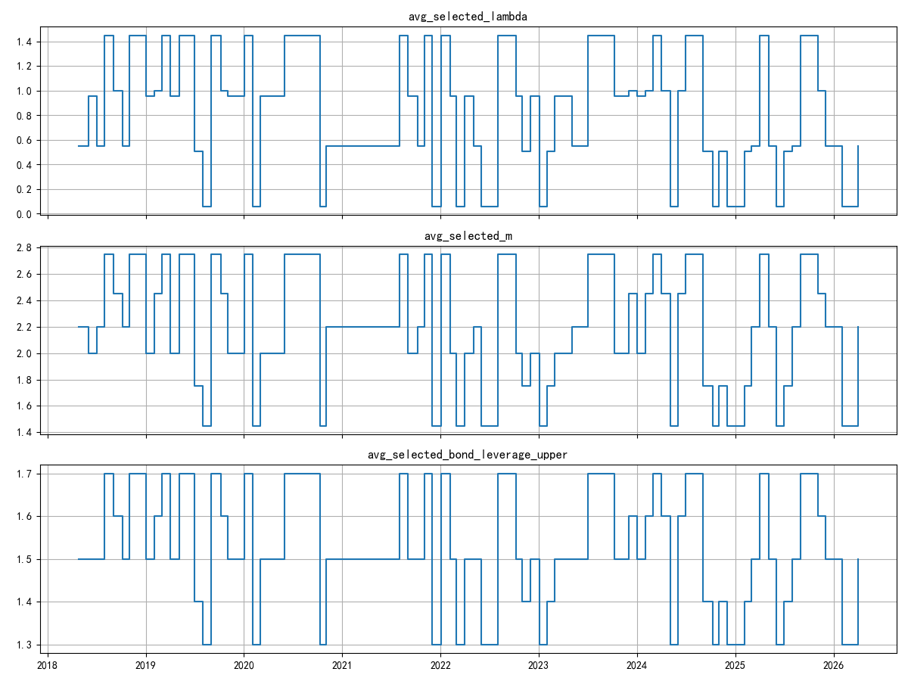
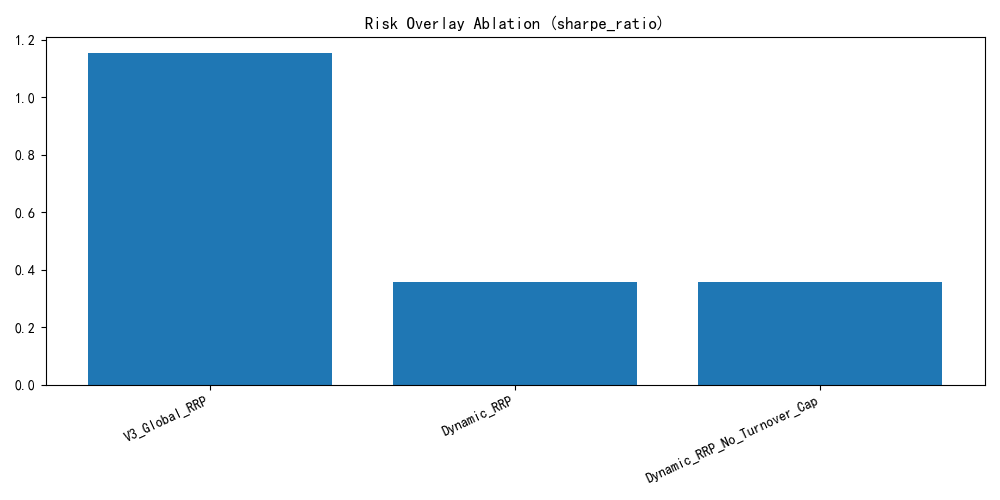
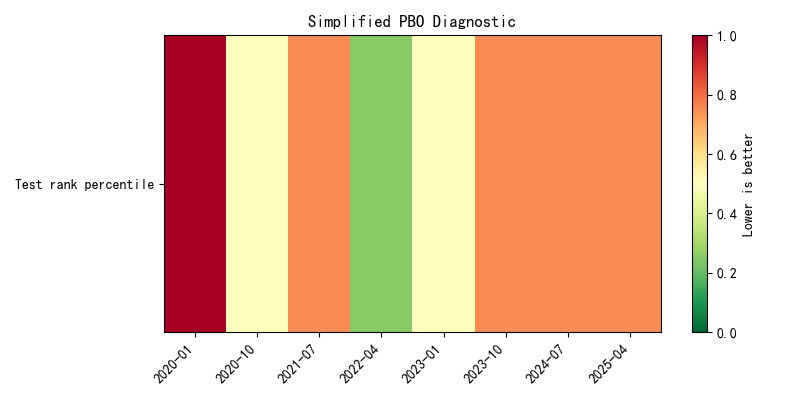

# 宽松型风险平价研究框架 | Relaxed Risk Parity Research

This repository is a thesis-oriented Relaxed Risk Parity framework for low-rate and global macro regimes. The main workflow compares standard Risk Parity, Relaxed Risk Parity, global RRP, Dynamic RRP with an AFML-inspired risk overlay, and HRP/HERC benchmarks.

The authoritative report generator is:

```bash
python scripts/run_rrp_pipeline.py --mode full
```

## 中文

### 项目定位

本项目研究传统风险平价在低利率、债券收益弹性下降、全球宏观波动加剧环境下的改进路径。核心模型为宽松型风险平价（Relaxed Risk Parity, RRP），并在 V3 全球资产池上加入动态选参与风险覆盖层，用于检验模型稳健性，而不是宣称未来一定跑赢。

### 模型演进

| 版本 | 模型 | 资产池 | 研究重点 |
| :--- | :--- | :--- | :--- |
| V1 | Standard RP | 本土资产 | 标准等风险贡献基准 |
| V2 | Relaxed RRP | 本土资产 | 加入收益目标与松弛约束 |
| V3 Global RRP | Relaxed RRP | 全球资产 | 当前静态全球配置展示模型 |
| Dynamic RRP | Walk-forward RRP + Overlay | 全球资产 | AFML-inspired 动态选参、风控覆盖与稳健性诊断 |
| HRP/HERC | Hierarchical benchmarks | 全球资产 | 二级分散化基准，不作为主叙事模型 |

### AFML-Inspired Risk Overlay

Dynamic RRP 使用月度再平衡与严格过去窗口数据：

- Walk-forward selection: 默认 24 个月滚动训练、1 个月测试；参数选择只使用再平衡日前数据。
- Drawdown scaling: 回撤不超过 2.5% 时权重缩放 1.00，2.5%-4.0% 时为 0.75，高于 4.0% 时为 0.50。
- Trend confirmation: 60 日动量为正且 20 日确认动量为正，才视为趋势正向。
- Vol targeting: EWMA realized volatility，decay 为 0.94，目标波动率 6.0%，不允许因低波动将风险暴露放大到 1.0 以上。
- Turnover-aware rebalancing: 默认月度 L1 换手上限 0.25，触发时向上一期权重线性混合。
- Transaction costs: 默认 3 bps，按换手扣减。
- Simplified PBO and adjusted Sharpe: 输出简化 PBO-style 诊断和保守 adjusted Sharpe；二者不是完整 CSCV 或完整 Deflated Sharpe Ratio。

### 回测看板

Evaluation starts on 2021-01-01. Current generated results:

| Model | Ann. Return | Volatility | Sharpe | Sortino | Max DD | Ann. Turnover |
| :--- | ---: | ---: | ---: | ---: | ---: | ---: |
| V3 Global RRP | 5.98% | 3.61% | 1.15 | 1.35 | -4.25% | 2.78 |
| Dynamic RRP | 3.22% | 3.93% | 0.36 | 0.37 | -7.12% | 2.31 |
| V2 Relaxed | 5.53% | 3.65% | 1.02 | 1.10 | -5.12% | 2.68 |
| V1 Standard | 1.25% | 1.21% | -0.47 | -0.50 | -2.65% | 2.60 |
| HRP | -0.09% | 0.37% | -5.19 | -3.84 | -0.77% | 0.12 |
| HERC | -0.09% | 0.37% | -5.16 | -4.65 | -0.77% | 0.12 |

结论应保持克制：本样本内 V3 Global RRP 的原始 Sharpe 和保守 adjusted Sharpe 更强；Dynamic RRP 的贡献是提供经过 walk-forward、交易成本、趋势确认、波动目标与换手约束检验的动态风险覆盖工作流。当前生成结果中，Dynamic RRP 并未改善最大回撤。

### Figures

<p align="center">
  
</p>

<p align="center">
  
</p>

<p align="center">
  
</p>

<p align="center">
  
</p>

<p align="center">
  
</p>

### 主要输出

- `results/tables/performance_summary.csv`
- `results/tables/risk_overlay_ablation.csv`
- `results/tables/walkforward_validation.csv`
- `results/tables/parameter_stability.csv`
- `results/tables/afml_diagnostics.csv`
- `results/tables/pbo_diagnostic.csv`
- `results/figures/nav_comparison.png`
- `results/figures/drawdown_comparison.png`
- `results/figures/dynamic_parameter_timeline.png`
- `results/figures/risk_overlay_ablation.png`
- `results/figures/pbo_heatmap.png`

### 局限

本项目是回测研究，不构成投资建议。参数选择不使用未来数据，但简化 PBO、保守 adjusted Sharpe、交易成本与滑点假设都不能证明未来表现。当前数据源、资产映射、交易可行性和杠杆融资成本仍需在正式实盘前单独验证。

## English

### Project Scope

This project studies Relaxed Risk Parity as an extension of standard Risk Parity under low-rate and global macro regimes. V3 Global RRP is the static global showcase. Dynamic RRP is the validated risk-overlay showcase, using walk-forward selection and AFML-inspired diagnostics.

### Quick Start

```bash
pip install -r requirements.txt
python scripts/run_rrp_pipeline.py --mode full
python -m pytest
```

### Repository Structure

```text
Relaxed-Risk-Parity-Research/
|-- src/
|   |-- risk_parity.py
|   |-- risk_overlay.py
|   |-- dynamic_selection.py
|   |-- validation.py
|   |-- backtest.py
|   |-- metrics.py
|   `-- visualization.py
|-- scripts/
|   |-- run_rrp_pipeline.py
|   `-- run_hrp_comparison.py
|-- results/
|   |-- tables/
|   `-- figures/
`-- tests/
```

### References

1. Gambeta, V., & Kwon, R. (2020). Risk return trade-off in relaxed risk parity portfolio optimization.
2. López de Prado, M. (2018). Advances in Financial Machine Learning.
3. Bailey, D. H., Borwein, J. M., López de Prado, M., & Zhu, Q. J. (2015). The Probability of Backtest Overfitting.
4. Bailey, D. H., & López de Prado, M. (2014). The Deflated Sharpe Ratio.
5. López de Prado, M. (2016). Building Diversified Portfolios that Outperform Out-of-Sample.
6. Zheshang Securities. (2026). Relaxed Risk Parity: From Localization to Globalization.

## License

MIT License.
