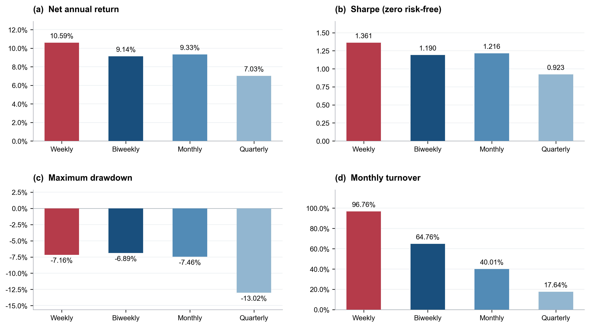

# 宽松风险平价全球资产配置框架 | Relaxed Risk Parity Framework for Global Asset Allocation

<p align="center">
  <a href="#中文"></a>
  &nbsp;
  <a href="#english"></a>
</p>

<p align="center">
  
  
  
  
</p>

---

## 中文

### 一句话概览

本项目是一个面向本科论文与可复现实证研究的量化资产配置框架：在中国可交易 ETF 约束下，将经典风险平价扩展为 **Relaxed Risk Parity (RRP)**，并进一步构建 **Convex Adaptive Global RRP** 与 **Improved Convex Adaptive Global RRP**，用于研究低换手、CVaR 尾部风险控制和全球多资产配置的权衡。

**主结论不是“追求最高收益”，而是：** 在纯多头、无杠杆、月度再平衡和 3 bps 单边交易成本下，Improved Convex Adaptive Global RRP 以 **5.98%** 净年化收益、**2.91%** 年化波动、**1.430** Sharpe、**-4.03%** 最大回撤和 **2.09%** 月均换手率，提供了一条可实施的稳健配置路径。

### 快速导航

| 你想看什么 | 入口 |
|---|---|
| 核心模型和定位 | [模型定位](#模型定位) |
| 最新绩效数字 | [最新绩效](#最新绩效) |
| ETF 资产池 | [资产池](#资产池) |
| 图表和持仓解释 | [关键图表](#关键图表) |
| 稳健性与过拟合控制 | [稳健性验证](#稳健性验证) |
| 经典全天候对照结果 | [全天候期货基准](#全天候期货基准) |
| 如何复现 | [快速开始](#快速开始) |

---

### 研究问题

> 在不依赖主观收益率预测的前提下，如何通过风险预算的系统性松弛设计，在风险均衡与收益目标之间取得可控平衡，并在中国可交易 ETF 的全球多资产框架下实现低成本落地？

经典风险平价要求各资产风险贡献严格相等，在实证中容易压制高夏普资产配置，并在协方差结构变化时带来高换手。本文的处理方式是：保留风险预算的可解释性，同时允许风险贡献在目标附近有约束地浮动，再通过凸优化、CVaR 约束和换手惩罚把模型推向可执行版本。

### 模型定位

| Public Label | 定位 | 说明 |
|---|---|---|
| Standard Risk Parity | 基准 | 风险贡献严格均等 |
| Local Relaxed Risk Parity | 本土扩展 | 仅使用本土资产池的 RRP |
| **Global RRP** | **主展示模型** | 体现宽松风险平价在 30-ETF 全球资产池中的收益效率 |
| Convex Adaptive Global RRP | 凸自适应版本 | 将松弛风险预算近似为可解的凸优化问题 |
| **Improved Convex Adaptive Global RRP** | **低换手、CVaR-aware 实施版本** | 主打可实施性、低换手、尾部风险控制与稳定配置 |
| Defensive Dynamic RRP | 防御实验 | 风险覆盖层实验，不是主收益最大化模型 |
| HRP Benchmark / HERC Benchmark | 基准 | 层次化风险分配参考，不是本文主模型 |

### 方法摘要

| 模块 | 作用 |
|---|---|
| 风险预算松弛 | 将严格风险贡献平价放宽为可调风险预算，避免过度刚性 |
| 凸自适应重构 | 用凸化近似替代原始非凸问题，提高求解稳定性和速度 |
| CVaR 约束 | 显式限制尾部损失，服务风险厌恶型长期资金 |
| 换手惩罚 | 将交易成本和调仓稳定性纳入目标函数 |
| 资产组约束 | 防止单一资产类别过度集中 |
| 稳健性验证 | 通过 walk-forward、holdout、CSCV-PBO、bootstrap 和压力期检验约束结论范围 |

---

### 资产池

当前资产池来自 `src/asset_universe.py`，共 **30 只 ETF、8 类资产**。数据区间为 `2015-11-19` 至 `2026-07-31`；绩效评价从 `2019-01-01` 开始，并对后上市 ETF 采用时间点可投性过滤。资产池配置已于 `2026-08-07` 完成轮换，供下一次月度研究更新使用；下方绩效仍是轮换前资产池的最近一次完整回测快照，本次未运行回测。

| 类别 | ETF 数量 | 代表性标的 |
|---|---:|---|
| 债券与现金 | 5 | 可转债ETF、国债ETF、10年国债ETF、信用债ETF、日利ETF |
| A股宽基 | 6 | 沪深300ETF、中证500ETF、中证1000ETF、中证2000ETF、创业板ETF、红利ETF |
| 中国科技与成长 | 4 | 半导体ETF、人工智能ETF、新能源ETF、科创50ETF |
| 中国行业与消费 | 3 | 证券ETF、军工ETF、消费ETF |
| 港股 | 1 | 恒生ETF |
| 全球股票 | 4 | 纳指ETF、标普500ETF、日经225ETF、欧洲ETF |
| 贵金属 | 2 | 黄金ETF、白银LOF |
| 大宗商品与资源 | 5 | 有色金属期货ETF、能源化工期货ETF、豆粕ETF、煤炭ETF、原油ETF |

候选池共 6 只，暂不进入回测：30年国债ETF（511090.SH）、中韩半导体ETF（513310.SH）、证券公司先锋策略ETF（516980.SH）、沙特ETF（520830.SH）、巴西ETF（520870.SH）、机器人ETF（562500.SH）。其中 `516980.SH` 此前在项目中误标为“云计算ETF”，现已按 Tushare 官方基金信息更正。

本次同时生成了 36 只 ETF 的 7 维 Barra-style 代理敞口及相关性诊断，覆盖中国市场、规模、价值、久期、信用、商品和全球股票风险源。该结果是基于 ETF 收益率构造的透明代理，并非商业 MSCI Barra 模型数据；方法定义与完整矩阵见 `data/processed/barra_style_methodology.json` 和 `data/processed/barra_style_exposure_correlation.csv`。

### 最新绩效

评价区间：`2019-01-01` 至 `2026-07-31`。交易成本：单边 3 bps，月度再平衡。

| 模型 | 净年化收益 | 年化波动 | Sharpe | Sortino | 最大回撤 | Calmar | 月均换手 |
|---|---:|---:|---:|---:|---:|---:|---:|
| **Improved Convex Adaptive Global RRP** | **5.98%** | **2.91%** | **1.430** | **2.165** | **-4.03%** | **1.486** | **2.09%** |
| Convex Adaptive Global RRP | 6.67% | 5.19% | 0.935 | 1.455 | -5.74% | 1.162 | 1.31% |
| Global RRP | 4.67% | 4.16% | 0.686 | 0.815 | -5.91% | 0.791 | 23.63% |
| Defensive Dynamic RRP | 4.85% | 4.40% | 0.690 | 0.879 | -7.12% | 0.682 | 24.65% |
| HERC Benchmark | 2.29% | 0.61% | 0.774 | 1.168 | -0.56% | 4.113 | 6.21% |
| HRP Benchmark | 1.72% | 0.18% | -0.550 | -0.905 | -0.08% | 21.323 | 1.29% |
| Equal Weight | 10.00% | 11.13% | 0.735 | 1.179 | -13.79% | 0.725 | 1.21% |

**解读：** Equal Weight 的绝对收益更高，但波动和回撤显著放大；Improved Convex Adaptive Global RRP 的优势在于更低路径风险、更浅回撤和更可控换手。HRP 的极低波动带来很小回撤，但也显著压低了收益空间，因此更适合作为基准而非主模型。

### 关键图表

**全模型净值对比**

<p align="center"></p>

**回撤路径对比**

<p align="center"></p>

**换手率对比**

<p align="center"></p>

**CVaR 尾部风险对比**

<p align="center"></p>

**Improved Convex Adaptive Global RRP 持仓路径**

<p align="center"></p>

组合长期以国债ETF和日利ETF为稳定底仓，黄金ETF提供尾部风险和通胀对冲，A股宽基与全球股票暴露随协方差结构动态调整。2020 年 3 月流动性冲击期间，组合明显向债券和现金管理工具倾斜，体现自适应风险预算的防御特征。

<!-- BEGIN MONTHLY_HS300_COMPARISON_CN -->
### 与沪深300ETF的月度收益对比

截至 `2026-07`，Improved Convex Adaptive Global RRP 与沪深300ETF的月度对比显示：策略累计收益为 **54.95%**，沪深300ETF为 **70.02%**；策略月度波动率 **0.85%**，显著低于沪深300ETF的 **4.60%**；日频最大回撤分别为 **-4.03%** 与 **-44.03%**。策略在 45/91 个月跑赢沪深300ETF，最近一个月（2026-07）策略收益 **0.37%**，沪深300ETF **-7.29%**。


<!-- END MONTHLY_HS300_COMPARISON_CN -->
### 稳健性验证

| 验证方法 | 用途 | 结论边界 |
|---|---|---|
| Walk-forward validation | 滚动样本外参数选择 | 检验参数是否只适配完整样本 |
| Holdout validation | 独立留出区间验证 | 检查样本内外结论是否一致 |
| CSCV-PBO | 多候选过拟合概率诊断 | 当前 PBO 低于 0.5，但仍是参考值而非未来保证 |
| Block bootstrap | 对 Sharpe 和回撤做重采样 | 评估结果对样本路径扰动的敏感性 |
| 协方差估计稳健性 | 比较 sample、Ledoit-Wolf、EWMA 等估计器 | 主要结论不依赖单一协方差估计器 |
| 参数扰动 | 改变关键惩罚项和 CVaR 阈值 | 输出随参数平滑变化，无明显断崖 |
| 调仓频率敏感性 | 比较周度、双周、月度、季度调仓 | 月度当前排名第一，但仍是预设实施规则而非事后择优结果 |

<p align="center"></p>

<p align="center"></p>

在固定 Improved Convex Adaptive Global RRP 参数、仅改变调仓频率的对照中，周度和双周调仓的净年化收益均约为 **5.78%**，Sharpe 分别为 **1.362** 和 **1.366**，平均月换手率分别为 **3.23%** 和 **2.66%**。月度调仓对应 **5.98%** 净年化收益、**1.430** Sharpe、**-4.03%** 最大回撤和 **2.09%** 平均月换手率；季度调仓换手率进一步降至 **1.65%**，净年化收益和 Sharpe 为 **5.96%** 和 **1.410**。月度调仓在本次样本中恰好取得四种频率中的最高净收益和 Sharpe，但其主设定仍基于长期配置下的响应速度、交易成本和组合稳定性，而非事后按最高收益选择。

### 全天候期货基准

本文主结果仍以 **30 只 ETF、纯多头、无杠杆** 的可实施资产池为准。作为对照实验，研究进一步构造 **Classic All Weather Futures Benchmark**：将期货品种划分为权益/增长、久期/通缩、通胀/商品三类风险桶，桶内采用 180 日滚动逆波动权重，桶间采用 30% / 40% / 30% 的经典全天候风险预算，并在期货价格收益之上叠加现金抵押收益。目标波动率版本允许最高 4.0x 名义敞口，以更接近经典全天候的期货杠杆实现方式。期货场景扣除 5 bps 单边成本。当前缓存覆盖 22 个品种，但 Y、OI、ZC 的最后可得日期分别为 2019-06-28、2018-05-15 和 2022-05-11；加载器会前向填充停更价格，因此该实验仅作为低置信度的补充基准，不是桥水真实组合复现。

| 场景 | 净年化收益 | 年化波动 | Sharpe | Calmar | 最大回撤 | 平均名义敞口 |
|---|---:|---:|---:|---:|---:|---:|
| ETF 基准（Improved Convex） | 5.98% | 2.91% | 1.430 | 1.486 | -4.03% | 1.00x |
| 经典全天候期货基准（1.0x） | 3.99% | 2.10% | 1.035 | 2.529 | -1.58% | 1.00x |
| 目标波动率全天候期货（8%） | 9.80% | 7.70% | 1.037 | 1.360 | -7.21% | 3.71x |
| 目标波动率全天候期货（10%） | 10.04% | 8.08% | 1.018 | 1.393 | -7.21% | 3.87x |

该对照显示：经典全天候期货框架在 1.0x 名义敞口下回撤更浅，但收益与 Sharpe 低于 Improved Convex Adaptive Global RRP；引入目标波动率与期货名义杠杆后，绝对收益提升至约 9.8%--10.0%，更符合经典全天候的资金利用逻辑，但风险调整收益仍低于 ETF 主模型。结论依赖连续合约构造、现金抵押收益、滚动窗口、目标波动率和名义敞口上限，应作为结构性基准而非主模型替代。

### 项目结构

```text
.
├── src/                       # 核心优化、回测、验证模块
├── scripts/                   # 数据更新与研究流水线
├── results/tables/            # 权威 CSV 结果
├── results/figures/           # README、论文和答辩使用的图
├── report/thesis_latex/       # 论文 LaTeX 源文件
├── report/ppt/                # 答辩 Beamer 源文件与 PDF
└── data/                      # ETF 价格数据与中间数据
```

### 快速开始

```bash
pip install -r requirements.txt

# 更新 ETF 数据，需要 Tushare token
export TUSHARE_TOKEN=your_token_here
python scripts/update_etf_data.py --provider tushare --start-date 20150101

# 运行完整研究流水线
python scripts/run_full_research_pipeline.py

# 仅运行凸自适应主模型
python scripts/run_convex_adaptive_rrp.py
```

---

## English

### At A Glance

This repository is a thesis-oriented quantitative asset allocation project. It extends classical Risk Parity into a **Relaxed Risk Parity (RRP)** framework, then builds convex, turnover-aware, CVaR-aware variants for a China-accessible global ETF universe.

The main result is not a maximum-return trading strategy. Under a long-only, unlevered, monthly-rebalanced ETF setting with 3 bps one-way transaction cost, **Improved Convex Adaptive Global RRP** delivers **5.98%** net annual return, **2.91%** annual volatility, **1.430** Sharpe, **-4.03%** maximum drawdown, and **2.09%** average monthly turnover.

### Navigation

| Looking for | Section |
|---|---|
| Model definitions | [Model Positioning](#model-positioning) |
| Latest results | [Latest Performance](#latest-performance) |
| ETF universe | [Asset Universe](#asset-universe) |
| Charts and interpretation | [Key Figures](#key-figures) |
| Robustness checks | [Robustness Validation](#robustness-validation) |
| Classic All Weather comparison | [All Weather Futures Benchmark](#all-weather-futures-benchmark) |
| Reproduction | [Quick Start](#quick-start) |

### Research Question

> Without relying on subjective return forecasts, how can a systematically relaxed risk-budgeting design balance risk equalization against return objectives, while remaining implementable in a globally diversified universe of China-accessible ETFs?

Classical Risk Parity forces all risk contributions to be equal. This is interpretable but rigid: it can suppress exposure to high-Sharpe assets and generate excessive turnover when the covariance structure changes. This project keeps the interpretability of risk budgeting while allowing controlled deviations from strict equality, then adds convex optimization, CVaR constraints, turnover penalties, and group limits for implementation.

### Model Positioning

| Public Label | Role | Description |
|---|---|---|
| Standard Risk Parity | Baseline | Strict equal risk contributions |
| Local Relaxed Risk Parity | Local extension | RRP restricted to the local asset pool |
| **Global RRP** | **Main showcase model** | Return-efficient global 30-ETF RRP |
| Convex Adaptive Global RRP | Convex approximation | Convexified relaxed risk-budgeting approximation |
| **Improved Convex Adaptive Global RRP** | **Implementable refinement** | Low-turnover, CVaR-aware, stable allocation model |
| Defensive Dynamic RRP | Defensive experiment | Risk-overlay experiment, not the main return-maximizing model |
| HRP Benchmark / HERC Benchmark | Benchmarks | Hierarchical allocation references |

### Method Summary

| Module | Purpose |
|---|---|
| Relaxed risk budgeting | Softens strict equal-risk-contribution constraints |
| Convex adaptive reformulation | Improves solver stability and scalability |
| CVaR constraint | Controls tail-loss exposure |
| Turnover penalty | Internalizes trading cost and allocation stability |
| Group limits | Prevents excessive concentration in one asset class |
| Robustness validation | Bounds conclusions through walk-forward, holdout, CSCV-PBO, bootstrap, and stress-period checks |

### Asset Universe

The universe is defined in `src/asset_universe.py`: **30 ETFs across 8 asset categories**. Data run from `2015-11-19` to `2026-07-31`; performance evaluation starts on `2019-01-01`. Later-listed ETFs enter only after sufficient valid observations. The universe configuration was rotated on `2026-08-07` for the next monthly research update. The performance section remains the last completed pre-rotation backtest snapshot; no backtest was run in this update.

| Category | ETF Count | Representative Exposures |
|---|---:|---|
| Bonds and cash | 5 | Convertible bond, government bond, 10-year government bond, credit bond, money market |
| China broad equity | 6 | CSI 300, CSI 500, CSI 1000, CSI 2000, ChiNext, dividend |
| China technology and growth | 4 | Semiconductor, AI, new energy, STAR 50 |
| China sectors and consumer | 3 | Securities, defense, consumer |
| Hong Kong equity | 1 | Hang Seng ETF |
| Global equity | 4 | Nasdaq-100, S&P 500, Nikkei 225, Europe |
| Precious metals | 2 | Gold, silver |
| Commodities and resources | 5 | Non-ferrous metals futures, energy and chemicals futures, soybean meal, coal, crude oil |

The six-ETF candidate pool, excluded from backtests until the next universe review, is: 30-year government bond (511090.SH), China-Korea semiconductor (513310.SH), securities-company pioneer strategy (516980.SH), Saudi Arabia (520830.SH), Brazil (520870.SH), and robotics (562500.SH). Tushare's official fund record identifies `516980.SH` as a securities-company strategy ETF; the former project label “cloud computing ETF” was incorrect and has been corrected.

This update also produces seven-dimensional Barra-style proxy exposures and exposure correlations for all 36 ETFs, covering China market, size, value, duration, credit, commodity, and global-equity risk sources. These are transparent ETF-return proxies, not licensed MSCI Barra model data; see `data/processed/barra_style_methodology.json` and `data/processed/barra_style_exposure_correlation.csv` for the definitions and full matrix.

### Latest Performance

Evaluation period: `2019-01-01` to `2026-07-31`. Transaction cost: 3 bps one-way, monthly rebalancing.

| Model | Net Annual Return | Annual Vol | Sharpe | Sortino | Max Drawdown | Calmar | Avg Monthly TO |
|---|---:|---:|---:|---:|---:|---:|---:|
| **Improved Convex Adaptive Global RRP** | **5.98%** | **2.91%** | **1.430** | **2.165** | **-4.03%** | **1.486** | **2.09%** |
| Convex Adaptive Global RRP | 6.67% | 5.19% | 0.935 | 1.455 | -5.74% | 1.162 | 1.31% |
| Global RRP | 4.67% | 4.16% | 0.686 | 0.815 | -5.91% | 0.791 | 23.63% |
| Defensive Dynamic RRP | 4.85% | 4.40% | 0.690 | 0.879 | -7.12% | 0.682 | 24.65% |
| HERC Benchmark | 2.29% | 0.61% | 0.774 | 1.168 | -0.56% | 4.113 | 6.21% |
| HRP Benchmark | 1.72% | 0.18% | -0.550 | -0.905 | -0.08% | 21.323 | 1.29% |
| Equal Weight | 10.00% | 11.13% | 0.735 | 1.179 | -13.79% | 0.725 | 1.21% |

Equal Weight generates higher absolute return but with much higher volatility and drawdown. The Improved Convex model is positioned as the implementable, low-turnover, tail-risk-controlled allocation rather than a return-maximizing strategy.

### Key Figures

<p align="center"></p>

<p align="center"></p>

<p align="center"></p>

<p align="center"></p>

<p align="center"></p>

<!-- BEGIN MONTHLY_HS300_COMPARISON_EN -->
### Monthly Return Comparison vs CSI 300 ETF

Through `2026-07`, the Improved Convex Adaptive Global RRP delivered **54.95%** cumulative return versus **70.02%** for the CSI 300 ETF proxy. Its monthly volatility was **0.85%**, far below the CSI 300 ETF's **4.60%**; daily maximum drawdowns were **-4.03%** and **-44.03%**, respectively. The strategy outperformed in 45/91 months. In the latest month (2026-07), the strategy returned **0.37%** versus **-7.29%** for the CSI 300 ETF.


<!-- END MONTHLY_HS300_COMPARISON_EN -->
### Robustness Validation

| Method | Purpose | Boundary |
|---|---|---|
| Walk-forward validation | Rolling out-of-sample parameter selection | Tests whether parameters only fit the full sample |
| Holdout validation | Independent validation period | Checks consistency between in-sample and holdout results |
| CSCV-PBO | Overfitting probability diagnostic | PBO is below 0.5, but remains a diagnostic rather than a future guarantee |
| Block bootstrap | Resampling of Sharpe and drawdown | Tests sensitivity to path variation |
| Covariance robustness | Sample, Ledoit-Wolf, EWMA and related estimators | Main conclusions do not depend on one estimator |
| Parameter perturbation | Vary key penalties and CVaR threshold | Performance changes smoothly without cliff-edge behavior |
| Rebalance frequency sensitivity | Weekly, biweekly, monthly, and quarterly rebalancing | Monthly currently ranks first, but remains an implementation choice rather than an ex-post selection rule |

<p align="center"></p>

<p align="center"></p>

With Improved Convex Adaptive Global RRP parameters fixed and only the rebalance schedule varied, weekly and biweekly rebalancing both deliver about **5.78%** net annual return, with Sharpe ratios of **1.362** and **1.366** and average monthly turnover of **3.23%** and **2.66%**. Monthly rebalancing delivers **5.98%** net annual return, **1.430** Sharpe, **-4.03%** maximum drawdown, and **2.09%** average monthly turnover. Quarterly rebalancing lowers turnover to **1.65%**, with **5.96%** net annual return and **1.410** Sharpe. Monthly happens to produce the highest net return and Sharpe among the four frequencies in this refresh, but it remains an implementation-oriented choice based on responsiveness, trading cost, and allocation stability rather than ex-post return selection.

### All Weather Futures Benchmark

The main results remain based on the implementable **30-ETF, long-only, unlevered** universe. As a benchmark experiment, the study also constructs a **Classic All Weather Futures Benchmark**. Futures are grouped into equity/growth, duration/deflation, and inflation/commodities buckets; each bucket uses 180-day rolling inverse-volatility weights, and bucket-level allocation uses a 30% / 40% / 30% classic All Weather risk budget. Futures price returns are layered over cash collateral earning the risk-free rate, and futures scenarios deduct a 5 bps one-way cost. The vol-targeted variants allow up to 4.0x gross notional exposure. The current cache covers 22 products, but Y, OI, and ZC end on 2019-06-28, 2018-05-15, and 2022-05-11; the loader forward-fills stale prices. This is therefore a lower-confidence supplementary benchmark, not a replication of Bridgewater's actual portfolio.

| Scenario | Net Annual Return | Annual Vol | Sharpe | Calmar | Max Drawdown | Avg Gross Notional |
|---|---:|---:|---:|---:|---:|---:|
| ETF Baseline (Improved Convex) | 5.98% | 2.91% | 1.430 | 1.486 | -4.03% | 1.00x |
| Classic All Weather Futures (1.0x) | 3.99% | 2.10% | 1.035 | 2.529 | -1.58% | 1.00x |
| Vol-Targeted All Weather Futures (8%) | 9.80% | 7.70% | 1.037 | 1.360 | -7.21% | 3.71x |
| Vol-Targeted All Weather Futures (10%) | 10.04% | 8.08% | 1.018 | 1.393 | -7.21% | 3.87x |

The benchmark shows that the 1.0x All Weather futures version achieves shallower drawdown but lower return and Sharpe than the Improved Convex ETF model. Vol-targeting and futures notional leverage lift absolute returns to roughly 9.8%--10.0%, but risk-adjusted performance remains below the ETF main model. These results depend on continuous-contract construction, collateral yield, rolling windows, target-volatility rules, and gross-notional caps.

### Repository Structure

```text
.
├── src/                       # Core optimization, backtest, and validation modules
├── scripts/                   # Data update and research pipeline scripts
├── results/tables/            # Authoritative CSV results
├── results/figures/           # Figures used by README, thesis, and defense slides
├── report/thesis_latex/       # Thesis LaTeX source
├── report/ppt/                # Defense Beamer source and PDF
└── data/                      # ETF price data and intermediate files
```

### Quick Start

```bash
pip install -r requirements.txt

export TUSHARE_TOKEN=your_token_here
python scripts/update_etf_data.py --provider tushare --start-date 20150101

python scripts/run_full_research_pipeline.py
python scripts/run_convex_adaptive_rrp.py
```

---

## License

MIT License.
