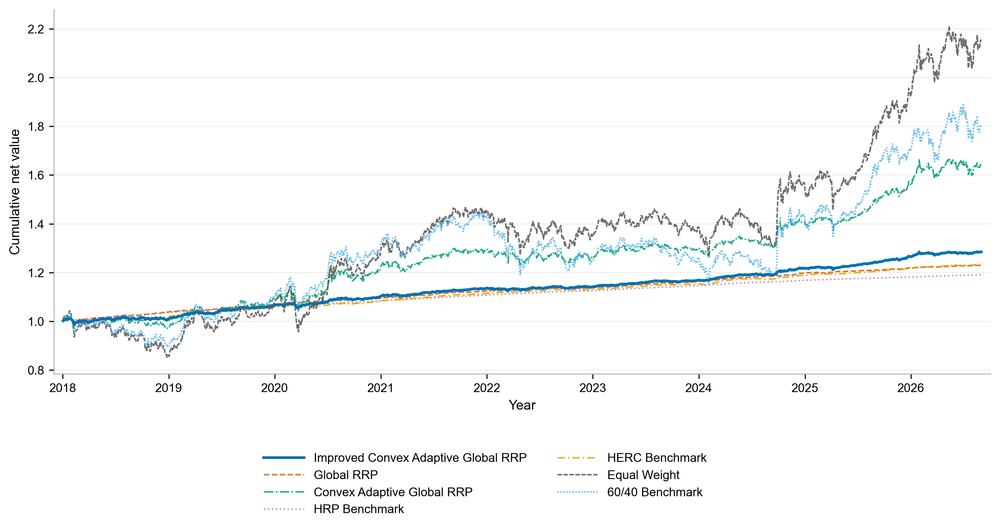
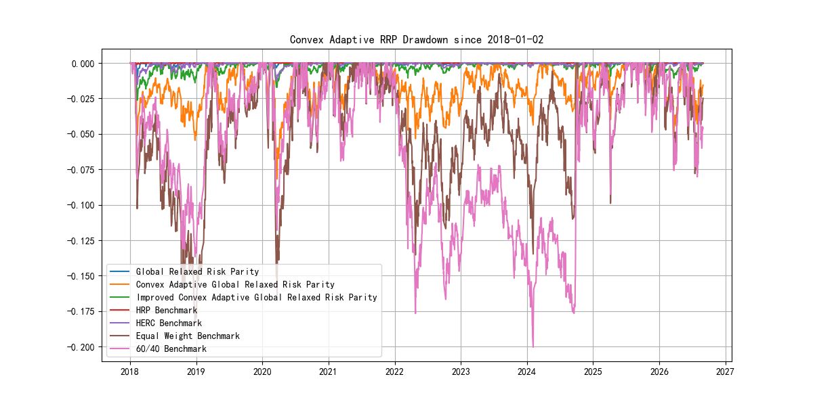
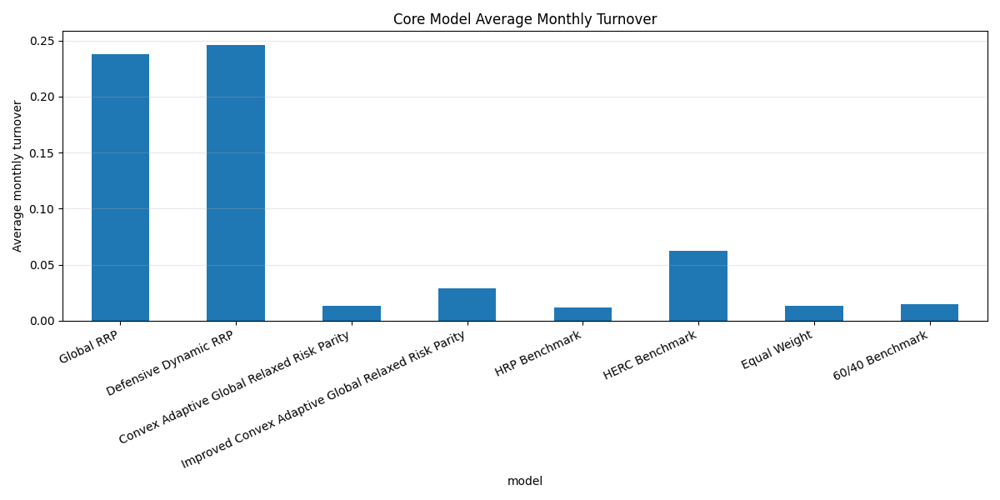
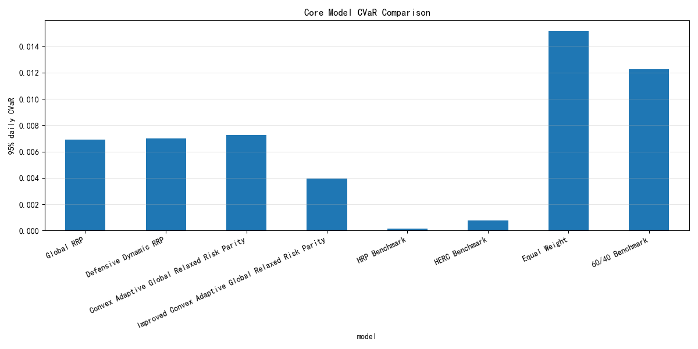
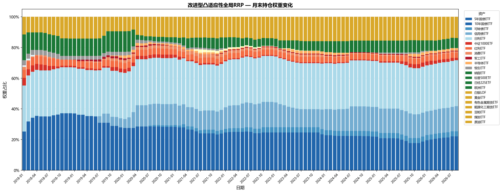
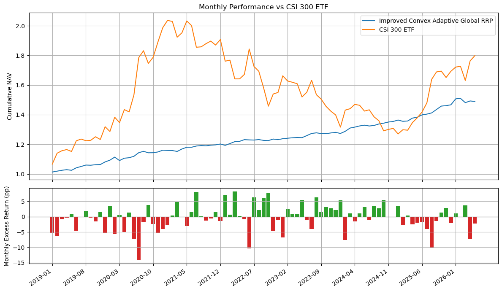
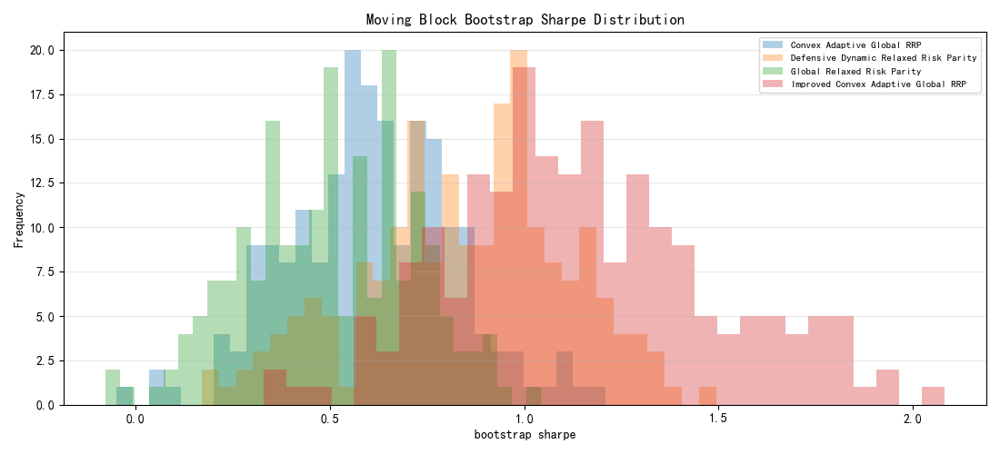

# 宽松风险平价全球资产配置框架 | Relaxed Risk Parity Framework for Global Asset Allocation

<p align="center">
  <a href="#中文"></a>
  &nbsp;
  <a href="#english"></a>
</p>

<p align="center">
  
  
  
  
</p>

---

## 中文

### 一句话概览

本项目是一个面向本科论文与可复现实证研究的量化资产配置框架：在中国可交易 ETF 约束下，将经典风险平价扩展为 **Relaxed Risk Parity (RRP)**，并进一步构建 **Convex Adaptive Global RRP** 与 **Improved Convex Adaptive Global RRP**，用于研究低换手、CVaR 尾部风险控制和全球多资产配置的权衡。

**主结论不是“追求最高收益”，而是：** 在纯多头、无杠杆、月度再平衡和 3 bps 单边交易成本下，Improved Convex Adaptive Global RRP 以 **5.57%** 净年化收益、**2.62%** 年化波动、**1.431** Sharpe、**-3.95%** 最大回撤和 **2.07%** 月均换手率，提供了一条可实施的稳健配置路径。

### 快速导航

| 你想看什么 | 入口 |
|---|---|
| 核心模型和定位 | [模型定位](#模型定位) |
| 最新绩效数字 | [最新绩效](#最新绩效) |
| ETF 资产池 | [资产池](#资产池) |
| 图表和持仓解释 | [关键图表](#关键图表) |
| 稳健性与过拟合控制 | [稳健性验证](#稳健性验证) |
| 股指期货/期货替换结果 | [期货扩展实验](#期货扩展实验) |
| 如何复现 | [快速开始](#快速开始) |

---

### 研究问题

> 在不依赖主观收益率预测的前提下，如何通过风险预算的系统性松弛设计，在风险均衡与收益目标之间取得可控平衡，并在中国可交易 ETF 的全球多资产框架下实现低成本落地？

经典风险平价要求各资产风险贡献严格相等，在实证中容易压制高夏普资产配置，并在协方差结构变化时带来高换手。本文的处理方式是：保留风险预算的可解释性，同时允许风险贡献在目标附近有约束地浮动，再通过凸优化、CVaR 约束和换手惩罚把模型推向可执行版本。

### 模型定位

| Public Label | 定位 | 说明 |
|---|---|---|
| Standard Risk Parity | 基准 | 风险贡献严格均等 |
| Local Relaxed Risk Parity | 本土扩展 | 仅使用本土资产池的 RRP |
| **Global RRP** | **主展示模型** | 体现宽松风险平价在 30-ETF 全球资产池中的收益效率 |
| Convex Adaptive Global RRP | 凸自适应版本 | 将松弛风险预算近似为可解的凸优化问题 |
| **Improved Convex Adaptive Global RRP** | **低换手、CVaR-aware 实施版本** | 主打可实施性、低换手、尾部风险控制与稳定配置 |
| Defensive Dynamic RRP | 防御实验 | 风险覆盖层实验，不是主收益最大化模型 |
| HRP Benchmark / HERC Benchmark | 基准 | 层次化风险分配参考，不是本文主模型 |

### 方法摘要

| 模块 | 作用 |
|---|---|
| 风险预算松弛 | 将严格风险贡献平价放宽为可调风险预算，避免过度刚性 |
| 凸自适应重构 | 用凸化近似替代原始非凸问题，提高求解稳定性和速度 |
| CVaR 约束 | 显式限制尾部损失，服务风险厌恶型长期资金 |
| 换手惩罚 | 将交易成本和调仓稳定性纳入目标函数 |
| 资产组约束 | 防止单一资产类别过度集中 |
| 稳健性验证 | 通过 walk-forward、holdout、CSCV-PBO、bootstrap 和压力期检验约束结论范围 |

---

### 资产池

当前资产池来自 `src/asset_universe.py`，共 **30 只 ETF、8 类资产**。数据区间为 `2018-02-28` 至 `2026-05-29`；绩效评价从 `2019-01-01` 开始，并对后上市 ETF 采用时间点可投性过滤。

| 类别 | ETF 数量 | 代表性标的 |
|---|---:|---|
| 债券与现金 | 4 | 可转债ETF、国债ETF、信用债ETF、日利ETF |
| A股宽基 | 5 | 沪深300ETF、中证500ETF、中证1000ETF、创业板ETF、红利ETF |
| 中国科技与成长 | 7 | 半导体ETF、人工智能ETF、机器人ETF、新能源ETF、中韩半导体ETF、科创50ETF、云计算ETF |
| 中国行业与消费 | 3 | 证券ETF、军工ETF、消费ETF |
| 港股 | 1 | 恒生ETF |
| 全球股票 | 4 | 纳指ETF、标普500ETF、日经225ETF、欧洲ETF |
| 贵金属 | 2 | 黄金ETF、白银LOF |
| 大宗商品与资源 | 4 | 有色ETF、豆粕ETF、煤炭ETF、原油ETF |

### 最新绩效

评价区间：`2019-01-01` 至 `2026-05-29`。交易成本：单边 3 bps，月度再平衡。

| 模型 | 净年化收益 | 年化波动 | Sharpe | Sortino | 最大回撤 | Calmar | 月均换手 |
|---|---:|---:|---:|---:|---:|---:|---:|
| **Improved Convex Adaptive Global RRP** | **5.57%** | **2.62%** | **1.431** | **2.099** | **-3.95%** | **1.410** | **2.07%** |
| Convex Adaptive Global RRP | 6.80% | 5.21% | 0.956 | 1.468 | -6.66% | 1.021 | 1.24% |
| Global RRP | 4.59% | 4.11% | 0.674 | 0.770 | -7.14% | 0.643 | 22.30% |
| Defensive Dynamic RRP | 4.59% | 4.45% | 0.622 | 0.779 | -7.11% | 0.645 | 24.58% |
| HERC Benchmark | 2.23% | 0.57% | 0.718 | 1.053 | -0.58% | 3.828 | 5.78% |
| HRP Benchmark | 1.68% | 0.17% | -0.785 | -1.289 | -0.08% | 20.665 | 1.05% |
| Equal Weight | 10.66% | 11.08% | 0.798 | 1.276 | -13.91% | 0.767 | 1.24% |

**解读：** Equal Weight 的绝对收益更高，但波动和回撤显著放大；Improved Convex Adaptive Global RRP 的优势在于更低路径风险、更浅回撤和更可控换手。HRP 的极低波动带来很小回撤，但也显著压低了收益空间，因此更适合作为基准而非主模型。

### 关键图表

**全模型净值对比**

<p align="center"></p>

**回撤路径对比**

<p align="center"></p>

**换手率对比**

<p align="center"></p>

**CVaR 尾部风险对比**

<p align="center"></p>

**Improved Convex Adaptive Global RRP 持仓路径**

<p align="center"></p>

组合长期以国债ETF和日利ETF为稳定底仓，黄金ETF提供尾部风险和通胀对冲，A股宽基与全球股票暴露随协方差结构动态调整。2020 年 3 月流动性冲击期间，组合明显向债券和现金管理工具倾斜，体现自适应风险预算的防御特征。

### 与沪深300ETF月度对比

截至 `2026-05`，Improved Convex Adaptive Global RRP 累计收益为 **48.93%**，沪深300ETF 为 **79.87%**；但策略月度波动率仅 **0.77%**，显著低于沪深300ETF的 **4.57%**，日频最大回撤分别为 **-3.95%** 与 **-44.00%**。策略并非以跑赢沪深300为目标，而是以较低波动和较浅回撤换取长期路径稳定性。



### 稳健性验证

| 验证方法 | 用途 | 结论边界 |
|---|---|---|
| Walk-forward validation | 滚动样本外参数选择 | 检验参数是否只适配完整样本 |
| Holdout validation | 独立留出区间验证 | 检查样本内外结论是否一致 |
| CSCV-PBO | 多候选过拟合概率诊断 | 当前 PBO 低于 0.5，但仍是参考值而非未来保证 |
| Block bootstrap | 对 Sharpe 和回撤做重采样 | 评估结果对样本路径扰动的敏感性 |
| 协方差估计稳健性 | 比较 sample、Ledoit-Wolf、EWMA 等估计器 | 主要结论不依赖单一协方差估计器 |
| 参数扰动 | 改变关键惩罚项和 CVaR 阈值 | 输出随参数平滑变化，无明显断崖 |

<p align="center"></p>

### 期货扩展实验

本文主结果仍以 **30 只 ETF、纯多头、无杠杆** 的可实施资产池为准。作为机构资金扩展实验，研究进一步测试了将固收与商品 ETF 替换为对应期货连续合约，并把 IF / IC / IH / IM 股指期货作为权益端 portable alpha 叠加层的名义敞口分配框架。

| 场景 | 净年化收益 | 年化波动 | Sharpe | Calmar | 最大回撤 |
|---|---:|---:|---:|---:|---:|
| ETF 基准（Improved Convex） | 5.57% | 2.62% | 1.431 | 1.410 | -3.95% |
| 期货 + 现金增强（1倍名义敞口） | 9.28% | 4.59% | 1.625 | 1.991 | -4.66% |
| 期货 1.5倍名义敞口 | 10.31% | 6.89% | 1.233 | 1.139 | -9.06% |
| 期货 2.0倍名义敞口 | 13.17% | 9.18% | 1.237 | 1.062 | -12.40% |

该实验说明：在具备保证金管理、现金增强和衍生品执行能力的机构场景下，RRP 框架具备进一步扩展空间；但其结论依赖连续合约构造、保证金比例、现金收益、展期与执行假设，不能替代本文 ETF 主模型的落地约束。

### 项目结构

```text
.
├── src/                       # 核心优化、回测、验证模块
├── scripts/                   # 数据更新与研究流水线
├── results/tables/            # 权威 CSV 结果
├── results/figures/           # README、论文和答辩使用的图
├── report/thesis_latex/       # 论文 LaTeX 源文件
├── report/ppt/                # 答辩 Beamer 源文件与 PDF
└── data/                      # ETF 价格数据与中间数据
```

### 快速开始

```bash
pip install -r requirements.txt

# 更新 ETF 数据，需要 Tushare token
export TUSHARE_TOKEN=your_token_here
python scripts/update_etf_data.py --provider tushare --start-date 20150101

# 运行完整研究流水线
python scripts/run_full_research_pipeline.py

# 仅运行凸自适应主模型
python scripts/run_convex_adaptive_rrp.py
```

---

## English

### At A Glance

This repository is a thesis-oriented quantitative asset allocation project. It extends classical Risk Parity into a **Relaxed Risk Parity (RRP)** framework, then builds convex, turnover-aware, CVaR-aware variants for a China-accessible global ETF universe.

The main result is not a maximum-return trading strategy. Under a long-only, unlevered, monthly-rebalanced ETF setting with 3 bps one-way transaction cost, **Improved Convex Adaptive Global RRP** delivers **5.57%** net annual return, **2.62%** annual volatility, **1.431** Sharpe, **-3.95%** maximum drawdown, and **2.07%** average monthly turnover.

### Navigation

| Looking for | Section |
|---|---|
| Model definitions | [Model Positioning](#model-positioning) |
| Latest results | [Latest Performance](#latest-performance) |
| ETF universe | [Asset Universe](#asset-universe) |
| Charts and interpretation | [Key Figures](#key-figures) |
| Robustness checks | [Robustness Validation](#robustness-validation) |
| Futures extension | [Futures Extension](#futures-extension) |
| Reproduction | [Quick Start](#quick-start) |

### Research Question

> Without relying on subjective return forecasts, how can a systematically relaxed risk-budgeting design balance risk equalization against return objectives, while remaining implementable in a globally diversified universe of China-accessible ETFs?

Classical Risk Parity forces all risk contributions to be equal. This is interpretable but rigid: it can suppress exposure to high-Sharpe assets and generate excessive turnover when the covariance structure changes. This project keeps the interpretability of risk budgeting while allowing controlled deviations from strict equality, then adds convex optimization, CVaR constraints, turnover penalties, and group limits for implementation.

### Model Positioning

| Public Label | Role | Description |
|---|---|---|
| Standard Risk Parity | Baseline | Strict equal risk contributions |
| Local Relaxed Risk Parity | Local extension | RRP restricted to the local asset pool |
| **Global RRP** | **Main showcase model** | Return-efficient global 30-ETF RRP |
| Convex Adaptive Global RRP | Convex approximation | Convexified relaxed risk-budgeting approximation |
| **Improved Convex Adaptive Global RRP** | **Implementable refinement** | Low-turnover, CVaR-aware, stable allocation model |
| Defensive Dynamic RRP | Defensive experiment | Risk-overlay experiment, not the main return-maximizing model |
| HRP Benchmark / HERC Benchmark | Benchmarks | Hierarchical allocation references |

### Method Summary

| Module | Purpose |
|---|---|
| Relaxed risk budgeting | Softens strict equal-risk-contribution constraints |
| Convex adaptive reformulation | Improves solver stability and scalability |
| CVaR constraint | Controls tail-loss exposure |
| Turnover penalty | Internalizes trading cost and allocation stability |
| Group limits | Prevents excessive concentration in one asset class |
| Robustness validation | Bounds conclusions through walk-forward, holdout, CSCV-PBO, bootstrap, and stress-period checks |

### Asset Universe

The universe is defined in `src/asset_universe.py`: **30 ETFs across 8 asset categories**. Data run from `2018-02-28` to `2026-05-29`; performance evaluation starts on `2019-01-01`. Later-listed ETFs enter only after sufficient valid observations.

| Category | ETF Count | Representative Exposures |
|---|---:|---|
| Bonds and cash | 4 | Convertible bond, government bond, credit bond, money market |
| China broad equity | 5 | CSI 300, CSI 500, CSI 1000, ChiNext, dividend |
| China technology and growth | 7 | Semiconductor, AI, robotics, new energy, China-Korea semiconductor, STAR 50, cloud computing |
| China sectors and consumer | 3 | Securities, defense, consumer |
| Hong Kong equity | 1 | Hang Seng ETF |
| Global equity | 4 | Nasdaq-100, S&P 500, Nikkei 225, Europe |
| Precious metals | 2 | Gold, silver |
| Commodities and resources | 4 | Non-ferrous metals, soybean meal, coal, crude oil |

### Latest Performance

Evaluation period: `2019-01-01` to `2026-05-29`. Transaction cost: 3 bps one-way, monthly rebalancing.

| Model | Net Annual Return | Annual Vol | Sharpe | Sortino | Max Drawdown | Calmar | Avg Monthly TO |
|---|---:|---:|---:|---:|---:|---:|---:|
| **Improved Convex Adaptive Global RRP** | **5.57%** | **2.62%** | **1.431** | **2.099** | **-3.95%** | **1.410** | **2.07%** |
| Convex Adaptive Global RRP | 6.80% | 5.21% | 0.956 | 1.468 | -6.66% | 1.021 | 1.24% |
| Global RRP | 4.59% | 4.11% | 0.674 | 0.770 | -7.14% | 0.643 | 22.30% |
| Defensive Dynamic RRP | 4.59% | 4.45% | 0.622 | 0.779 | -7.11% | 0.645 | 24.58% |
| HERC Benchmark | 2.23% | 0.57% | 0.718 | 1.053 | -0.58% | 3.828 | 5.78% |
| HRP Benchmark | 1.68% | 0.17% | -0.785 | -1.289 | -0.08% | 20.665 | 1.05% |
| Equal Weight | 10.66% | 11.08% | 0.798 | 1.276 | -13.91% | 0.767 | 1.24% |

Equal Weight generates higher absolute return but with much higher volatility and drawdown. The Improved Convex model is positioned as the implementable, low-turnover, tail-risk-controlled allocation rather than a return-maximizing strategy.

### Key Figures

<p align="center"></p>

<p align="center"></p>

<p align="center"></p>

<p align="center"></p>

<p align="center"></p>

### Monthly Comparison vs CSI 300 ETF

Through `2026-05`, the Improved Convex Adaptive Global RRP delivered **48.93%** cumulative return versus **79.87%** for the CSI 300 ETF proxy. Monthly volatility was **0.77%**, far below the CSI 300 ETF's **4.57%**; daily maximum drawdowns were **-3.95%** and **-44.00%**, respectively.


### Robustness Validation

| Method | Purpose | Boundary |
|---|---|---|
| Walk-forward validation | Rolling out-of-sample parameter selection | Tests whether parameters only fit the full sample |
| Holdout validation | Independent validation period | Checks consistency between in-sample and holdout results |
| CSCV-PBO | Overfitting probability diagnostic | PBO is below 0.5, but remains a diagnostic rather than a future guarantee |
| Block bootstrap | Resampling of Sharpe and drawdown | Tests sensitivity to path variation |
| Covariance robustness | Sample, Ledoit-Wolf, EWMA and related estimators | Main conclusions do not depend on one estimator |
| Parameter perturbation | Vary key penalties and CVaR threshold | Performance changes smoothly without cliff-edge behavior |

<p align="center"></p>

### Futures Extension

The main results remain based on the implementable **30-ETF, long-only, unlevered** universe. As an institutional extension, the study also tests a notional allocation framework that replaces fixed-income and commodity ETFs with futures continuous contracts, while adding IF / IC / IH / IM index futures as an equity portable-alpha overlay.

| Scenario | Net Annual Return | Annual Vol | Sharpe | Calmar | Max Drawdown |
|---|---:|---:|---:|---:|---:|
| ETF Baseline (Improved Convex) | 5.57% | 2.62% | 1.431 | 1.410 | -3.95% |
| Futures + Cash Overlay (1.0x notional) | 9.28% | 4.59% | 1.625 | 1.991 | -4.66% |
| Futures 1.5x Notional Allocation | 10.31% | 6.89% | 1.233 | 1.139 | -9.06% |
| Futures 2.0x Notional Allocation | 13.17% | 9.18% | 1.237 | 1.062 | -12.40% |

This extension suggests that the RRP framework can scale into derivative-enabled institutional mandates. The result depends on continuous-contract construction, margin assumptions, cash yield, roll mechanics, and execution assumptions, and should not be interpreted as replacing the ETF-based main model.

### Repository Structure

```text
.
├── src/                       # Core optimization, backtest, and validation modules
├── scripts/                   # Data update and research pipeline scripts
├── results/tables/            # Authoritative CSV results
├── results/figures/           # Figures used by README, thesis, and defense slides
├── report/thesis_latex/       # Thesis LaTeX source
├── report/ppt/                # Defense Beamer source and PDF
└── data/                      # ETF price data and intermediate files
```

### Quick Start

```bash
pip install -r requirements.txt

export TUSHARE_TOKEN=your_token_here
python scripts/update_etf_data.py --provider tushare --start-date 20150101

python scripts/run_full_research_pipeline.py
python scripts/run_convex_adaptive_rrp.py
```

---

## License

MIT License.
