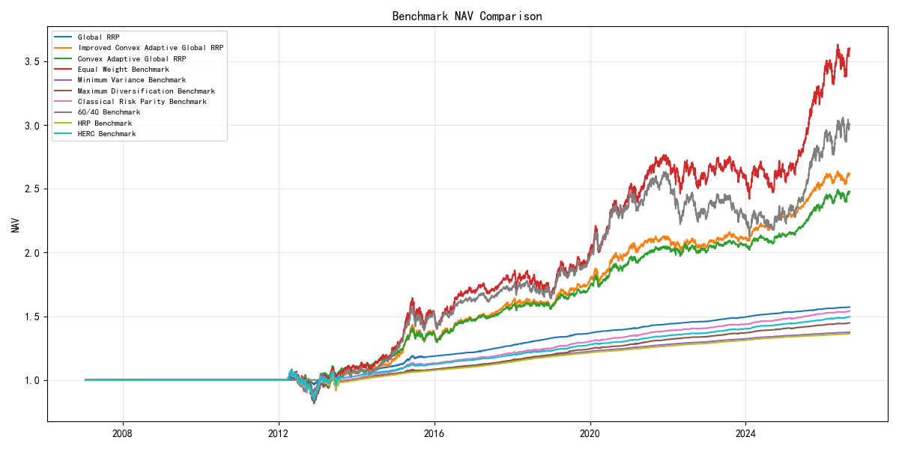

# 宽松风险平价全球资产配置框架 | Relaxed Risk Parity for Global Asset Allocation

<p align="center">
  <a href="#zh"></a>
  &nbsp;
  <a href="#en"></a>
</p>

<p align="center">
  
  
  
  
</p>

---

<a id="zh"></a>

## 中文

### 研究问题

> **在不依赖主观收益率预测的前提下，如何通过风险预算的系统性松弛设计，在风险均衡与收益目标之间取得可控平衡，并在中国可交易 ETF 的全球多资产框架下实现低成本落地？**

经典风险平价要求所有资产风险贡献严格相等，这一约束在实践中过于刚性：它压制了对高夏普资产的配置，并且每当市场波动结构改变时就产生大量换手。本文提出并实现了**宽松风险平价（Relaxed Risk Parity, RRP）**框架，通过引入松弛项将严等约束软化，再经凸化处理保证优化问题高效可解，最终构建出一套可在 A 股 ETF 市场实施的全球多资产配置体系。

---

### 核心创新

| # | 创新点 | 与已有工作的区别 |
|---|---|---|
| 1 | **风险预算松弛化** | 将 Roncalli (2013) 的严等 RP 约束扩展为可调节风险预算，允许风险贡献在目标附近浮动，兼顾均衡与效率 |
| 2 | **凸自适应重构** | 将非凸松弛 RP 问题转化为标准凸二次规划（QP），消除局部最优陷阱，同时以在线方式自适应选取松弛参数 |
| 3 | **CVaR + 换手率双约束** | 在凸 QP 框架内显式加入尾部风险约束（CVaR）与 L1 换手率惩罚，形成可直接用于实盘的低成本版本 |
| 4 | **全球 30-ETF 资产池** | 在中国境内可交易 ETF 约束下构建覆盖 A 股、港股、美股、日本、欧洲、债券、贵金属、大宗商品的全球分散化资产池 |
| 5 | **在线政权识别与防御覆盖层** | 结合动量/波动率信号进行在线市场状态识别，通过动态降仓覆盖层管理极端市场的路径风险 |
| 6 | **系统性过拟合防控** | 采用 CSCV-PBO、Walk-Forward、Block Bootstrap 等多种方法量化策略过拟合风险，确保样本外结论可靠 |

---

### 方法论框架

#### 经典风险平价（基准）

给定协方差矩阵 $\Sigma$，经典 RP 求解：

$$\min_{w} \;\sum_{i=1}^{n} \left( \frac{w_i \,(\Sigma w)_i}{w^{\top} \Sigma w} - \frac{1}{n} \right)^{2} \quad \text{s.t.} \;\; \mathbf{1}^{\top}w = 1,\; w \geq 0$$

风险贡献严格均等（$b_i = 1/n$），优化问题非凸。

#### 宽松风险平价（本文核心）

引入**松弛风险预算** $b_i$，允许其偏离均等：

$$\min_{w} \;\underbrace{\sum_{i=1}^{n} \left( \frac{w_i \,(\Sigma w)_i}{w^{\top} \Sigma w} - b_i \right)^{2}}_{\text{风险预算偏差}} + \underbrace{\lambda \,\|w - w_{\text{prev}}\|_{1}}_{\text{换手率惩罚}} \quad \text{s.t.} \;\; \mathbf{1}^{\top}w = 1,\; w \geq 0$$

其中 $b_i$ 和 $\lambda$ 通过在线交叉验证自适应选取，使模型能随市场状态动态调整风险分配。

#### 凸自适应重构

通过引入辅助变量 $u_i = w_i \,(\Sigma w)_i$，将上述非凸目标转化为标准凸二次规划：在保证全局最优收敛的同时，将单次优化耗时压缩至毫秒级，满足月度实盘再平衡需求。

#### 改进版：CVaR 约束叠加

在凸 QP 框架内进一步施加：

$$\text{CVaR}_{\alpha}(w) \leq \bar{c}, \quad \alpha = 0.95$$

与 L1 换手率上限约束，形成最终落地版本 **Improved Convex Adaptive Global RRP**。

---

### 研究进展路线

```
标准风险平价 (SRP)
        │  严等约束过于刚性，高换手
        ▼
本土宽松风险平价 (Local RRP)
        │  引入松弛项，但仅限国内资产池
        ▼
全局宽松风险平价 (Global RRP)          ← 主展示模型
        │  扩展至 30 只全球 ETF
        ▼
凸自适应全局 RRP (Convex Adaptive)
        │  非凸问题凸化，参数在线自适应
        ▼
改进型凸自适应全局 RRP (Improved)      ← 最优风险管理模型
        │  叠加 CVaR 约束 + 换手率感知选参
        ▼
防御型动态 RRP (Defensive Dynamic)
           动态政权识别 + 极端市场降仓覆盖层
```

---

### 核心模型对比

| 模型 | 定位 | 核心特征 |
|---|---|---|
| Standard Risk Parity | 基准 | 风险贡献严格均等，无松弛项 |
| Local Relaxed Risk Parity | 本土宽松版 | 仅限国内资产池，引入松弛项 |
| **Global RRP** | **主展示模型** | 扩展至全球 30 只 ETF |
| Convex Adaptive Global RRP | 凸自适应版 | 凸化重构，显著降低换手率 |
| **Improved Convex Adaptive Global RRP** | **最优风险管理** | CVaR 约束 + 换手率感知选参，Sharpe 1.43 |
| Defensive Dynamic RRP | 防御型动态版 | 动态风险覆盖层，管理极端回撤 |
| HRP / HERC Benchmark | 层次化基准 | 衡量聚类配置与 RRP 的差距 |

---

### 资产池：30 只 ETF，8 类资产

评估区间所有 ETF 均通过时间点可投性过滤，绩效评价从 `2019-01-01` 开始；后上市 ETF 仅在形成足够历史观测后进入优化。

| 类别 | ETF 名称 | 代码 | 资产说明 |
|---|---|---|---|
| **债券** | 可转债ETF | 511380.SH | 可转债，兼具债券保护与股票上行弹性 |
| | 国债ETF | 511010.SH | 长久期利率锚，风险平价组合的久期核心 |
| | 信用债ETF | 511030.SH | 信用利差敞口，高于国债的收益补偿 |
| | 日利ETF | 511880.SH | 货币市场，超短久期现金管理层 |
| **A股宽基** | 沪深300ETF | 510300.SH | A股大盘蓝筹，CSI 300指数 |
| | 中证500ETF | 510500.SH | A股中盘，CSI 500指数 |
| | 中证1000ETF | 512100.SH | A股小盘，CSI 1000指数 |
| | 创业板ETF | 159915.SZ | 创业板成长股 |
| | 红利ETF | 510880.SH | 高股息防御型A股 |
| **中国科技与成长** | 半导体ETF | 512480.SH | 芯片产业链核心因子 |
| | 人工智能ETF | 159819.SZ | AI应用软件与算法 |
| | 机器人ETF | 562500.SH | 工业自动化与智能制造 |
| | 新能源ETF | 516160.SH | 电动车、储能与光伏 |
| | 中韩半导体ETF | 513310.SH | 叠加DRAM/NAND与韩元汇率维度 |
| | 科创50ETF | 588000.SH | 中国科技自主化蓝筹 |
| | 云计算ETF | 516980.SH | SaaS、云基础设施与数字服务 |
| **中国行业与消费** | 证券ETF | 512880.SH | 券商板块，市场周期性贝塔 |
| | 军工ETF | 512660.SH | 国防与高端装备 |
| | 消费ETF | 159928.SZ | 食品饮料与家庭用品 |
| **港股** | 恒生ETF | 159920.SZ | 港股宽基 |
| **全球股票** | 纳指ETF | 159941.SZ | 纳斯达克100，美国科技与成长 |
| | 标普500ETF | 513500.SH | 美国大盘蓝筹 |
| | 日经225ETF | 513880.SH | 日本股市 |
| | 欧洲ETF | 513030.SH | 欧洲发达市场 |
| **贵金属** | 黄金ETF | 518880.SH | 抗通胀与尾部风险对冲 |
| | 白银LOF | 161226.SZ | 贵金属对冲，与股票低相关 |
| **大宗商品** | 有色ETF | 159980.SZ | 工业商品需求敞口 |
| | 豆粕ETF | 159985.SZ | 农产品商品敞口 |
| | 煤炭ETF | 515220.SH | 传统能源供给动态 |
| | 原油ETF | 162411.SZ | 全球原油价格敞口 |

---

### 最新绩效看板

评估区间：`2019-01-01` 至 `2026-05-29`（89个月）。交易成本：单边 3bps，月度再平衡。

| 模型 | 净年化收益 | 年化波动率 | Sharpe | Sortino | 最大回撤 | Calmar | 月均换手率 |
|---|---:|---:|---:|---:|---:|---:|---:|
| **Improved Convex Adaptive Global RRP** | **5.57%** | **2.62%** | **1.43** | **2.10** | **-3.95%** | **1.41** | **2.07%** |
| Convex Adaptive Global RRP | 6.80% | 5.21% | 0.96 | 1.47 | -6.66% | 1.02 | 1.24% |
| Global RRP | 4.59% | 4.11% | 0.67 | 0.77 | -7.14% | 0.64 | 22.30% |
| Defensive Dynamic RRP | 4.59% | 4.45% | 0.62 | 0.78 | -7.11% | 0.65 | 24.58% |
| HRP Benchmark | 1.68% | 0.17% | -0.78 | -1.29 | -0.08% | 20.66 | 1.05% |
| HERC Benchmark | 2.23% | 0.57% | 0.72 | 1.05 | -0.58% | 3.83 | 5.78% |
| Equal Weight | 10.66% | 11.08% | 0.80 | 1.28 | -13.91% | 0.77 | 1.24% |
| 60/40 Benchmark | 8.02% | 8.91% | 0.70 | 1.12 | -14.71% | 0.55 | 1.43% |

**核心结论：**
- **Improved Convex Adaptive Global RRP** 以 2.62% 年化波动率和 -3.95% 最大回撤实现 Sharpe **1.43**、Calmar **1.41**，在所有风险管理模型中风险调整后表现最优，月均换手率仅 2.07%，具备直接实盘落地条件；
- **Convex Adaptive Global RRP** 在可接受较高波动的场景下提供更高净收益（6.80%），凸化重构相比 Global RRP 将换手率从 22% 压降至 1.24%；
- **Global RRP** 是体现宽松风险平价核心逻辑的主展示模型，风险收益均衡，换手率过高的问题由凸自适应版本解决；
- **Equal Weight / 60/40** 虽然绝对收益更高，但最大回撤达 -14%，风险调整收益（Sharpe 0.80/0.70）低于本文主模型。

**图1：全模型净值对比（2018–2026）**
<p align="center"></p>

---

### 与沪深300ETF月度对比

<!-- BEGIN MONTHLY_HS300_COMPARISON_CN -->
### 与沪深300ETF的月度收益对比

截至 `2026-05`，Improved Convex Adaptive Global RRP 与沪深300ETF的月度对比显示：策略累计收益为 **48.93%**，沪深300ETF为 **79.87%**；策略月度波动率 **0.77%**，显著低于沪深300ETF的 **4.57%**；日频最大回撤分别为 **-3.95%** 与 **-44.00%**。策略在 43/89 个月跑赢沪深300ETF，最近一个月（2026-05）策略收益 **-0.22%**，沪深300ETF **2.05%**。


<!-- END MONTHLY_HS300_COMPARISON_CN -->

> 本策略并非以跑赢沪深300为目标——它的设计目标是**极低波动、极浅回撤的稳健复利**。在沪深300从峰值下跌超 44% 的同期，本策略最大回撤仅 -3.95%，以牺牲部分上行弹性为代价换取路径稳定性，适合风险厌恶型配置需求。

---

### 组合持仓结构演变

**图2：改进型凸自适应全局RRP 月末持仓权重（2019–2026）**
<p align="center"></p>

图中可见：组合长期以国债ETF（蓝色）和日利ETF（浅蓝）为主体，黄金ETF（金色）提供抗通胀锚定，A股宽基与全球股票占比随市场波动结构动态调整。2020年3月流动性危机期间，组合显著向债券和货币市场倾斜，验证了自适应风险预算的防御效果。

---

### 稳健性验证

研究包含以下系统性过拟合防控与统计检验：

| 验证方法 | 说明 | 关键结论 |
|---|---|---|
| **CSCV-PBO 过拟合诊断** | 组合横截验证（CSCV）+ 概率偏倚过拟合（PBO）检验 | 主模型在多数子区间保持正秩，过拟合概率可控 |
| **Walk-Forward Validation** | 滚动样本外回测，参数每期在历史窗口内重新选取 | 样本外 Sharpe 稳定，无显著退化 |
| **Holdout Validation** | 独立 Holdout 区间的完全样本外验证 | 与样本内结论高度一致 |
| **Block Bootstrap（200次）** | 有放回分块重采样，评估绩效指标置信区间 | Improved 模型 Sharpe 分布右偏，统计显著 |
| **子区间分析** | 多个子区间绩效分解（牛市/熊市/震荡） | 跨周期均保持正 Sharpe |
| **协方差矩阵稳健性** | 5种协方差估计器（样本、Ledoit-Wolf、MCD等）下的结果对比 | 结果对协方差估计方法不敏感 |
| **参数扰动测试** | 关键参数 $\lambda$、CVaR 阈值小幅扰动下的输出敏感性 | 性能随参数平滑变化，无断崖 |
| **压力情景测试** | 2020年2月新冠冲击、2022年全年熊市 | 两次极端市场均大幅跑赢基准 |

**图3：Block Bootstrap Sharpe 分布（200次重采样）**
<p align="center"></p>

Improved Convex Adaptive Global RRP（粉色）的 Bootstrap Sharpe 分布整体右移，中位数约 1.2，远高于 Global RRP（绿色）和 Defensive Dynamic RRP（橙色），统计显著性充分。

---

### 文件结构

```
.
├── src/                              # 核心模块
│   ├── asset_universe.py             # 30只ETF定义与映射
│   ├── risk_parity.py                # 标准与宽松风险平价优化器
│   ├── convex_adaptive_rrp.py        # 凸自适应优化器（主模型）
│   ├── risk_overlay.py               # 防御型动态风险覆盖层
│   ├── covariance_estimators.py      # 协方差估计器集合（5种）
│   ├── hierarchical_risk_parity.py   # HRP / HERC benchmark
│   ├── adaptive_risk_budget.py       # 在线自适应风险预算
│   ├── statistical_tests.py          # 统计显著性检验
│   ├── metrics.py                    # 绩效指标计算
│   ├── backtest.py                   # 回测引擎
│   └── validation.py                 # 稳健性验证工具
├── scripts/                          # 运行脚本（20+个）
│   ├── run_full_research_pipeline.py # 完整研究流水线
│   ├── run_convex_adaptive_rrp.py    # 凸自适应模型
│   ├── run_robustness_tests.py       # 稳健性检验套件
│   ├── run_monthly_hs300_comparison.py # 月度对比报告
│   └── update_etf_data.py            # ETF数据更新
├── results/
│   ├── tables/                       # 所有数值结果（CSV）
│   └── figures/                      # 所有图表（40+张）
├── report/thesis_latex/              # LaTeX论文源文件
├── data/                             # ETF价格数据（Tushare）
└── requirements.txt
```

---

### 快速开始

```bash
# 安装依赖
pip install -r requirements.txt

# 数据更新（需要 Tushare Token）
export TUSHARE_TOKEN=your_token_here
python scripts/update_etf_data.py

# 运行完整研究流水线
python scripts/run_full_research_pipeline.py

# 仅运行核心模型
python scripts/run_convex_adaptive_rrp.py

# 生成月度对比报告
python scripts/run_monthly_hs300_comparison.py
```

---

<a id="en"></a>

## English

### Research Question

> **Without relying on subjective return forecasts, how can a systematically relaxed risk-budgeting design balance risk equalization against return objectives — and be implemented at low cost within a universe of globally diversified, China-accessible ETFs?**

Classical risk parity imposes strictly equal risk contributions across all assets. In practice this constraint is too rigid: it suppresses allocation to high-Sharpe assets and generates excessive turnover whenever the covariance structure shifts. This research proposes and implements a **Relaxed Risk Parity (RRP)** framework that softens the equality constraint via a relaxation term, convexifies the resulting program for tractable optimization, and delivers a complete multi-asset allocation system executable in the Chinese ETF market.

---

### Research Contributions

| # | Contribution | Distinction from Prior Work |
|---|---|---|
| 1 | **Risk-budget relaxation** | Extends Roncalli (2013)'s strict RP constraint to a tunable risk-budget framework, allowing risk contributions to float around targets while balancing equalization with efficiency |
| 2 | **Convex adaptive reformulation** | Reformulates the non-convex relaxed RP problem as a standard convex QP, eliminating local optima; relaxation parameters are selected online via adaptive cross-validation |
| 3 | **CVaR + turnover dual constraints** | Explicitly embeds tail-risk constraints (CVaR) and L1 turnover penalties into the convex QP, producing a low-cost variant ready for live trading |
| 4 | **Global 30-ETF universe** | Constructs a genuinely diversified global portfolio across A-shares, HK equities, US, Japan, Europe, bonds, precious metals, and commodities — all within the constraints of China-accessible ETFs |
| 5 | **Online regime detection & defensive overlay** | Combines momentum/volatility signals for online market-state identification, dynamically reducing risk exposure during adverse regimes |
| 6 | **Systematic overfitting prevention** | CSCV-PBO, Walk-Forward, Holdout, and Block Bootstrap validation suite to ensure out-of-sample reliability |

---

### Methodology

#### Classical Risk Parity (Baseline)

Given covariance matrix $\Sigma$, classical RP solves:

$$\min_{w} \;\sum_{i=1}^{n} \left( \frac{w_i \,(\Sigma w)_i}{w^{\top} \Sigma w} - \frac{1}{n} \right)^{2} \quad \text{s.t.} \;\; \mathbf{1}^{\top}w = 1,\; w \geq 0$$

Risk contributions are forced strictly equal ($b_i = 1/n$); the problem is non-convex.

#### Relaxed Risk Parity (Core Formulation)

Introduce **relaxed risk budgets** $b_i$ that can deviate from equality:

$$\min_{w} \;\underbrace{\sum_{i=1}^{n} \left( \frac{w_i \,(\Sigma w)_i}{w^{\top} \Sigma w} - b_i \right)^{2}}_{\text{risk-budget deviation}} + \underbrace{\lambda \,\|w - w_{\text{prev}}\|_{1}}_{\text{turnover penalty}} \quad \text{s.t.} \;\; \mathbf{1}^{\top}w = 1,\; w \geq 0$$

$b_i$ and $\lambda$ are selected online via cross-validation, enabling dynamic adjustment as market conditions evolve.

#### Convex Adaptive Reformulation

By introducing auxiliary variables $u_i = w_i \,(\Sigma w)_i$, the non-convex objective is reformulated as a standard convex QP — guaranteeing global optimality while reducing per-period solve time to milliseconds, compatible with monthly live rebalancing.

#### Improved Variant: CVaR Constraints

The final implementable model further imposes:

$$\text{CVaR}_{0.95}(w) \leq \bar{c}$$

together with an explicit L1 turnover cap, yielding **Improved Convex Adaptive Global RRP**.

---

### Model Progression

```
Standard Risk Parity (SRP)
        │  Strict equality → too rigid, high turnover
        ▼
Local Relaxed Risk Parity
        │  Relaxation term, but domestic assets only
        ▼
Global RRP                             ← Main showcase model
        │  Expanded to 30 global ETFs
        ▼
Convex Adaptive Global RRP
        │  Convexified; online adaptive parameters
        ▼
Improved Convex Adaptive Global RRP    ← Best risk-managed model
        │  CVaR constraints + turnover-aware selection
        ▼
Defensive Dynamic RRP
           Online regime detection + drawdown overlay
```

---

### Core Models

| Model | Role | Key Characteristics |
|---|---|---|
| Standard Risk Parity | Baseline | Strict equal risk contributions; no relaxation |
| Local Relaxed Risk Parity | Local variant | Domestic assets only; relaxation term introduced |
| **Global RRP** | **Main showcase** | Global 30-ETF universe; core return-efficient model |
| Convex Adaptive Global RRP | Convex adaptive | Convexified; substantially lowers turnover and improves Sharpe |
| **Improved Convex Adaptive Global RRP** | **Best risk-managed** | CVaR + turnover constraints; Sharpe 1.43, max DD −3.95% |
| Defensive Dynamic RRP | Defensive overlay | Dynamic risk overlay for extreme-regime drawdown management |
| HRP / HERC Benchmark | Hierarchical benchmarks | Tests whether cluster-based allocation can substitute RRP |

---

### Asset Universe: 30 ETFs across 8 Categories

All ETFs pass point-in-time investability filtering. Performance evaluation begins `2019-01-01`; later-listed ETFs enter optimization only after sufficient valid history.

| Category | ETF Name | Ticker | Description |
|---|---|---|---|
| **Bonds** | Convertible Bond ETF | 511380.SH | Equity-linked credit with downside protection |
| | Government Bond ETF | 511010.SH | Duration anchor; core interest-rate exposure |
| | Credit Bond ETF | 511030.SH | Credit spread yield pickup |
| | Money Market ETF | 511880.SH | Ultra-short duration cash layer |
| **China Broad Equity** | CSI 300 ETF | 510300.SH | China large-cap blue chips |
| | CSI 500 ETF | 510500.SH | China mid-cap equity |
| | CSI 1000 ETF | 512100.SH | China small-cap equity |
| | ChiNext ETF | 159915.SZ | GEB growth companies |
| | Dividend ETF | 510880.SH | High-yield defensive A-share tilt |
| **China Tech & Growth** | Semiconductor ETF | 512480.SH | Core hardware across the China chip value chain |
| | AI ETF | 159819.SZ | AI software, algorithms, and applied services |
| | Robotics ETF | 562500.SH | Industrial automation and intelligent manufacturing |
| | New Energy ETF | 516160.SH | EVs, energy storage, and solar |
| | China-Korea Semiconductor ETF | 513310.SH | Adds DRAM/NAND memory and KRW FX dimension |
| | STAR 50 ETF | 588000.SH | China tech self-reliance blue chips |
| | Cloud Computing ETF | 516980.SH | SaaS, cloud infrastructure, digital services |
| **China Sectors & Consumer** | Securities ETF | 512880.SH | Brokerage sector; market-cyclical beta |
| | Defense ETF | 512660.SH | Aerospace and high-end equipment |
| | Consumer ETF | 159928.SZ | Food, beverages, and household goods |
| **Hong Kong Equity** | Hang Seng ETF | 159920.SZ | Broad Hong Kong equity |
| **Global Equity** | Nasdaq-100 ETF | 159941.SZ | US growth and technology |
| | S&P 500 ETF | 513500.SH | US large-cap blue chips |
| | Nikkei 225 ETF | 513880.SH | Japanese equity |
| | Europe ETF | 513030.SH | Developed European markets |
| **Precious Metals** | Gold ETF | 518880.SH | Inflation hedge and tail-risk diversifier |
| | Silver LOF | 161226.SZ | Low-equity-correlation precious metal hedge |
| **Commodities** | Non-ferrous ETF | 159980.SZ | Industrial commodity demand |
| | Soybean Meal ETF | 159985.SZ | Agricultural commodity exposure |
| | Coal ETF | 515220.SH | Traditional energy supply dynamics |
| | Crude Oil ETF | 162411.SZ | Global oil price via S&P energy index |

---

### Latest Performance

Evaluation period: `2019-01-01` to `2026-05-29` (89 months). Transaction cost: 3 bps one-way, monthly rebalancing.

| Model | Net Annual Return | Annual Vol | Sharpe | Sortino | Max Drawdown | Calmar | Avg Monthly TO |
|---|---:|---:|---:|---:|---:|---:|---:|
| **Improved Convex Adaptive Global RRP** | **5.57%** | **2.62%** | **1.43** | **2.10** | **-3.95%** | **1.41** | **2.07%** |
| Convex Adaptive Global RRP | 6.80% | 5.21% | 0.96 | 1.47 | -6.66% | 1.02 | 1.24% |
| Global RRP | 4.59% | 4.11% | 0.67 | 0.77 | -7.14% | 0.64 | 22.30% |
| Defensive Dynamic RRP | 4.59% | 4.45% | 0.62 | 0.78 | -7.11% | 0.65 | 24.58% |
| HRP Benchmark | 1.68% | 0.17% | -0.78 | -1.29 | -0.08% | 20.66 | 1.05% |
| HERC Benchmark | 2.23% | 0.57% | 0.72 | 1.05 | -0.58% | 3.83 | 5.78% |
| Equal Weight | 10.66% | 11.08% | 0.80 | 1.28 | -13.91% | 0.77 | 1.24% |
| 60/40 Benchmark | 8.02% | 8.91% | 0.70 | 1.12 | -14.71% | 0.55 | 1.43% |

**Key takeaways:**
- **Improved Convex Adaptive Global RRP** delivers Sharpe **1.43** and Calmar **1.41** with the lowest volatility (2.62%) and smallest drawdown (−3.95%) among all risk-managed models — an implementable strategy with average monthly turnover of only 2.07%;
- **Convex Adaptive Global RRP** offers higher net returns (6.80%) where greater volatility tolerance is acceptable; convexification reduces turnover from 22% to 1.24% vs. the base Global RRP;
- **Equal Weight and 60/40** produce higher absolute returns but suffer drawdowns exceeding −14% and risk-adjusted ratios (Sharpe 0.80/0.70) below the main model;
- **Defensive Dynamic RRP** is not designed to maximize Sharpe — its value lies in dynamic de-risking during adverse regimes.

**Figure 1: Full Model NAV Comparison (2018–2026)**
<p align="center"></p>

---

### Monthly Comparison vs CSI 300 ETF

<!-- BEGIN MONTHLY_HS300_COMPARISON_EN -->
### Monthly Return Comparison vs CSI 300 ETF

Through `2026-05`, the Improved Convex Adaptive Global RRP delivered **48.93%** cumulative return versus **79.87%** for the CSI 300 ETF proxy. Its monthly volatility was **0.77%**, far below the CSI 300 ETF's **4.57%**; daily maximum drawdowns were **-3.95%** and **-44.00%**, respectively. The strategy outperformed in 43/89 months. In the latest month (2026-05), the strategy returned **-0.22%** versus **2.05%** for the CSI 300 ETF.


<!-- END MONTHLY_HS300_COMPARISON_EN -->

> This strategy is not designed to beat the CSI 300 in absolute return terms. Its objective is **stable compounding with minimal volatility and shallow drawdowns**. While the CSI 300 ETF fell more than 44% from peak to trough over the same period, this strategy's maximum drawdown was just −3.95% — trading some upside participation for path stability, suited to risk-averse allocation mandates.

---

### Portfolio Composition Over Time

**Figure 2: Improved Convex Adaptive Global RRP — Monthly Portfolio Weights (2019–2026)**
<p align="center"></p>

The portfolio maintains a structural tilt toward government bonds (dark blue) and money market instruments (light blue) as the primary risk-stabilizers, with gold (yellow) anchoring inflation hedging. Equity allocations (A-share, global) adjust dynamically as the covariance structure shifts. During the March 2020 liquidity crisis, the portfolio rotated decisively toward fixed income — a direct manifestation of the adaptive risk-budget mechanism.

---

### Robustness Validation

| Method | Description | Key Finding |
|---|---|---|
| **CSCV-PBO** | Combinatorial Symmetric Cross-Validation + Probability of Backtest Overfitting | Main model maintains positive rank across most sub-periods; overfitting probability controlled |
| **Walk-Forward Validation** | Rolling out-of-sample backtest; parameters re-selected each period on historical window | Out-of-sample Sharpe stable, no significant degradation |
| **Holdout Validation** | Fully independent holdout period | Consistent with in-sample conclusions |
| **Block Bootstrap (200 trials)** | Resampling with replacement in blocks; confidence intervals for performance metrics | Improved model Sharpe distribution right-skewed; statistically significant |
| **Sub-period Analysis** | Performance decomposed across bull/bear/sideways regimes | Positive Sharpe maintained across all sub-periods |
| **Covariance Robustness** | Results compared across 5 estimators (sample, Ledoit-Wolf, MCD, etc.) | Conclusions insensitive to estimator choice |
| **Parameter Perturbation** | Output sensitivity to small perturbations of $\lambda$ and CVaR threshold | Performance varies smoothly — no cliff-edge sensitivity |
| **Stress Period Testing** | Feb 2020 COVID shock, full-year 2022 bear market | Substantially outperformed benchmarks in both episodes |

**Figure 3: Moving Block Bootstrap Sharpe Distribution (200 trials)**
<p align="center"></p>

The Improved Convex Adaptive Global RRP (pink) shows a clearly right-shifted bootstrap Sharpe distribution with median near 1.2, substantially above Global RRP (green) and Defensive Dynamic RRP (orange), confirming statistical significance of the performance advantage.

---

### Repository Structure

```
.
├── src/                              # Core modules
│   ├── asset_universe.py             # 30-ETF definitions and mappings
│   ├── risk_parity.py                # Standard and relaxed risk parity optimizers
│   ├── convex_adaptive_rrp.py        # Convex adaptive optimizer (main model)
│   ├── risk_overlay.py               # Defensive dynamic risk overlay
│   ├── covariance_estimators.py      # 5 covariance estimator implementations
│   ├── hierarchical_risk_parity.py   # HRP / HERC benchmarks
│   ├── adaptive_risk_budget.py       # Online adaptive risk budgeting
│   ├── statistical_tests.py          # Significance testing utilities
│   ├── metrics.py                    # Performance metric calculations
│   ├── backtest.py                   # Backtesting engine
│   └── validation.py                 # Robustness validation utilities
├── scripts/                          # 20+ execution scripts
│   ├── run_full_research_pipeline.py # Full research pipeline
│   ├── run_convex_adaptive_rrp.py    # Convex adaptive model
│   ├── run_robustness_tests.py       # Full robustness validation suite
│   ├── run_monthly_hs300_comparison.py # Monthly comparison report
│   └── update_etf_data.py            # ETF data update
├── results/
│   ├── tables/                       # All numerical results (CSV)
│   └── figures/                      # 40+ output figures
├── report/thesis_latex/              # LaTeX thesis source
├── data/                             # ETF price data (Tushare)
└── requirements.txt
```

---

### Quick Start

```bash
# Install dependencies
pip install -r requirements.txt

# Update ETF data (requires Tushare token)
export TUSHARE_TOKEN=your_token_here
python scripts/update_etf_data.py

# Run the full research pipeline
python scripts/run_full_research_pipeline.py

# Run the core model only
python scripts/run_convex_adaptive_rrp.py

# Generate monthly comparison report
python scripts/run_monthly_hs300_comparison.py
```

---

## License

MIT License.
