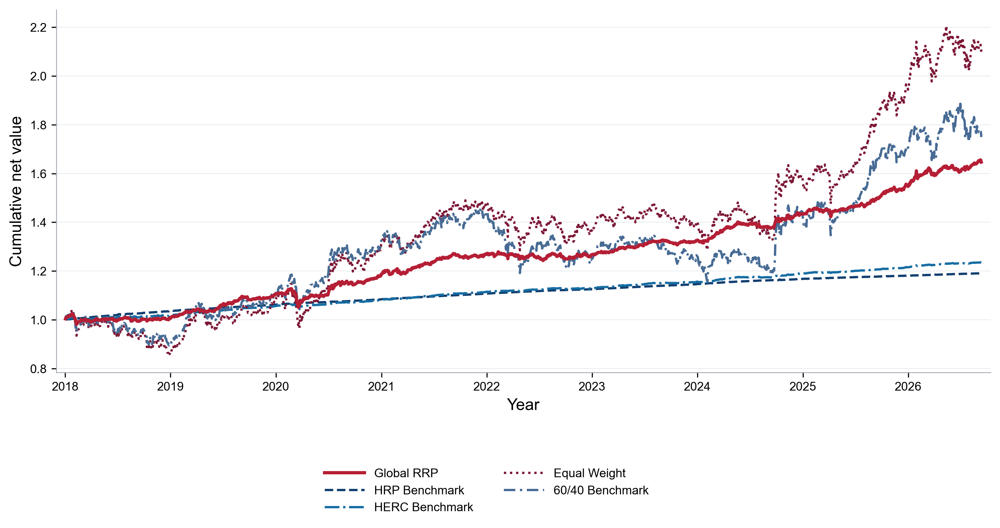
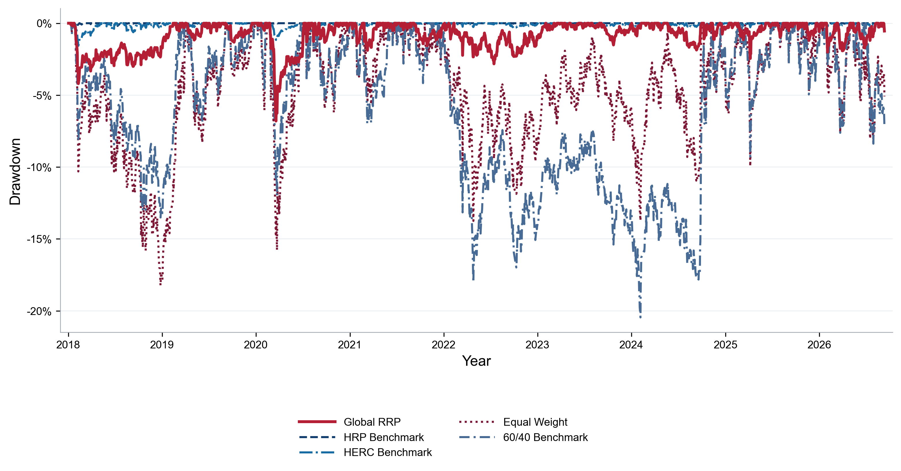
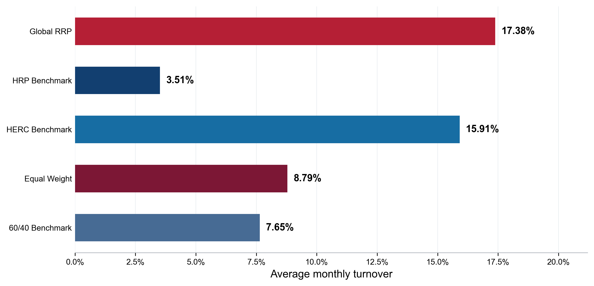
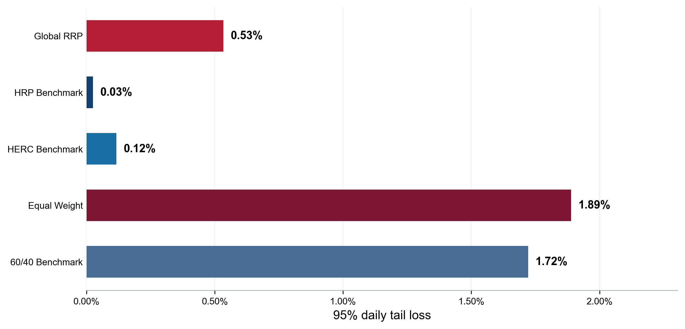
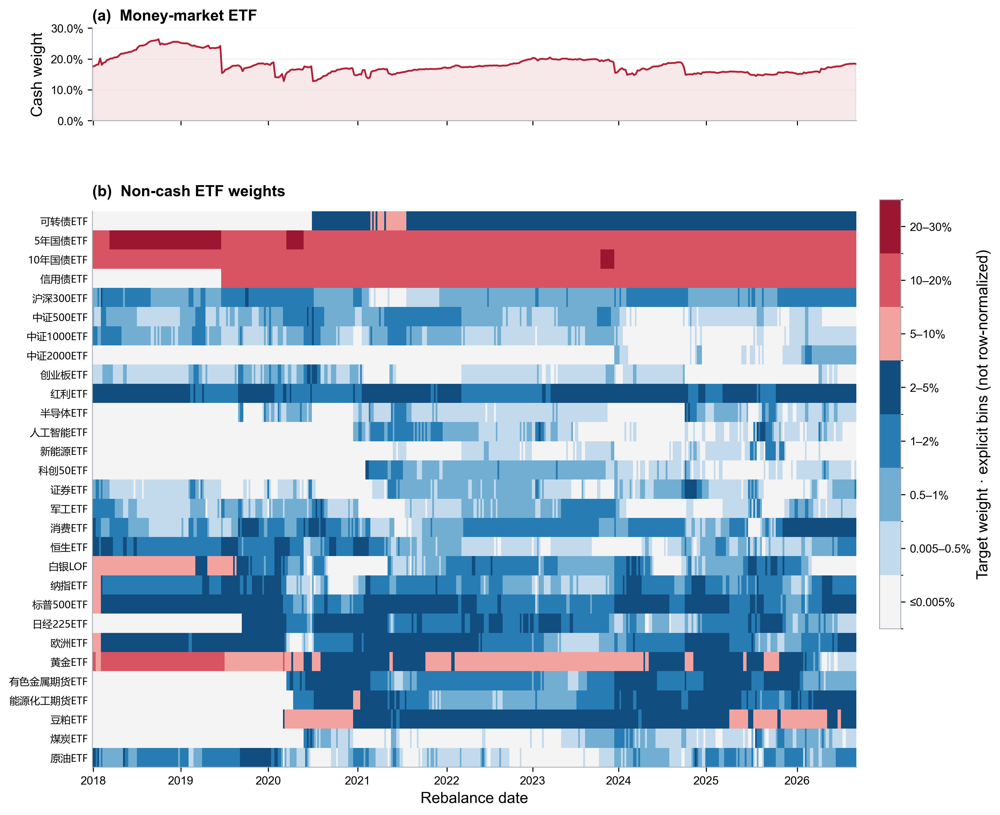

# 宽松风险平价全球资产配置框架 | Relaxed Risk Parity Framework for Global Asset Allocation

[中文](#中文) · [English](#english) · [论文](report/thesis_latex/main.pdf) · [答辩](report/ppt/rrp_defense.pdf)

## 中文

### 模型与方法

**Global RRP** 是周频主模型。HRP Benchmark、HERC Benchmark、Equal Weight 和 60/40 Benchmark 是周频对照。正式结果只包含这五个模型。

主模型先求凸风险预算参考 $q_t$，再平衡参考跟踪、归一化方差和预测收益短缺。收益软目标取当期参考组合的预测收益。

$$
R_t = μ_tᵀq_t
$$

历史窗口和年化口径均为252个交易日。协方差采用 Ledoit-Wolf 收缩估计，收益均值采用20日半衰期指数加权估计。组合保持多头、满仓和无杠杆。

方差及收益短缺惩罚每年更新一次。每次更新先用较早的252日校准目标项尺度，再用随后252日净收益验证候选，所选参数在下一年冻结。全部步骤只读取参数生效日前的数据。

### 历史结果

评价区间为 **2018-01-02 至 2026-08-31**。收益保留极端观察，主指标采用 **rf=0、252日年化和单边3 bps约定成本**。

| 模型 | 净年化收益 | 年化波动 | 夏普 | Sortino | 最大回撤 | 月均换手 |
|---|---:|---:|---:|---:|---:|---:|
| Global RRP | 6.13% | 3.59% | 1.674 | 2.392 | -6.80% | 17.53% |
| HRP Benchmark | 2.10% | 0.27% | 7.832 | 17.381 | -0.19% | 3.53% |
| HERC Benchmark | 2.55% | 0.81% | 3.099 | 4.668 | -1.57% | 16.03% |
| Equal Weight | 9.46% | 13.14% | 0.754 | 1.067 | -18.23% | 8.84% |
| 60/40 Benchmark | 7.18% | 12.08% | 0.635 | 0.911 | -20.46% | 7.70% |

Global RRP 的净年化收益为 **6.13%**，夏普为 **1.674**，最大回撤为 **-6.80%**。主模型定位来自当前研究选择，不代表各项指标均优于对照。

日利ETF的平均权重为 **18.02%**，最高权重为 **26.43%**。日利ETF、5年国债ETF、10年国债ETF和信用债ETF的平均合计权重为 **66.27%**，这一结构解释了较低波动和有限收益。30只ETF均曾在合格期间形成实质持仓，优化器仍允许单期零权重。

年度验证中，每年9组候选都进入一倍夏普标准误集合，能够区分参数的年度为 **0/10**。滚动规则可以复现，现有样本没有识别出唯一惩罚系数。

### 图表

五个模型使用相同评价日期与周度调仓日历。

回撤表示净值相对历史高点的跌幅。

换手按买入和卖出绝对权重变化之和计算，并按自然月汇总。

95% CVaR 是实现收益的事后描述，主模型没有启用 CVaR 约束。

### 数据与复现

资产池包含30只ETF和8类资产，另有6只候选资产不参与本次回测。缓存覆盖2007-01-18至2026-08-31。资产至少需要60个有效历史观察及正方差，上市前价格不回填。

配置 `TUSHARE_TOKEN` 后运行 `python scripts/run_primary_publication_pipeline.py`。入口刷新ETF数据，复跑年度滚动校准及四个对照，随后生成表格、红蓝配色图和两份PDF。无风险利率固定为零，不调用中债利率接口。

| 内容 | 文件 |
|---|---|
| 主模型配置 | [配置记录](results/tables/primary_model_configuration.json) |
| 发布审计 | [审计记录](results/tables/primary_publication_audit.json) |
| 年度参数 | [参数表](results/tables/primary_parameter_schedule.csv) |
| 候选验证 | [验证表](results/tables/primary_calibration_candidates.csv) |
| 自然年结果 | [年度绩效](results/tables/primary_annual_summary.csv) |
| 每周结果 | [持仓](results/tables/primary_weekly_holdings.csv) · [权重](results/tables/primary_weekly_weights.csv) · [周收益](results/tables/primary_weekly_summary.csv) |
| 资产池 | [资产定义](src/asset_universe.py) |
| 研究边界 | [模型治理](docs/MODEL_GOVERNANCE.md) |

逐周持仓只保存在仓库CSV中，论文和答辩展示持仓结构。图表同时提供矢量PDF和300 dpi PNG。

## English

### Models and method

**Global RRP** is the weekly primary model. HRP Benchmark, HERC Benchmark, Equal Weight and 60/40 Benchmark are weekly comparisons. These are the five models in the publication results.

The primary model first solves for a convex risk-budget reference. A second convex problem balances reference tracking, normalized variance and expected-return shortfall. Its feasible return target equals the predicted return of the contemporaneous reference portfolio.

$$
R_t = μ_tᵀq_t
$$

The lookback and annualization conventions both use 252 trading days. Covariance uses Ledoit-Wolf shrinkage, while expected returns use a 20-day half-life. The portfolio remains long-only, fully invested and unlevered.

Variance and shortfall penalties update annually. An earlier 252-day block calibrates objective scales, the following 252-day block evaluates candidates after costs, and the selected coefficients remain fixed for the next year. Every update uses information available before its effective date.

### Historical results

The common period is **2018-01-02 to 2026-08-31**. Results retain extreme returns and use a zero risk-free rate, 252-day annualization and assumed 3-bp one-way costs.

| Model | Net annual return | Volatility | Sharpe | Sortino | Max drawdown | Monthly turnover |
|---|---:|---:|---:|---:|---:|---:|
| Global RRP | 6.13% | 3.59% | 1.674 | 2.392 | -6.80% | 17.53% |
| HRP Benchmark | 2.10% | 0.27% | 7.832 | 17.381 | -0.19% | 3.53% |
| HERC Benchmark | 2.55% | 0.81% | 3.099 | 4.668 | -1.57% | 16.03% |
| Equal Weight | 9.46% | 13.14% | 0.754 | 1.067 | -18.23% | 8.84% |
| 60/40 Benchmark | 7.18% | 12.08% | 0.635 | 0.911 | -20.46% | 7.70% |

Global RRP records **6.13%** net annual return, a **1.674** Sharpe ratio and **-6.80%** maximum drawdown. Primary status records the designated research specification and does not imply metric dominance.

The money-market ETF averages **18.02%** and reaches **26.43%**. The money-market ETF and three bond ETFs together average **66.27%**. All 30 ETFs receive material weight during eligible periods, while zero weight remains allowed on any date.

All nine candidates fall within one Sharpe standard error in every annual validation. The procedure is reproducible, but the current sample does not identify unique penalty coefficients.

Run `python scripts/run_primary_publication_pipeline.py` with `TUSHARE_TOKEN` set. The linked files contain the configuration, audit, annual parameter schedule, candidate results and complete weekly holdings. Detailed holdings stay in repository CSV files rather than the thesis or defense appendix.
